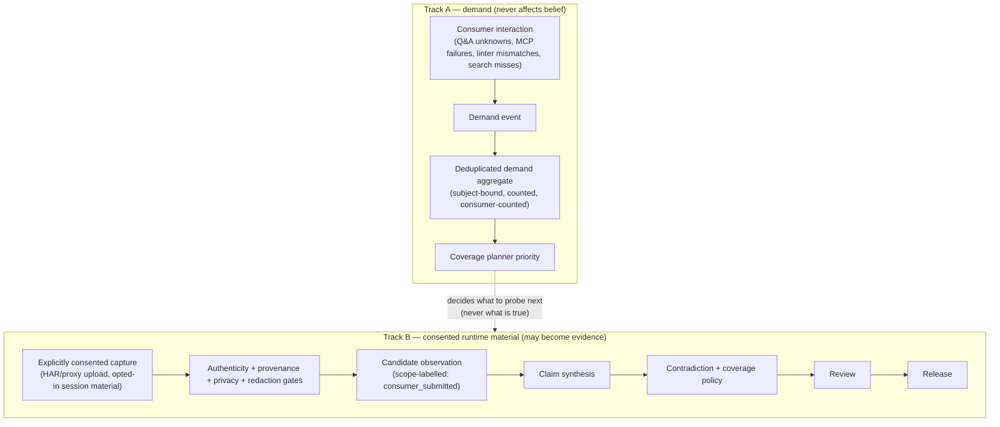

# DocentAPI Gap Analysis — What the World-Class Version Still Needs

> **Version:** 2 (2026-08-05). Revised after an adversarial verification pass over every factual claim in v1 and in the external critique of v1.
> **Status:** Companion to `MASTER_TECHNICAL_PLAN.md`, which remains the authoritative build plan and the authoritative **epistemic and safety spine**. This document amends it; it does not replace it.
> **Verification method:** seven parallel audits — four reading the repository directly (including a full `vitest` run), three checking research claims against primary sources (the MCP specification corpus, vendor documentation, the original papers). Verdicts are recorded in Appendix A. Claims that failed verification have been removed or narrowed, including several of v1's own.

This document answers one question: **what is missing** for DocentAPI to be the world-class owner of "the API part of the company." It does not restate what the master plan already gets right (truth semantics, R0–R4 policy gating, immutable observations → scoped claims → signed releases, coverage denominators). Those foundations are sound and are the reason the rest of this document can be additive.

**The one rule that governs every addition below:** demand may change *what DocentAPI investigates*; it may never change *what DocentAPI believes*. Usage friction is not evidence about provider behavior. v1 of this document violated that rule in its own architecture diagram; §3 corrects it.

---

## 0. Read this first: five live defects that outrank every strategic idea here

These were found by reading the current code. Four were raised by the external critique and are **confirmed**; the fifth was missed by both the critique and v1 of this document and is the most severe. All of them are in production today. Every one of them is a *trust* defect — the product asserting something it has not established — which makes them the same category of problem the master plan exists to solve, only already shipped.

### 0.1 Pasted credentials become public page content and public MCP tool schemas

**Severity: highest. This is a live credential-exposure path, not a retention concern.**

Verified chain, read end to end:

1. `src/lib/importer/curl.ts:169-176` — every URL query parameter of a pasted cURL becomes `schema: { type: 'string', example: value }, example: value`. There is no credential filtering on query parameters. `?api_key=sk_live_…` becomes an example value.
2. `src/lib/importer/curl.ts:196` — any header not matching `authorization`, `^(x-)?api[-_]?key$`, or `^x-auth` is carried in **with its live value as an example** (`Private-Token`, `X-Goog-Api-Key`, and similar do not match).
3. `src/lib/normalize.ts:294-308` — the only filters are the detected `authIn` parameter and `authorization`/`cookie` headers. Query credentials survive into `exampleParams`.
4. `src/lib/normalize.ts:380-386` — `SCHEMA_KEEP_KEYS` includes `example`, so sanitization preserves it. `src/lib/persist.ts:118` writes it to `actions.examples`.
5. `src/lib/db/schema.ts:73` — `visibility` defaults to **`'public'`**.
6. `src/lib/snippets.ts:60` — generated code snippets prefer `schema.example` as the *first* choice of sample value.
7. `src/lib/mcpTools.ts:42` — `paramsSchema` is served verbatim as each MCP tool's `inputSchema`.

A user pasting a working cURL command — the single most-encouraged onboarding action — can publish their own live credential to a public web page, into copy-pasteable code snippets, and into a public MCP tool schema. Related: `curl.ts:124,128` echo pasted tokens back in 422 error messages, and `src/app/api/import/route.ts:81` logs the raw error object.

**Fix before anything else:** deny-by-default secret detection on import (entropy + known key patterns + all query/header/body values), quarantine rather than store, strip examples that fail the check, and default new persisted APIs to `private` until an owner opts into publication.

### 0.2 A "verified" score can be produced with zero successful API calls

`src/lib/probes/run.ts:37-38` renormalizes the total over probes that did not flag `insufficientData`. But `authClarity` computes its entire subscore statically before any network I/O (`authClarity.ts:29`) and swallows live failures (`:49-53`), and `idempotency` is a pure regex over parameter names with **zero** live calls (`idempotency.ts:5,19`). Therefore:

- every live call failing (DNS, timeout, 5xx) still yields **50/100**;
- if the spec additionally lacks corruptible examples or response schemas, `errorQuality` and `docDrift` drop out of the denominator and the result is **100/100 with no HTTP request attempted at all**;
- `scoreRuns.status` is written `'succeeded'` regardless, because every probe catches its own errors;
- the UI states "Computed from live probes run against the real API — this is the earned Agent-Ready Score, not a static estimate" (`VerifiedScorePanel.tsx:26-27`) and the public badge turns green (`badge/[slug]/route.ts:61-65`).

Worse in detail than the critique stated: auth clarity is not "predominantly" static, it is **100% static** — the live request cannot change the subscore in any branch, and an API that *accepts* an unauthenticated request (a real failure) receives no penalty at all. `errorQuality`'s required-parameter-drop test fails **client-side deterministically** at Ajv validation (`mcpTools.ts:116-117`) before any request is sent, and that non-event is recorded as `probe.error_quality` and rendered to users as "returned an unreadable error on a 0 response" (`scoreWrite.ts:40-41`) — a fabricated HTTP exchange. `errorQuality` never checks `status >= 400`, so a 200 response containing `{"message": "..."}` scores points. `docDrift` never checks status either, so auth failures and DocentAPI-side errors are attributed to the provider's documentation quality. All probe evidence is written `confidence: 1, environment: 'production'` (`scoreWrite.ts:88-89`) including these failures. Read-only APIs receive an automatic 25/25 for idempotency with nothing measured (`idempotency.ts:13`).

**Fix:** the root cause is blending static heuristics and live observations into one number. Do not rename the blend — **split it**. Structural findings stay a spec-derived readiness preview (what `score_previews` already is). The live component becomes the master plan's **Sampled Live Check**, which *must not exist at all* without at least one successful upstream response, and must publish its observed-vs-static point split, sample size, and attempted-call outcomes. This is a stronger correction than the critique's proposed rename to "Integration Readiness Score," which would leave the blend intact under a third name.

### 0.3 Scores and evidence are not fenced to a spec version

The `scores` table *has* a `spec_version_id` column and it *is* populated on write (`schema.ts:186`, `scoreWrite.ts:98`) — but **no reader anywhere uses it in a predicate**. The badge joins on `apiId` alone (`badge/[slug]/route.ts:43-48`), as do the product page (`persistentApi.ts:124`), the dashboard chip (`persistentApi.ts:149-154`), and the advisor/MCP insight layer (`advisor/insights.ts:29`), which presents `basis: 'live probes against the running API'` with no version check.

Re-import never touches `scores` (`persist.ts` does not even import the table), so **an API can change its contract and keep serving the previous green badge**. The `revalidatePath` purges in `ci/sync` and `verify` re-render the *same stale row*, and the code comments in `badge/[slug]/route.ts:8-12` and `ci/sync/route.ts:122-125` assert an invalidation that does not exist. The stale window is up to 168 h on the Business plan and **unbounded on every other plan**, since `scheduledVerification` is `false` for free/launch/pro/team (`plans.ts:49,62,75,88`) and cron candidacy keys on score *age*, not spec change (`reverify.ts:91`).

There are also real races: `verify/route.ts` reads `currentSpecVersionId` at line 29, loads the record separately at line 58, probes for up to 60 s, then stamps the score with the line-29 value — so a re-import landing in between grades one version and attributes it to another. `scoreWrite.ts:107-111` is an unconditional upsert with no compare-and-set. `score_runs` has no `spec_version_id` column at all, so the misattribution cannot even be audited after the fact. Advisor/MCP evidence reads are equally version-unbound (`insights.ts:30-35`), mixing observations across superseded versions.

**Fix:** this is Phase 0 item zero in structural terms — every run, score, evidence fact, and published claim fences to an immutable source-version hash, with compare-and-set on publication and version-scoped reads. The master plan already requires this for the new architecture (§4.3, §8.5); the point is that the *current* product needs it now.

### 0.4 Deletion destroys the audit trail and keeps the sensitive material

`DELETE /api/apis/[slug]` cascades away `credential_audit` rows (`schema.ts:245`, `drizzle/0004_credential_vault.sql`) while **no code anywhere deletes Blob objects** — `specStore.ts` imports only `{ get, put }`. Raw spec snapshots (possibly containing §0.1 secrets) and generated artifacts survive forever, while the forensic record of credential use is destroyed. The API response tells the owner everything "is gone. This cannot be undone" while the route's own comment says snapshots are deliberately retained.

Structurally, deletion is currently *impossible* to implement safely: snapshots are keyed by content hash alone (`specs/<sha256>.txt`) with no org scoping, so identical bytes are shared across tenants and safe removal would require reference counting that does not exist. The stored raw snapshot also has **zero readers** — `getSpecSnapshot` is exported and never called — so it is pure retained liability.

**Fix:** one coherent retention/deletion/legal-hold policy; org-scoped artifact keys; audit rows outlive the entity they describe.

### 0.5 The job chain cannot retry a genuine failure

Not raised by the critique, and arguably worse than the duplicate-write risk it did raise: `analyze-crawl` and `analyze-enrich` catch stage failures, return **200**, and chain forward (`analyze-crawl/route.ts:82-92`, `analyze-enrich/route.ts:294-304`). QStash therefore never retries — a transient crawl or enrichment failure is **permanent for that spec version**. The whole three-stage chain also has zero test coverage.

On the critique's related claim that "analysis-job idempotency is missing and must be added immediately": **partly refuted.** Idempotency is deliberately designed in — succeeded-stage skip checks in every stage, a real partial unique index on `clarifications (spec_version_id, group_key)` with `.onConflictDoNothing()`, and replay-safe artifact overwrites keyed by `specVersionId`. The genuine residual gaps are narrower: `analysis_runs` has no unique constraint on `(api_id, spec_version_id, stage)`, so concurrent duplicate deliveries race a non-atomic select-then-insert; replay after partial failure duplicates evidence facts (which enrichment then re-reads and re-bills as LLM input) and can resend emails; `publishJob` sets no QStash `deduplicationId`. Worth hardening, but the failure mode is duplicate rows and emails — not corrupted verified state — so it ranks below §0.1–§0.4.

### 0.6 Corrected repository facts

v1 of this document carried four wrong numbers. All four corrections from the critique verified:

| v1 said | Actual | Source |
|---|---|---|
| 16 tables | **18** | `schema.ts` — 18 `pgTable()` definitions |
| 1,051 tests | **1,110 across 72 files** | `npx vitest run` — 72 passed / 1110 passed |
| "~500 lineage facts per import" | **up to 500** (a hard cap, not a typical count) | `lineageEvidence.ts:30,54` |
| "Phase 0 is ~0 of 11" | denominator is **10** | `MASTER_TECHNICAL_PLAN.md:1934-1943` |

The substantive judgment stands: Phase 0 remains approximately **0 of 10** delivered, and §0.1–§0.5 above are additions to it, not substitutes for it.

---

## 1. Ground truth: what is built vs what the plan assumes

The repository is a working product: two import pipelines (anonymous instant + authenticated deep analysis with docs crawl → LLM enrichment → clarification email loop), grounded Q&A, hosted multi-tenant MCP, playground, credential vault, Stripe billing, domain claims, CI sync, badges — 18 tables, 1,110 green tests across 72 files. That is a credible front door and most of it survives into the target architecture.

**Phase 0 (trust-boundary correction) is ~0 of 10 delivered.** Live today: the "verified"/"Agent-Ready" language over a ≤6-GET read-only sample; `?key=` credentials accepted in the MCP URL (`mcp/[id]/route.ts:98`, advertised in `McpBlock.tsx:61`); raw *write* operations exposed as MCP tools with only `destructive` filtered (`ir.ts:71`) while `enabledForMcp` is a dead column never read; credential wrapping by HKDF of an env var with `kms_key_id` storing a local label; credential-audit writes that fail **open**; no kill switch, no effect/risk classes, no provider budgets, no feature flags.

**Phases 1–2 are 0% started.** No `source_artifacts`, no Contract IR v2, no observations/claims/releases tables, no policy or planner code. The current normalizer is lossy by design (`mergeCombinators()` collapses `oneOf`/`allOf`; 300-action cap; single response/media selection). The plan's sequencing — IR v2 before engine — remains correct.

### 1.1 Built-but-unreachable value (fastest wins in the repo)

The deep pipeline already produces its most valuable artifacts and then hides them:

- **Arazzo workflow docs + enriched OpenAPI** are generated on every completed analysis and written to Blob — and **no route or UI serves them**. `getArtifactText()` has zero non-test callers. (Note: the generator emits Arazzo **1.0.1**; the current specification is **1.1.0** — worth updating when this is surfaced.)
- **Per-action MCP analytics** (`/api/apis/[slug]/analytics`), **CI token issuance**, and **org MCP token** routes are implemented and tested with no UI caller.
- **Up to 500 field-lineage evidence facts per import** are written and nothing reads them back — these are exactly the seed data a Behavior Explorer DAG view needs.
- `score_runs.probes_run` never written; `MAX_PROBED_ACTIONS` exported, never used.

Surfacing these is real product value at near-zero engineering cost.

---

## 2. Keeping the original idea in the centre

Before the additions, an explicit anti-drift check. The product described at the outset was:

> A company hands over its API documentation. We parse all of it, hit every endpoint, try the parameters and the kinds of values they take, and learn where each value comes from — so that any question a developer can think of has an answer. Whatever we cannot establish, we email them a questionnaire they complete on our platform. Then, because we know everything, we can also generate a working integration.

Every element of that maps to committed architecture, and **nothing in this document may displace it**:

| Original element | Where it lives | Status |
|---|---|---|
| Parse all of it, losslessly | Contract IR v2 (plan §7.1, §9) | Planned, not started |
| Hit every endpoint; try parameters and value kinds | Coverage obligations + probe engine (plan §11, §12) | Planned, not started |
| Where does each value come from | Entity dependency / value-provenance graph (plan §16.1); `lineage.ts` is the v1 | Partially built, unread |
| Answer any question | Grounded Q&A over release claims (plan §19.3) | Built, not release-backed |
| Email a questionnaire for what we can't establish | Clarifications + signed email links (`src/lib/clarify/*`) | **Built and working** |
| Development key, keep hitting the APIs | Identity profiles + governed runner (plan §6.3, §12) | Planned, not started |
| Also generate an MVP | Verified integration kit (plan §21.2) | Planned, gated behind verified workflows |

Two notes on focus:

- **The questionnaire loop is the most under-defended asset here.** It is already built, it is the mechanism that turns "we couldn't figure it out" into knowledge, and it is the piece most likely to be crowded out by the strategic additions below. It should be *generalized* (readiness questions, evidence-gap questions, contradiction review — plan §18) rather than left as a field-semantics-only flow.
- **The generated MVP stays, and stays gated.** The plan's ordering — verified workflows first, integration kit second (§21.2) — is the correct reading of "because we have everything, we can also do that." Generating an app before the behavior model is trustworthy automates integration bugs.

Everything in §3–§9 below is one of three things: a **safety precondition** for doing the above at all, a **demand signal** that tells the probe engine which parameters and endpoints to attack first, or a **deferred** idea explicitly parked behind an interface. Anything that is none of those does not belong.

---

## 3. The missing subsystem: consumer lifecycle and feedback

The master plan's five planes all face the **provider**. The consumer — the developer or agent actually integrating — appears only as an anonymous reader of the serving plane. This drops the original product #4 (the onboarding linter: verify a consumer's calls against the learned patterns) and with it the data flywheel.

v1 of this document proposed a "Consumer Integration Plane" and drew consumer linter output and session telemetry flowing directly into observations. **That was wrong and is corrected here.** A failed MCP call can mean the consumer sent a bad value, used the wrong version or environment, hit a gateway that rewrote the request, holds a stale profile, has different tenant permissions, DocentAPI generated a bad tool — or the provider genuinely changed. Treating that as evidence about provider behavior would corrupt the exact truth model the master plan exists to protect.

This is also not a clean standalone plane; it crosses serving, execution, and evidence. Call it the **Consumer Lifecycle and Feedback subsystem**, with two strictly separated tracks:

Track A changes the *queue*. Only Track B — with authenticated provenance, consent, redaction, scope labelling, and the same review gates as any other evidence — can ever touch a claim, and even then it enters at the lowest assurance class (§7.3).

### 3.1 Components

- **`integration_profiles` (versioned)** — the operations, fields, workflows, and claims a specific consumer depends on. Sources cheapest-first: derived from that consumer's MCP/Q&A sessions; uploaded consumer contract (Pact); uploaded HAR/proxy capture; manual selection. Versioned, because "what you depended on" changes and stale profiles are a known false-signal source.
- **Conformance linter** — validates a consumer's requests/responses against a release, as a CI action first (the repo already ships `examples/github-action/`) and a dev proxy later. A mismatch emits a **demand event**, never an observation, and is triaged into: consumer defect / stale profile / twin gap / candidate provider change. Only the last, after Track B treatment, can reach evidence.
- **Consumer-scoped release impact** — `release diff × integration profile`: "release N+1 changed 2 of the 12 fields you depend on, one breakingly." This is far more valuable than a generic changelog, and it is the alert people actually read.
- **Third-party dependency monitoring** — scheduled re-verification surfaced to consumers as continuous watch on an API they depend on.

### 3.2 Why this is also the moat

Every unanswerable question and every linter mismatch tells DocentAPI *where its own knowledge is thin* — with consent, through the front door. That is the flywheel, expressed as an architecture that cannot launder friction into truth.

---

## 4. The missing feedback arc: demand-driven prioritization

The plan's priority formula (§11.3) ranks obligations partly by "integration importance" but never defines where that number comes from. Today it would be a guess. The product already logs the right signal and discards it: Q&A answers that resolve to unknown, MCP tool calls that fail or return empty, explorer searches with no result, and clarification questions the provider *skips* (a skip means the provider does not know either — a high-value unknown).

Add a **`demand_signals` table** (kind, subject binding to operation/field/workflow, occurrence count, distinct-consumer count, first/last seen) feeding **deduplicated demand aggregates** into the planner. This converts the planner from "probe what the spec suggests" into "probe what integrators are blocked on" — better probe economics and a far better sales story ("47 developers asked about refund behavior last month; here is the verified answer").

A second demand source, with permission: the provider's **existing support exhaust** (tickets, community threads, tagged questions). The product's core promise is reducing support burden; reading the actual support burden is the shortest path to knowing which twenty questions matter. Mechanically this is the existing bounded-crawler pattern pointed at a new corpus, emitting demand aggregates and `candidate` claims — never published claims. *(Deferred behind an interface — see §10.)*

---

## 5. The missing distribution architecture

The plan builds a destination and assumes visitors. World-class requires the knowledge to travel:

1. **Serve the artifacts that already exist** (§1.1) — an artifacts page and download routes for Arazzo (upgraded to 1.1.x) and the enriched spec. Days of work.
2. **`llms.txt` / `llms-full.txt` per API, generated from the release.** Cheap — a release-view renderer — and DocentAPI's version cites claim scope and freshness inline, which no handwritten one does. **Treat it as table stakes for agent consumption, not a growth channel:** it remains a proposal rather than a standard, and adoption studies disagree on whether it produces measurable uplift. Implement it; do not build projections on it.
3. **Embeddable Behavior Explorer.** The "not a docs CMS" non-goal is right, but it leaves the twin marooned on one domain. An embeddable widget (DAG view, failure catalog, webhook contract) that drops into a provider's existing Mintlify/ReadMe/Scalar site puts the verified layer *inside* every doc site instead of competing with it. This is the concrete mechanism for "a layer on top of existing docs."
4. **Public index and scorecards.** `scripts/seed-unclaimed.mjs` exists; the strategy does not. Seed static-only twins for major public APIs — honestly labelled `declared`/`inferred`, at the assurance level defined in §7.1 — and publish per-API scorecards. The claim ladder gives every unclaimed page an upgrade path: "claim this API to verify it." *(Deferred — §10.)*
5. **Badge → manifest.** The badge should deep-link to the verification manifest (scope, coverage counts, freshness, version fence) rather than a bare number. It is the only DocentAPI surface most consumers will ever see.

---

## 6. Missing claim families — and why they need their own schemas

The seven L2 layers plus plan §16.8 cover runtime behavior well. Real integration pain starts *before* the first call and extends past the API surface. Missing families:

| Family | Answers | Primary source |
|---|---|---|
| **Auth bootstrapping** | "How do I *get* credentials?" — portal steps, approval waits, OAuth app registration, redirect-URI rules, scope→capability map, rotation ceremony | Readiness questionnaire + docs; `declared`/`human_confirmed` only |
| **Cost & quota** | "What does this call cost or consume?" — billing units, metered vs flat, quota windows, overage behavior | Provider declaration + observed 429/`Retry-After` |
| **Data classification** | "Which endpoints return regulated data? What may I store?" | Provider/legal assertion; detectors produce *findings*, not classifications |
| **Operational history** | "Is it up? When does it break?" — status page, incidents, maintenance windows, latency/availability trend | Status ingestion + DocentAPI's own probe-timing history |
| **SDK reality** | "Does the official SDK match the API?" — languages, versions, registry, coverage gaps | Registry crawl; later SDK-vs-spec diffing |
| **Named-spec conformance** | "Does it follow standards I already know?" — Standard Webhooks, IETF Idempotency-Key draft, RFC 9457, RFC 8594 | Probe-verifiable |

**These cannot share one promotion policy.** Pricing varies by contract, plan, region, and effective date. Data classification is a provider assertion where a detector only yields a finding. One probe's latency is neither availability history nor an SLA. SDK support needs package, language, version, and registry scope. Standards conformance must name the standard's version and the conformance suite used. So: model them as **typed integration-knowledge claims with family-specific schemas, evidence requirements, freshness policies, and promotion rules** — extending the plan's §15.5 promotion machinery per family rather than overloading one path.

Auth bootstrapping deserves emphasis: it is consistently the largest real-world time sink, it is almost entirely human-process knowledge no competitor structures, and the existing questionnaire machinery is already the right tool.

---

## 7. Corrections and tightenings to v1's proposals

### 7.1 A static-only release is not a "Verification Release"

v1 proposed shipping a static-only release early and called it a verification release. A signature proves issuer and artifact integrity; it proves nothing about whether the enclosed claims are true. This would have violated the master plan's own §1.2 and §3.1 discipline about reserving "verified."

Ship it as an **Integration Release carrying an explicit `assuranceLevel`**:

| `assuranceLevel` | Contents | May be called "verified" |
|---|---|---|
| `compiled` | Contract IR + static findings only | No |
| `declared` | + provider-declared and human-confirmed knowledge | No |
| `observed` | + governed runtime observations with coverage denominators | Yes, scoped |
| `verified` | `observed` + review + gate satisfaction per plan §17.4 | Yes |

The term **Verification Release** remains reserved for the top of that ladder.

### 7.2 Cleanup: require a `CleanupContract`, not an inverse operation

v1's absolute — "no create-probe executes until its inverse operation is known" — is too narrow, and partly duplicates the plan's existing requirement (§12.5). An inverse operation alone also does not make mutation safe. Require instead an **approved, tested `CleanupContract`** that may be satisfied by: an inverse operation; a provider TTL; an ephemeral-environment reset; an approved cleanup job; a reusable fixture pool; or explicit quarantine with recorded residual-risk acceptance. The plan's terminal run states (§12.11) already encode the consequences; this defines the precondition.

### 7.3 Provider-CI execution is the right idea — with its own assurance class

The strongest architectural proposal in v1 stands: a **provider-CI runner mode** — a GitHub Action or container executing a signed, policy-bound plan *inside the provider's own CI*, where credentials already live, returning only redacted observations. It reuses the plan's runner protocol verbatim and converts the biggest sales objection ("hand your sandbox credentials to a third party") into a deployment choice. Pull it far ahead of the Phase 8 enterprise runner.

But results from it must not silently carry managed-execution assurance. Add **execution classes** to every observation and every coverage result:

- `managed_observed` — DocentAPI-operated runner, full policy enforcement;
- `provider_runner_observed` — provider-hosted runner executing a signed plan;
- `consumer_submitted` — consented consumer-supplied material (the only path from §3 Track B).

Runner digest, plan hash, policy version, redaction version, and result bundle are all signed and replay-resistant, and the execution class is part of the release manifest.

### 7.4 MCP: rebase on 2026-07-28, but support both eras

The plan targets the 2025-11-25 authorization spec and the July 2026 release candidate. Verified against the specification itself:

- **2026-07-28 is the current, released revision** — not an RC. Headline change is statelessness: the `initialize` handshake and protocol-level sessions are gone; version, capabilities, and `clientInfo` travel in `_meta` on every request. The current stateless `mcp-handler` implementation is accidentally well-positioned.
- **Tasks moved to the `io.modelcontextprotocol/tasks` extension** — poll-based `tasks/get`, new `tasks/update` for mid-flight input, `tasks/list` removed, servers may return task handles unsolicited.
- **MRTR replaces server-initiated requests** — servers return `resultType: "input_required"` with `inputRequests`; clients retry carrying `inputResponses`. Roots, Sampling, and Logging are deprecated outright. `resultType` is now required on all results.
- **Authorization**: DCR deprecated in favour of **CIMD** (note: CIMD rests on an IETF *draft*, not a published RFC). RFC 9207 `iss` validation is **MUST-validate-when-present** on clients, while server-side inclusion is still SHOULD — a precision trap worth encoding correctly.
- **`server/discover`** is real and mandatory for servers to implement (clients *may* call it).
- **Cache hints** (`ttlMs`, `cacheScope`) apply to `tools/list`, `prompts/list`, `resources/list`, `resources/read`, `resources/templates/list`, and `server/discover` — **not** to `tools/call` results. v1 implied broader applicability. Immutable releases still make aggressive hints on those surfaces a free win.
- **Do not hard-cut legacy clients.** Official migration guidance is built around dual-era support (one endpoint serving both; rejecting 2025-era clients requires an explicit opt-out), and the spec permits simultaneous version support. Ship a **compatibility matrix**, not a cutover.

### 7.5 Tool budget: a benchmarked hypothesis, not a constant

v1 asserted a "hard budget of ~15 tools" and attributed a "~30–40 tool" degradation threshold to the RAG-MCP paper. **That attribution was wrong** — the threshold appears nowhere in that paper. What the primary sources actually support:

- RAG-MCP reports tool-*selection* accuracy of 43.13% vs a 13.62% baseline — on one MCPBench subset, 20 trials per method, base model qwen-max-0125, judged by an LLM verifier. Directionally useful; weak external validity; even the winner failed a majority of trials. (The critique's own counter-claim that this was "a 43-tool pool" is also mistaken — 43 is the accuracy figure.)
- Anthropic's tool-search documentation states degradation "once you exceed 30–50 available tools," and recommends considering tool search from ~10 tools or ~10K tokens of definitions, keeping only the **3–5 hottest tools** non-deferred.
- Published production telemetry shows the onset is model-dependent — smaller models degrading in the 10–15 range where frontier models hold to 20–30.
- Current official MCP client best practice expresses the trigger as a **share of the context window (≈1–5%)**, not a tool count — which matters because a count-based rule is simultaneously too strict for terse schemas and too lax for fat ones.

So: keep the **architecture** (a small outcome-oriented surface, a `search_capabilities` tool over the claim graph — a pattern the official best-practice docs explicitly endorse, plus a code-execution escape hatch for the long tail). Express the **budget** as a per-model, benchmarked figure stated in *both* definition tokens and count, with the 3–5 hottest tools always loaded and the tail deferred. Validate it per model on release builds rather than freezing a constant.

### 7.6 Research techniques enter as benchmarked adapters, not architectural facts

v1 used superlatives — "the cheapest known generator," "the single biggest driver" — that the underlying papers do not support. The techniques remain worth adopting; the framing changes to **planner adapters evaluated against the reference lab**, each admitted on measured benefit:

- **Error-message mining** (EmRest): mine 4xx bodies for undocumented inter-parameter constraints; cluster 5xx to steer probe budget. For DocentAPI the mined constraints are *inventory* — `candidate` claims feeding the existing clarification loop — not disposable test machinery.
- **Semantic + dynamically-updated dependency graphs** (AutoRestTest's SPDG, Morest's RPG): embedding-similarity parameter matching across operations, re-weighted by execution feedback. `lineage.ts` is the v1 heuristic; this is its successor.
- **Spec-enhancement preprocessing** (RESTGPT/NLPtoREST): extract machine-readable constraints from description prose as `inferred` candidates, *validated against live responses before promotion*. `deepEnrich.ts` is most of this already, pointed at a UI instead of the planner.
- **Passive traffic as a second evidence channel**: uploaded HAR/proxy captures, not eBPF agents — entering through §3 Track B at `consumer_submitted` assurance.
- **Observation-grounded mock twin**: replay recorded exemplars, observed latency distributions, real error shapes, verified state machines — rather than schema-synthesized examples.
- **Release diffing as a product**: classify breaking/non-breaking/deprecation between releases and publish a subscribable behavioral timeline per API; intersect with §3 integration profiles for targeted impact alerts.

---

## 8. Competitive positioning (August 2026)

### 8.1 Three facts that frame it

1. **Consolidation.** Anthropic acquired Stainless and is winding down its hosted products; Postman acquired Fern. Labs and incumbents are buying the spec→tooling pipeline; neutral evidence-based infrastructure is newly scarce.
2. **The category is consensus and funded.** MCP is Linux-Foundation-hosted and, per Anthropic's and the MCP project's own posts dated 28 July 2026, passed **400M+ monthly SDK downloads** (~4× year-over-year, from ~97M monthly stated in the December 2025 foundation announcement). Mintlify — which raised $45M at a $500M valuation — measures agents at **66% of documentation traffic**. Capital concentrated on agent auth, tool catalogs, and agent-readable docs.
3. **The verification position is validated but not occupied.** SmartBear's PactFlow Drift sells spec-conformance *inward*, as provider CI. Levo/Salt/Akamai build observed-behavior inventories and sell them to *security teams*. Neither publishes verified behavior as a consumable, evidence-cited product for consumers and agents.

### 8.2 Language discipline

Replace v1's "nobody," "uncontested," and "the position is vacant" with the narrower, testable, and still strategically strong formulation:

> No competitor identified under our documented evaluation rubric currently publishes reproducible, upstream semantic outcome evidence with version-bound receipts.

Maintain the rubric as an artifact, with dated evidence per competitor, and re-run it each quarter.

### 8.3 Arazzo positioning, corrected

v1 claimed the MCP specification references Arazzo, and that every Arazzo document is hand-written or spec-inferred. **The first is false** — a grep of the complete official MCP documentation corpus (2.35 MB, verified to contain the full 2026-07-28 spec) returns **zero** occurrences of "arazzo." **The second is too strong.** On the record today:

- **Generating** Arazzo from specs is commoditized across at least four vendors (Redocly's `generate-arazzo`, Jentic's generator, Specmatic Studio, Speakeasy's bootstrap).
- **Executing** Arazzo against live APIs is done by Speakeasy (contract tests, live target opt-in via `x-speakeasy-test-server`), Specmatic (happy and unhappy paths against real services), and Jentic's OSS `arazzo-runner` on PyPI. Execution confers no moat.
- **Jentic** markets "capture successful agent behavior as deterministic workflows" — the closest adjacent claim — but that capture is sandbox-simulated rather than governed production evidence, carries no signing or attestation, and their own documentation shows workflow creation is currently a manual, maintainer-driven process. Their OAK corpus (~2,000 workflows over 6,000+ APIs) is AI-generated from specs with only structural/spec-compliance validation, never live-execution verification.

The defensible claim is therefore narrower and still valuable:

> **Arazzo generated from governed runtime evidence, carrying signed receipts and coverage denominators, has no identified competitor** — and must be stated by explicitly differentiating from Jentic rather than claiming a vacuum.

Also: emit Arazzo **1.1.x**, not the 1.0.1 the current generator produces.

### 8.4 Threats, each with an architectural answer

1. **Platform bundling** — Postman, Kong, Zuplo, Mintlify, and ReadMe all ship a "good enough" spec-derived agent path by default. *Answer:* §5's distribution architecture, and refusing to compete on artifact generation. Bundlers ship spec-derived tools; only DocentAPI ships claims with receipts.
2. **Agents may self-discover at call time** — self-healing integration products exist and labs are internalizing API knowledge. *Answer:* the durable premium is where trial-and-error is unacceptable — money movement, messaging, deletion, idempotency and retry safety, webhook contracts. An agent cannot safely *discover* whether a duplicate POST double-charges. Position the twin as the **safety substrate for agent self-service**, not a substitute for it. This is the fintech-beachhead argument, and it holds.
3. **Verification captured provider-side** — PactFlow Drift lives in the provider's CI with no third-party trust required. *Answer:* §7.3's provider-CI runner mode meets it on that turf with a stronger artifact, while assurance classes keep the evidence model honest.

---

## 9. Product promotions the plan undersells

1. **Sandbox-as-a-service.** The mock twin is listed as an artifact; promoted, it is a product. Most providers' sandboxes are poor — that is the validated pain — and an evidence-grounded twin with scenario selection (failure modes, latency bands, webhook duplicates, eventual consistency) *is* a better sandbox. Export Microcks-compatible artifacts rather than competing on deployment infrastructure. *(Deferred — §10.)*
2. **Support deflection.** Grounded Q&A already exists. Packaged as an embeddable "Ask this API" widget plus support-inbox assist (draft evidence-cited replies), it attacks the buyer's support-cost line directly — the number they already measure.
3. **Serving-quality evaluation.** The plan's reference lab tests the *engine*; nothing continuously tests the *serving layer*. Add an integration-task eval suite (cold agent completes N reference tasks via MCP, graded on correctness, hallucinated values, citation integrity) run on every release build. This turns the "verified integration task success" north star into CI, and its scores are themselves publishable proof.

---

## 10. Disposition and discipline

| Treatment | Items |
|---|---|
| **Add immediately** (§0) | Import secret detection + quarantine + private-by-default; version fencing for every run/score/claim; no score without a successful observation; coherent retention/deletion/legal-hold policy; job-chain retry semantics and stage uniqueness |
| **Adopt** | Versioned consumer integration profiles; release-impact analysis; semantic release diffs; provider-CI runner with execution classes; demand aggregates; serving-quality evals; vertical slices; typed claim families |
| **Rewrite as specified** | Consumer feedback as two separated tracks (§3); release terminology and `assuranceLevel` (§7.1); `CleanupContract` (§7.2); MCP dual-era rebase (§7.4); tool budget as benchmarked hypothesis (§7.5); research techniques as measured adapters (§7.6); Arazzo positioning (§8.3); competitive language rubric (§8.2) |
| **Defer behind interfaces** | Public index and comparative scorecards; support-ticket ingestion; third-party MCP conformance attestation; sandbox-as-a-service; embeddable explorer |
| **Skip / watch only** | Formal API ontology (the claim graph *is* the ontology); eBPF traffic capture; agent-payment protocols (watch — relevant to fintech, but a monetization decision, not architecture); early GraphQL/gRPC/AsyncAPI adapters (the plan's sequencing behind HTTP release quality is right) |

Unchanged non-goals: docs CMS, Cartesian fuzzing, autonomous production mutation, LLM-as-oracle, microservices before a trust boundary demands them.

---

## 11. Revised sequencing

The plan's own estimate is 7–10 months for a senior team of 3–4, or 14–20 months solo, before Phase 7 value. That is engineering-correct and commercially wrong for a solo builder: it is horizontal, so nothing is sellable until nearly everything works. Vertical slices, each ending in a shippable trust artifact:

| Slice | Contents | Ships |
|---|---|---|
| **S0 — Stop the bleeding** (days) | §0.1 secret quarantine + private-by-default; §0.3 version fencing; §0.2 no-score-without-observation and the static/live split; §0.4 retention policy; §0.5 retry semantics | Removes live credential exposure and false trust claims |
| **S0.5 — Phase 0 proper** (days) | The plan's 10 Phase 0 deliverables: Sampled Live Check naming + manifest, remove `?key=`, enforce `enabledForMcp` with writes off by default, effect/risk overrides, kill switch, provider budgets, KMS root, audit fail-closed, feature flags | The product claims exactly what it can prove |
| **S1 — Unlock built value** (days) | Serve Arazzo (1.1.x) + enriched spec; analytics UI; read lineage facts into a first DAG view; badge → manifest | Visible differentiation from code that already exists |
| **S2 — Integration Release, `compiled`/`declared`** (weeks) | Minimal `source_artifacts`/`api_versions`; IR v2 over the supported subset; `behavior_claims` + releases with `assuranceLevel`; llms.txt; release diff timeline | First real release artifact; honest public index becomes possible |
| **S3 — One governed run, read-only** (weeks) | Policy + budgets + durable orchestration + read-only runner + immutable observations, against MudraCore and 2–3 public sandboxes | First `observed` claims with coverage denominators |
| **S4 — One stateful workflow, end to end** (weeks–months) | `CleanupContract` + fixtures + Schemathesis + error-mining adapter + demand-driven planner, for selected workflows on the MudraCore sandbox | The 90-second demo: prerequisite chain, state machine, failure catalog — verified, cited, reproducible |
| **S5 — Consumer feedback v1** (weeks) | Integration profiles from MCP sessions; CI conformance linter; consumer release-impact alerts; demand aggregates feeding the planner | The flywheel starts, with Track A/B separation enforced |

Each slice is demoable, none strands work, and the plan's phase exit gates survive as the quality bars inside each slice.

---

## 12. Summary: what actually matters

1. **Five live defects outrank every strategic idea in this document** (§0) — starting with pasted credentials reaching public pages and MCP tool schemas.
2. **Demand may change what we investigate; never what we believe.** v1 violated this; §3 fixes it with two strictly separated tracks.
3. **The original idea stays central** (§2): parse losslessly, probe every endpoint and parameter, trace where values come from, email the questionnaire for the rest, then generate the integration kit. The questionnaire loop is built and under-defended; the MVP generator stays gated behind verified workflows.
4. **Reserve "verified."** Static releases ship as `compiled`/`declared` under an explicit assurance ladder; signatures prove integrity, not truth.
5. **The consumer subsystem is the missing commercial loop** — integration profiles, conformance linting, and `release diff × profile` impact alerts.
6. **Demand-driven prioritization** turns logged unknowns and support exhaust into the probe queue.
7. **Distribution is architecture**: serve the artifacts, embed the explorer, publish manifests.
8. **Claim families need typed schemas and their own promotion policies** — auth bootstrapping first.
9. **Research techniques enter as benchmarked adapters**, not as asserted facts.
10. **Rebase MCP on 2026-07-28 with dual-era support**; cache hints apply to list/read surfaces only; the tool budget is a per-model measured figure, not a constant.
11. **Provider-CI execution answers the credential objection** — with its own assurance class, never silently equal to managed execution.
12. **Claim narrowly and testably**: no competitor identified *under a documented rubric* publishes reproducible upstream semantic outcome evidence with version-bound receipts. Arazzo from governed runtime evidence with signed receipts is the specific, defensible white space — stated by differentiating from Jentic, not by claiming a vacuum.

---

## Appendix A — Verification record

Every factual claim in v1 and in the external critique was independently audited on 2026-08-05: four agents reading the repository (including a full `vitest` run), three checking primary sources.

**Critique claims confirmed in full:** score/spec-version fencing absent across all readers, with races and unbounded staleness (all five sub-claims); score producible without meaningful verification (all seven sub-claims, several understated); imported sources retain credentials (all five sub-claims); deletion/audit-retention contradiction; all four stale inventory figures; the consumer-friction-as-evidence conceptual error; release terminology; claim-taxonomy typing; `CleanupContract` breadth; provider-CI assurance tiering; MCP dual-era support; cache-hint scope; Arazzo not referenced by the MCP spec; Speakeasy executing Arazzo as live contract tests; the RAG-MCP mis-attribution; unsupported superlatives; llms.txt over-promising; competitive absolutes.

**Critique claims refuted or narrowed:**
- *"400M monthly SDK downloads needs a dated primary source"* — **refuted.** Both Anthropic's blog and the official MCP blog, dated 28 July 2026, state it (~4× growth from the ~97M figure in the December 2025 announcement). The underlying discipline point is fair and the citation is now in-text.
- *"Analysis-job idempotency is missing; add immediately"* — **partly refuted.** Idempotency is deliberately designed in, including a real partial unique index with `onConflictDoNothing`. Genuine residual gaps are narrower than stated (§0.5), and the more serious defect in that subsystem is the opposite one: failed stages return 200 and are never retried.
- *"RAG-MCP used a 43-tool pool"* — **mistaken.** 43.13% is the reported accuracy; the paper never states the pool size for that experiment.

**Found by neither document:** credentials re-published to public pages, code snippets, and MCP tool schemas (§0.1); QStash stages never retrying genuine failures (§0.5); `score_runs` lacking any `spec_version_id`, making misattribution unauditable; advisor/MCP evidence reads being version-unbound; the deletion endpoint telling owners data is unrecoverable while snapshots are deliberately retained; content-hash Blob keys without org scoping making safe deletion structurally impossible; zero test coverage of the entire job chain; `authClarity` being unable to penalize an API that accepts unauthenticated requests; read-only APIs receiving a free 25/25 idempotency score; the Arazzo generator emitting 1.0.1 against a 1.1.0 current specification.
