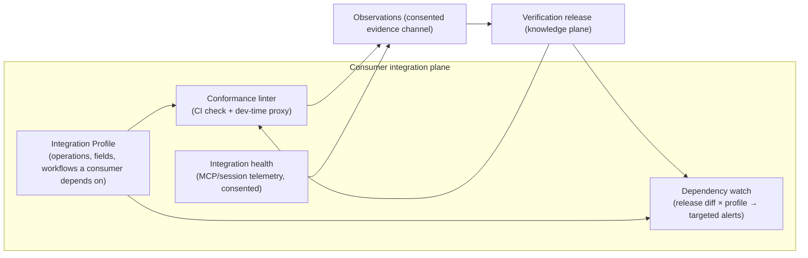

# DocentAPI Gap Analysis — What the World-Class Version Still Needs

> **Status:** Companion to `MASTER_TECHNICAL_PLAN.md` (which remains the authoritative build plan)
> **Date:** 2026-08-04
> **Inputs:** full code inventory of the repository as of `8e6b7b3`, `PLATFORM_ARCHITECTURE_AUDIT_2026-08-04.md`, and August-2026 web research into the competitive landscape and the 2024–2026 technical state of the art.

This document answers one question: **what is missing** — from the codebase, from the master plan, and from the product thesis — for DocentAPI to be the world-class owner of "the API part of the company." It does not restate what the master plan already gets right (truth semantics, R0–R4 policy gating, immutable observations → scoped claims → signed releases, coverage denominators). Those foundations are sound. The gaps are of four kinds:

1. **Execution gap** — the plan's own Phase 0 is effectively 0/11 done, and several trust-breaking behaviors are live in production today.
2. **Architecture gaps** — a missing sixth plane (consumer-side runtime), a missing feedback arc (demand-driven prioritization), and a missing distribution architecture.
3. **Knowledge-model gaps** — claim families integrators need that no layer of the plan produces.
4. **Technique gaps** — 2025–2026 research and spec changes the plan predates or under-uses.

---

## 1. Ground truth: what is actually built vs. what the plan assumes

The repository is a working product: two import pipelines (anonymous instant + authenticated deep analysis with docs crawl → LLM enrichment → clarification email loop), grounded Q&A, hosted multi-tenant MCP, playground, credential vault, Stripe billing, domain claims, CI sync, badges — 16 tables, 1,051 green tests. That is a credible front door.

But the delta against the master plan is stark and must be stated honestly:

### 1.1 Phase 0 ("trust-boundary correction") status: ~0 of 11 deliverables

Live today, verified in code:

| Trust gap | Where it lives |
|---|---|
| UI/badge call a ≤6-GET read-only sample "verified" / "Agent-Ready Score" | `VerifiedScorePanel.tsx`, `badge/[slug]/route.ts`, dashboard |
| Upstream credential accepted via `?key=` query string | `src/app/mcp/[id]/route.ts:98`, advertised in `McpBlock.tsx:61` |
| Raw **write** operations exposed as MCP tools (only `destructive` is filtered) | `src/lib/ir.ts:71` |
| `enabledForMcp` column exists but is dead — never read, no UI to change it | `schema.ts:139` vs `persistentApi.ts` |
| Credential "KMS" is an HKDF of an app env var, not a KMS | `src/lib/keys.ts`, `vault.ts:62` |
| Credential-audit writes fail **open** (log and continue) | `vaultStore.ts:31-35` |
| No kill switch, no effect/risk classes, no provider budgets, no feature flags | zero grep hits repo-wide |

**This is the single most important finding of this analysis.** Every week these ship, the product makes a public claim ("verified", "agent-ready") that its own master plan §1.2 defines as impossible certainty. Phase 0 is not hygiene — it is the difference between the pitch being true and false. It is also small (days, not months) and requires no new architecture.

### 1.2 Built-but-unreachable value (fastest wins in the repo)

The deep pipeline already produces its most valuable artifacts and then hides them:

- **Arazzo workflow docs + enriched OpenAPI** are generated on every completed analysis and written to Blob — and **no route or UI serves them**. `getArtifactText()` has zero non-test callers.
- **Per-action MCP analytics** (`/api/apis/[slug]/analytics`) is implemented and tested — no UI calls it.
- **CI token issuance** and **org MCP token** routes exist — no UI.
- **~500 field-lineage evidence facts per import** are written — nothing reads them back (`lineageEvidence.ts` says so in its own header).
- `score_runs.probes_run` never written; `MAX_PROBED_ACTIONS` exported, never used.

Surfacing these is pure product value at near-zero engineering cost, and the lineage facts are precisely the seed data the Behavior Explorer's DAG view needs.

### 1.3 Phases 1–2: 0% started

No `source_artifacts`, no Contract IR v2, no observations/claims/releases tables, no policy or planner code. The current normalizer is lossy by design (`mergeCombinators()` collapses `oneOf`/`allOf`; 300-action cap; single response/media selection), and `enrichedSpec.ts` admits there is "no clean 1:1 path back onto the original tree." The plan's sequencing (IR v2 before engine) remains correct.

---

## 2. The missing sixth plane: the consumer-side runtime

The master plan has five planes: provider inputs, control, execution, knowledge, serving. Every one of them faces the **provider**. The consumer — the developer or agent actually integrating — only appears as an anonymous reader of the serving plane.

This drops the README's product #4 (the **onboarding linter**: "verify a consumer's calls against the learned patterns") entirely, and with it the data flywheel (§9 of the README) that was supposed to replace traffic mirroring. It is the largest strategic omission in the plan, because the consumer side is where the network effect and the recurring engagement live. A provider publishes a release occasionally; a consumer integrates against it daily.

### 2.1 Proposed plane: Consumer Integration Plane

New domain objects:

- **`integration_profiles`** — the set of operations, fields, workflows, and behavioral claims a specific consumer depends on. Sources, cheapest first: (a) derived automatically from that consumer's MCP/Q&A sessions; (b) uploaded consumer contract (Pact files — see §6.3); (c) uploaded HAR/proxy capture; (d) manual selection in the explorer.
- **Conformance linter** — validate a consumer's requests/responses against the release: as a CI action (they already have `examples/github-action/`), and later as a local dev proxy. Every mismatch is either a consumer bug (their value) or a twin gap (our value — it becomes an obligation).
- **Consumer-scoped drift alerts** — release-to-release diff intersected with the integration profile: *"release N+1 changed 2 of the 12 fields you depend on, one breakingly."* Provider-facing drift is in the plan; consumer-facing impact analysis is not, and it is the alert people will actually pay attention to.
- **Third-party dependency monitoring** — scheduled re-verification already exists in the plan for freshness; expose it to consumers as "we continuously watch the API you depend on and alert on behavioral change." Optic (the main tool in this niche) was archived in January 2026; the position is vacant.

### 2.2 Why this plane is also the moat

Every linter mismatch, failed MCP call, and unanswerable question is **evidence about the API that probing didn't produce** — collected with consent, through the front door. This is the README's flywheel, given a concrete architecture. Without it, DocentAPI's knowledge only improves when a provider re-runs probes; with it, knowledge improves every time anyone integrates.

---

## 3. The missing feedback arc: demand-driven prioritization

The plan's priority formula (§11.3) ranks obligations by "integration importance" — but nothing in the plan defines where that number comes from. Today it would be a guess. Meanwhile the product already logs exactly the right signal and throws it away:

- Q&A questions that end in "unknown" (the plan *requires* answering unknown honestly — those unknowns are demand).
- MCP tool calls that fail or return empty.
- Explorer/search queries with no result.
- Clarification questions providers skip (skipped = provider doesn't know either = high-value unknown).

**Add a `demand_signals` table** (question/tool/search, subject binding to operation/field/workflow, frequency, consumer count) and make it a first-class input to the coverage planner. This converts the planner from "probe what the spec suggests" to "probe what integrators are actually blocked on" — which is both better economics (probe budget goes where value is) and a better sales story ("47 developers asked about refund behavior last month; here's the verified answer").

Second demand source the plan omits: **the provider's existing support exhaust.** With permission, ingest support tickets / community threads / Stack Overflow tags as R0 evidence-and-demand. The product's core value proposition is reducing support burden; reading the actual support burden is the shortest path to knowing which 20 questions matter. This is a bounded crawler + classifier — the `docsCrawler.ts` pattern already built, pointed at a new corpus, emitting demand signals and `candidate` claims instead of doc excerpts.

---

## 4. The missing distribution architecture

The plan builds a destination product and assumes visitors. World-class requires the knowledge to travel to where developers already are:

1. **Serve the artifacts that already exist** (§1.2). An `/apis/[slug]/artifacts` page + download routes for Arazzo and the enriched spec. Days of work; unlocks "we generate standards, not lock-in" immediately.
2. **`llms.txt` + `llms-full.txt` per API, generated from the release.** Stripe, Cloudflare, Vercel, Anthropic all ship it; 844K+ sites do. For DocentAPI it is nearly free — a release-view renderer — and the generated file cites claim scope/freshness inline, which no handwritten llms.txt does. One caveat from the research: a 300K-domain analysis found no measurable citation uplift from llms.txt, so treat it as table stakes for agent consumption, not a growth strategy.
3. **Embeddable Behavior Explorer.** The plan's non-goal ("not a docs CMS") is right, but it leaves the twin marooned on docentapi.xyz. An embeddable widget/iframe (DAG view, failure catalog, webhook contract) that providers drop into their existing Mintlify/ReadMe/Scalar pages puts the verified layer inside every doc site instead of competing with them. This is the concrete mechanism for "layer on top of existing docs."
4. **The public index as growth engine.** `scripts/seed-unclaimed.mjs` exists; the strategy doesn't. Seed static-only (honestly labeled `declared`/`inferred`) twins for the top public APIs, publish per-API scorecards and a periodic "State of API Behavior" report (which % of top-100 APIs document their idempotency? webhook retry policy?). This is the SSL-Labs/SecurityHeaders playbook: the free public graders became the category's front door. The claim ladder (`declared → observed → human_confirmed`) gives unclaimed pages a built-in upgrade path: "claim this API to verify it."
5. **Badge → manifest.** The badge should deep-link to the verification manifest (scope, coverage counts, freshness) rather than a bare score — the badge is the only DocentAPI surface most consumers will ever see on a provider's README.

---

## 5. Missing claim families: what integrators ask that no layer produces

The seven L2 layers + plan §16.8 additions cover runtime behavior thoroughly. But real integration pain starts before the first call and extends past the API surface. Missing claim families, all servable through the same claims/release machinery:

| Claim family | What it answers | Source |
|---|---|---|
| **Auth bootstrapping contract** | "How do I *get* credentials?" — portal steps, approval wait times, OAuth app registration, redirect-URI rules, scope→capability map, key rotation ceremony | Readiness questionnaire + docs crawl + provider review. Pure `declared`/`human_confirmed` — no probing needed |
| **Cost & quota contract** | "What does this call cost / count against?" — billing units per operation, metered vs flat, quota windows, overage behavior | Docs + provider declaration; observed 429/`Retry-After` already planned in `RateContract` |
| **Data-classification contract** | "Which endpoints return PII / regulated data? What can I store?" — per-field data classes, retention expectations, residency | Provider declaration + redaction detectors already running over observations |
| **Operational contract** | "Is it up? When does it break?" — status page link, incident history, maintenance windows, historical latency/availability from scheduled re-verification runs | Status-page ingestion + DocentAPI's own probe timing history (already stored, never aggregated) |
| **SDK reality map** | "Does the official SDK match the API?" — which SDKs exist, version lag, endpoints missing from SDKs | Registry crawl (npm/PyPI) + later: SDK-vs-spec diffing |
| **Named-spec conformance** | "Does this API follow standards I already know?" — Standard Webhooks conformance, IETF Idempotency-Key draft semantics, RFC 9457 problem details, RFC 8594 sunset headers | Probe-verifiable — see §7 |

The auth-bootstrapping family deserves emphasis: it is consistently the #1 time sink in real integrations, it is almost entirely *human-process* knowledge no competitor structures, and DocentAPI's questionnaire machinery is already the right tool to capture it. The plan models identity profiles for probing but never publishes "how a stranger obtains one."

---

## 6. Engine upgrades: 2025–2026 research the plan predates

The plan commits to Schemathesis + declared Links + static lineage. Correct core; four upgrades from the current research frontier, each chosen because its output survives as an evidence-backed claim (the filter that matters for DocentAPI):

### 6.1 Error-message mining as a claim source (EmRest, ISSTA 2025)
Statistically analyze 4xx bodies to infer undocumented inter-parameter constraints; cluster 5xx responses to steer probe budget toward bug-prone operations. For every other tool this is test plumbing; for DocentAPI the mined constraints **are inventory** — `candidate` claims like "`currency` is required when `amount` is set (inferred from 12 consistent 400s; unconfirmed)" that flow into the existing clarification loop for provider confirmation. This is the cheapest known generator of high-value questions.

### 6.2 Semantic dependency graph, dynamically updated (AutoRestTest ICSE 2025 + Morest)
The plan infers producer→consumer edges from declared Links, names, and static lineage. 2025 benchmarks are unambiguous: embedding-similarity matching of parameters across operations (not name-equality) plus updating the graph from execution feedback is the single biggest driver of stateful-sequence quality. `lineage.ts` (677 lines, name/shape heuristics) is the v1; the v2 planner should treat its output as candidates scored semantically and re-weighted by what actually worked at runtime — which the observation store makes natural.

### 6.3 Spec-enhancement preprocessing pass (RESTGPT/NLPtoREST pattern)
Before probing, run an LLM extraction pass over description prose to pull machine-readable constraints, examples, and inter-parameter dependencies into the Contract IR as `inferred` candidates — *validated against live responses before promotion* (NLPtoREST's validation step maps exactly onto the plan's epistemic classes). This makes Schemathesis dramatically more effective on real-world specs and is consistent with "LLMs propose, deterministic systems decide." `deepEnrich.ts` is 70% of this already — it just feeds a UI today instead of the planner.

### 6.4 Compensation registry + reversibility tiers (2026 agent-safety convergence)
Extend R2 policy: **no create-probe executes until its inverse operation is known** (registered compensation, or the probe is refused/flagged), RESTler-style GC as a mandatory sequence epilogue with orphan audit — the plan has cleanup (§12.5, §12.11) but does not make *pre-computed inverses a precondition of execution*, which is where the 2026 agent-safety literature landed. Bonus: DocentAPI's R0–R4 + policy-gated probing is ahead of published literature; writing it up as a methodology paper/post is free authority in the exact space (safe autonomous API interaction) the market is anxious about.

### 6.5 Two pull-forwards from Phase 9
- **Passive traffic as a second evidence channel** — not eBPF agents (enterprise sale, later), but *uploaded* HAR/mitmproxy/proxy captures, ingested through the same observation pipeline with `sampled`/traffic-scope labels. Covers endpoints that can't be safely probed and powers the consumer linter (§2). mitmproxy2swagger-class tooling makes this a bounded parser project.
- **Observation-grounded mock twin** — the plan's mock twin generates schema-valid variants; ground it instead in recorded exemplars, observed latency distributions, real error shapes, and verified state machines. No incumbent (Microcks, WireMock, Prism, Speedscale, Keploy) combines spec-grounding with evidence-grounding; this is also what makes "twin as the provider's better sandbox" (§8) credible.

### 6.6 Release diffing is a product, not plumbing
The plan diffs releases for provider review. Classify changes oasdiff-style (breaking/non-breaking/deprecation) and make the diff a **public, subscribable timeline per API** — behavioral changelog, computed. Combined with §2's integration profiles it becomes targeted breakage alerts; combined with §4's index it becomes "we caught Stripe changing X before their changelog did," the single most shareable artifact this product can produce. Optic's death (Jan 2026) left this position empty.

---

## 7. MCP architecture correction (spec moved under the plan)

The plan targets MCP 2025-11-25 auth + the July 2026 RC. The **2026-07-28 revision** landed as the largest-ever spec release and intends to be the final breaking one. Material changes for the plan's §20:

- **Stateless request/response** — no handshake/session; per-request `_meta` carries identity/capabilities. (The current stateless `mcp-handler` implementation is accidentally well-positioned.)
- **Tasks are now an extension** (`io.modelcontextprotocol/tasks`, poll-based `tasks/get`) — the plan's long-running task handles should target this, with plain run APIs as fallback exactly as §20.4 says.
- **MRTR replaces elicitation/sampling** (`resultType: "input_required"` + client retry) — the plan-before-effect confirmation flow should be expressed this way.
- **Auth: DCR deprecated in favor of CIMD** (Client ID Metadata Documents), RFC 9207 issuer validation required.
- **`ttlMs`/`cacheScope` response caching hints** — verification releases are immutable, so DocentAPI can set aggressive cache hints for free; almost no MCP server can. Cheap differentiator.
- **`Mcp-Method`/`Mcp-Name` headers** enable gateway-level authz/routing — relevant to the capability-grant design.

Also now research-confirmed (RAG-MCP: tool-selection accuracy 13.6%→43.1% with retrieval; models degrade past ~30–40 tools): hold a **hard budget of ~15 outcome-oriented tools** + `search_capabilities` over the claim graph + an opt-in code-execution mode for the long tail. The plan's §20.2 says this directionally; make the budget explicit and testable.

---

## 8. Product promotions the plan undersells

1. **Sandbox-as-a-service.** The mock twin is listed as an artifact. Promoted, it is a product: most providers' sandboxes are bad (the README's own validated pain — "sandboxes are fake"), and an evidence-grounded twin with scenario selection (failure modes, latency bands, webhook duplicates, eventual consistency) *is* a better sandbox. Host it per-API: the provider's docs link "try it against the behavioral sandbox." Export Microcks-compatible artifacts for the self-host crowd rather than competing on deployment infrastructure.
2. **Support deflection surface.** Grounded Q&A exists today. Packaged as an embeddable "Ask this API" widget + a support-inbox assist (draft evidence-cited replies), it attacks the provider's support-cost line item directly — the thing the buyer already measures. Same engine, new skin, directly monetizable.
3. **Serving-quality eval harness.** The plan's reference lab tests the *engine*; nothing continuously tests the *serving layer*. Add an integration-task eval suite (cold-agent completes N reference tasks via MCP; graded on correctness, hallucinated values, citation integrity) run on every release build — this is the "verified integration task success" north star (§32) turned into CI, and its scores are themselves publishable proof.

---

## 9. Competitive positioning (August 2026)

### 9.1 Three facts that change the frame

1. **Consolidation.** Anthropic acquired Stainless ($300M+, May 2026) and is winding down its hosted products; Postman acquired Fern (Jan 2026). Labs and incumbents are buying the spec→tooling pipeline. Neutral, evidence-based infrastructure is newly scarce — and Stainless's stranded hosted customers are migrating somewhere right now.
2. **The category is consensus.** MCP was donated to the Linux Foundation's Agentic AI Foundation (Dec 2025), 400M+ monthly SDK downloads; the 2026-07-28 spec is final; Mintlify measures **agents at 66% of docs traffic** (213M agent requests vs 105M human loads, July 2026). Capital concentrated on agent auth (Arcade $60M A), tool catalogs (Composio $29M A), and agent-readable docs (Mintlify $45M B @ $500M). "Agent-ready APIs" is no longer a thesis; it is a funded market.
3. **The verification position is validated but unclaimed.** SmartBear's **PactFlow Drift** (March 2026) sells "does the running API match its spec" — but inward, as provider CI, using the language "the evidence layer at the API boundary." Levo.ai/Salt/Akamai build observed-behavior inventories from traffic — but sell them to security teams. **Nobody publishes verified behavior as a consumable, evidence-cited knowledge product for consumers and agents.** The intersection DocentAPI targets is demonstrably real (adjacent products monetize each half) and demonstrably empty.

### 9.2 Closest thesis competitor: Jentic

Jentic ($4.5M pre-seed) is building "the open knowledge layer for AI agents and APIs" — 6,000+ APIs, 2,000+ **Arazzo** workflows (the OAK repository), plus an Arazzo runner. Their knowledge is spec-derived and crowd-sourced, **not verified against live APIs**. They validate the category and define the differentiation line: DocentAPI must lead with evidence (observed, scoped, reproducible) precisely because the free alternative is unverified spec-inference at scale.

### 9.3 Who is best at what (condensed)

| Capability | Best today |
|---|---|
| Spec → SDKs | Speakeasy (default winner post-Stainless) |
| Agent-readable docs / llms.txt at scale | Mintlify |
| Spec → curated MCP tools + hosting | Speakeasy Gram |
| MCP governance/gateway | Kong (enterprise), Zuplo (mid-market) |
| Agent auth (act-as-user) | Arcade.dev |
| Third-party tool catalogs | Composio |
| Spec ↔ implementation drift (provider CI) | PactFlow Drift |
| Traffic → spec/inventory | Levo.ai (sold to security) |
| Traffic → tests + mocks | Keploy |
| Mocking from specs incl. AsyncAPI | Microcks (CNCF Incubating, May 2026) |
| Stateful probing engines | Schemathesis / EvoMaster / RESTler (OSS, not productized as knowledge) |
| Arazzo workflow knowledge | Jentic (spec-derived, unverified) |
| API changelog as product | Bump.sh |
| Distribution to API teams | Postman (500K orgs; new API Catalog) |
| **Published, verified behavioral twin for humans + agents** | **Nobody** |

### 9.4 Whitespace DocentAPI is positioned to own

1. **The verification trust mark** — behavior verification as a *published consumable*, not a CI gate (§9.1.3).
2. **Generated Arazzo from live probing.** Arazzo is now referenced by the MCP spec itself and adopted by Kong/Speakeasy/Jentic — yet every Arazzo document in existence is hand-written or spec-inferred. DocentAPI already emits Arazzo (§1.2, currently unreachable) and the plan verifies workflows: **emitting *verified* Arazzo is uncontested ground.** This should be named a flagship artifact, not a line item.
3. **MCP tool conformance attestation.** ~9,400 MCP servers across fragmented registries; none verify listed tools actually work. Kong's registry governs *access*, not *accuracy*. "This server's tools were exercised against the live API on date X; N/M behaviors confirmed" is a natural extension of verification releases — including attesting *third-party* MCP servers, which turns every registry into a distribution channel.
4. **The undocumented-behavior corpus** (error semantics, rate-limit reality, pagination quirks, consistency windows) sold to consumers and agents rather than security teams.
5. **Neutral ground post-consolidation** — publish to every agent ecosystem (MCP, OpenAI Apps SDK, A2A) from an independent evidence base.

### 9.5 The three threats, each with an architectural answer

1. **Platform bundling.** Postman/Kong/Zuplo/Mintlify/ReadMe all ship a "good enough" spec-derived agent path by default; DocentAPI loses on distribution by default. *Answer:* §4's distribution architecture (embed, artifacts, index) plus refusing to compete on artifact generation — compete on what artifacts are **grounded in**. Bundlers ship spec-derived tools; only DocentAPI ships claims with receipts.
2. **Agents may self-discover at call time.** superglue self-heals broken integrations; Membrane's AI writes integrations from docs; labs are internalizing API knowledge (Anthropic–Stainless). *Answer:* the durable premium is where trial-and-error is unacceptable — money movement, messaging, deletion, idempotency/retry safety, webhook contracts. An agent cannot safely "discover" whether a duplicate POST double-charges. This is exactly the fintech beachhead argument; keep it, and let the twin position itself as the **safety substrate for agent self-service**, not a substitute for it.
3. **The sandbox-credential trust objection.** DocentAPI's model asks providers to hand sandbox credentials to a third party that probes stateful endpoints — a real security/legal objection PactFlow Drift sidesteps by living in the provider's own CI. *Answer (new architecture item):* pull a lightweight **provider-CI runner mode** far forward of Phase 8 — a GitHub Action / container that executes a signed, policy-bound plan *inside the provider's CI*, where credentials already live, returning only redacted observations. It reuses the plan's runner protocol verbatim, converts the trust objection into a deployment choice, and meets PactFlow on its own turf with a stronger artifact. The full VPC/Helm enterprise runner remains Phase 8.

---

## 10. What NOT to add (discipline check)

Confirmed non-goals, unchanged by this analysis: docs CMS, Cartesian fuzzing, autonomous production mutation, LLM-as-oracle, microservices-first. Additions from research:

- **Skip** formal API-ontology work — the claim graph *is* the ontology; ship it instead of modeling it.
- **Skip** eBPF/agent-based traffic capture — upload-based ingestion first; kernel agents are an enterprise sale the team cannot support yet.
- **Watch, don't build, x402/agent payments** — foundation-backed and real (100M+ transactions on Base, Cloudflare/AWS at edge), directly relevant to the fintech beachhead, but it is a monetization protocol decision, not architecture. Track it; revisit when task-MCP executes money-adjacent workflows.
- **Don't chase GraphQL/gRPC/AsyncAPI adapters early** — the plan already sequences these correctly behind HTTP release quality; nothing in the 2026 landscape changes that.

---

## 11. Revised sequencing for the actual team

The plan's own estimate is 7–10 months for a senior team of 3–4, or 14–20 months solo — before Phase 7 value. That sequencing is *engineering-correct* and *commercially wrong* for a solo builder: it is horizontal (all schema, then all execution, then all serving), so nothing is sellable until nearly everything works. Restructure into vertical slices that each end in a shippable trust artifact:

| Slice | Contents | Ships |
|---|---|---|
| **S0 — Make the pitch true** (days) | Phase 0 verbatim: rename to Sampled Live Check + sample manifest, kill `?key=`, enforce `enabledForMcp` + writes-off-by-default, kill switch, KMS root, audit fail-closed, feature flags | Honest current product; removes live liability |
| **S1 — Unlock built value** (days) | Serve Arazzo/enriched-spec artifacts; analytics UI; read lineage facts into a first DAG view; badge→manifest link | Visible differentiation from existing code |
| **S2 — Static twin as a real release** (weeks) | Minimal `source_artifacts`/`api_versions` + IR v2 for the *supported subset* + `behavior_claims`/`verification_releases` (static-only: `declared`/`inferred`, honest labels) + llms.txt + release diff timeline | First "verification release" exists; public index seeding becomes honest; distribution surfaces (§4) go live |
| **S3 — One governed run, read-only** (weeks) | Policy + budgets + QStash Workflow + read-only runner + observations, against MudraCore + 2–3 public sandboxes | First `observed` claims; "Sampled Live Check" becomes coverage-labeled truth |
| **S4 — One stateful workflow, end-to-end** (weeks–months) | Fixtures/cleanup/compensation registry + Schemathesis + EmRest mining + demand-driven planner, for *selected workflows* on MudraCore sandbox | The 90-second demo: create-transfer prerequisite chain, state machine, failure catalog — verified, cited, reproducible |
| **S5 — Consumer plane v1** (weeks) | Integration profiles from MCP sessions + CI conformance linter + consumer drift alerts on release diffs | The flywheel starts; recurring consumer engagement |

Each slice is demoable, none strands work, and the plan's phase exit gates survive as the quality bars inside each slice. The full Phase 5–8 program (async layers, review UX at scale, enterprise runners, protocols) remains the map after S5 — by then with design partners shaping priority.

---

## 12. Summary: the twelve gaps that matter

1. **Phase 0 is unstarted and the live product currently overstates its evidence** — fix first, it's days of work.
2. **Generated Arazzo/enriched-spec artifacts are unreachable by users** — serve them; *verified* Arazzo is uncontested competitive ground (§9.4).
3. **No consumer-side plane**: the onboarding linter, integration profiles, and consumer drift alerts vanished from the plan — and they are the flywheel.
4. **No demand-driven prioritization**: Q&A unknowns, MCP failures, and support exhaust should rank the probe queue.
5. **No distribution architecture**: embeddable explorer, llms.txt, public index/scorecards, badge→manifest.
6. **Missing claim families**: auth bootstrapping, cost/quota, data classification, operational history, SDK reality, named-spec conformance.
7. **Engine techniques a generation behind current research**: error-message mining, semantic+dynamic dependency graphs, spec-enhancement preprocessing, compensation-first mutation.
8. **MCP section targets a superseded spec** — rebase on 2026-07-28 (stateless, tasks extension, MRTR, CIMD, ttlMs).
9. **No answer to the sandbox-credential trust objection** — add the provider-CI runner mode (§9.5.3) far ahead of the Phase 8 enterprise runner.
10. **MCP tool conformance attestation is unowned whitespace** the release machinery can claim (§9.4.3).
11. **Undersold products hiding in planned artifacts**: sandbox-as-a-service, support deflection, serving-quality evals.
12. **Sequencing is horizontal**; a solo builder needs vertical slices that each ship a trust artifact.
