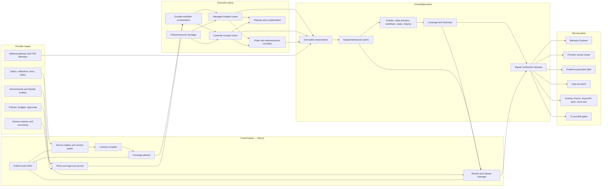
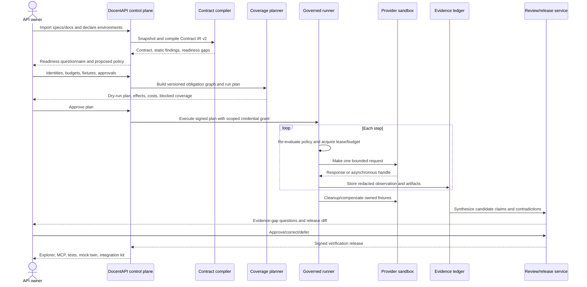
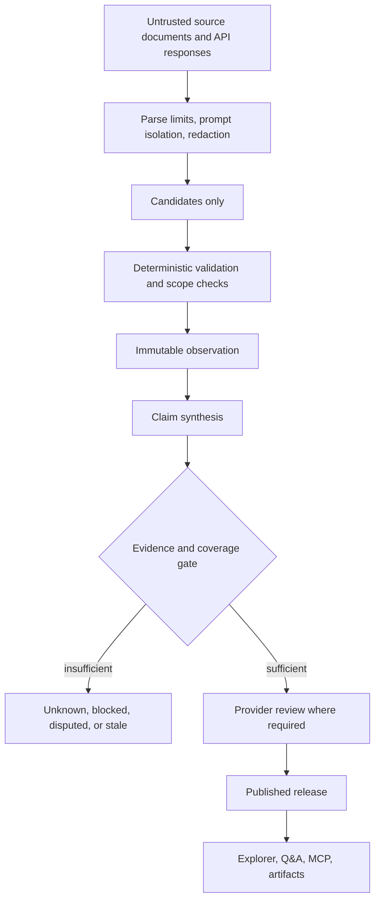
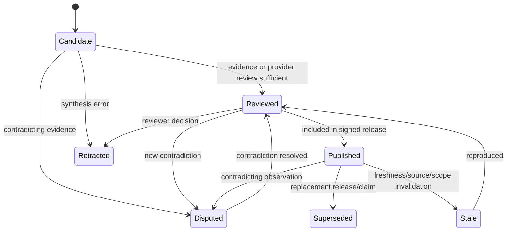
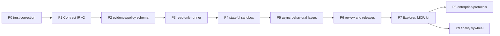

# DocentAPI Master Technical Plan

> **Status:** Authoritative implementation plan  
> **Date:** 2026-08-04  
> **Product target:** A governed, continuously verified behavioral twin for APIs  
> **Supersedes:** implementation sequencing in `TECH_IMPLEMENTATION.md`, `BUILD_PLAN.md`, and `ARCHITECTURE_2026-05-20.md`  
> **Retains:** the product thesis in `README.md`, the seven behavioral layers in `L2_ENGINE_SPEC.md`, and the findings in `PLATFORM_ARCHITECTURE_AUDIT_2026-08-04.md`

This is the implementation-ready plan for taking the current DocentAPI product to the product originally described: a company supplies its API contract, documentation, test environments, identities, and operating constraints; DocentAPI compiles all declared knowledge, safely exercises the API, learns its stateful and asynchronous behavior, asks the provider only what cannot be established, publishes a reviewed behavioral model, and serves that model to humans, agents, tests, SDKs, and generated integration kits.

The plan is deliberately additive. The current importer, product pages, Q&A, MCP handler, clarification workflow, tenancy, billing, SSRF controls, and test suite remain useful. The work below evolves them behind versioned interfaces and dual-write migrations rather than replacing the application wholesale.

---

## 1. Product contract

### 1.1 The system must answer five questions

For a specified API version, environment, tenant class, identity role, region, and intended outcome, DocentAPI must answer:

1. **What can be done?** Operations, events, resources, workflows, and capabilities.
2. **How is it done?** Ordered prerequisites, value provenance, authentication, state gates, polling/webhook behavior, retries, and compensations.
3. **What actually happens?** Observed responses, errors, timing, state transitions, idempotency, rate behavior, and environment divergence.
4. **How certain are we?** Source, scope, freshness, sample size, contradictions, completeness, and reproducibility.
5. **What may this caller safely do?** Permissions, side effects, approval requirements, budgets, data policy, and execution mode.

### 1.2 The system must never imply impossible certainty

- A finite sample does not prove every value an open field can accept.
- Sandbox behavior does not silently stand in for production behavior.
- One role or tenant does not prove behavior for every role or tenant.
- A successful request does not prove retry safety, eventual behavior, or webhook delivery.
- A provider statement, model inference, and runtime observation are different epistemic classes.
- “Verified” is never global; it always names a scope and a coverage denominator.

### 1.3 North-star output

The primary output is a **Verification Release**:

```text
VerificationRelease
  source and API version hashes
  environments, regions, tenants, and identity roles covered
  immutable probe policy and approvals
  coverage obligations and results
  published behavioral claims and contradictions
  workflow/state/error/webhook/idempotency artifacts
  supporting evidence hashes and reproduction status
  generated Overlay/Arazzo/AsyncAPI/tests/MCP artifacts
  reviewer, signature, issued time, freshness deadline, and superseded release
```

The explorer, Q&A, MCP server, SDK helpers, badges, mock twin, and reference application are views or derivatives of this release. They are not separate sources of truth.

---

## 2. Scope and non-goals

### 2.1 In scope

- Lossless ingestion of OpenAPI 3.0, 3.1, and 3.2, Swagger 2 conversion, Postman, and cURL.
- Safe external reference resolution and versioned source snapshots.
- OpenAPI Links, callbacks, webhooks, auth alternatives/combinations, all request/response representations, parameter serialization, and JSON Schema dialect fidelity.
- Documentation crawling, changelogs, examples, SDK snippets, and optional telemetry as separate evidence sources.
- Multiple environments, regions, tenants, credential roles, OAuth scopes, and secret bundles.
- Policy-controlled HTTP probing with stateful workflows, fixture management, cleanup, adaptive exploration, asynchronous correlation, and reproducibility.
- The seven L2 layers: entity dependency, state machines, failures, environment divergence, webhook behavior, idempotency/safety, and cross-provider correlation.
- Typed value domains, invariants, pagination, rate behavior, eventual consistency, and workflow compensation.
- Human readiness questions, evidence-gap questions, contradiction review, and release approval.
- Behavior Explorer, provider control center, grounded Q&A, task-first MCP, conformance tests, mock twin, and verified integration kit.
- GraphQL after the HTTP engine is complete; AsyncAPI/webhooks next; gRPC after that.
- Managed SaaS execution and an enterprise customer-hosted runner.

### 2.2 Explicit non-goals for the core program

- A general documentation CMS, markdown editor, theme marketplace, or replacement for ReadMe/Mintlify/Scalar.
- Brute-forcing the Cartesian product of every parameter value.
- Autonomous production mutation by default.
- Treating LLM output as behavioral evidence or a correctness oracle.
- Mirroring all production traffic as the default onboarding path.
- Generating an arbitrary business application before workflows are verified.
- Rewriting the working product into microservices before an isolation or scaling boundary requires it.
- Promising complete discovery of behavior that is unreachable, forbidden, time-dependent, or externally controlled.

---

## 3. Current baseline and reuse map

The current repository is a working Next.js modular monolith. The following components remain and become compatibility or product layers around the new engine.

| Current component | Keep | Evolve into |
|---|---:|---|
| `src/lib/importer/*` | Yes | Source adapters feeding the lossless contract compiler |
| `src/lib/normalize.ts`, `src/lib/ir.ts` | Temporarily | `LegacyActionProjection` generated from Contract IR v2 |
| `src/lib/fieldMap.ts`, `src/lib/lineage.ts` | Yes | Static inference candidates feeding the planner and claim synthesizer |
| `src/lib/docsCrawler.ts`, `src/lib/deepEnrich.ts` | Yes | Bounded documentation evidence and semantic candidate generation |
| `clarifications` workflow | Yes | General review items, readiness questions, and evidence-gap questions |
| `src/lib/probes/*` | Yes, relabeled | A sampled smoke-check suite, not the behavioral verifier |
| `src/lib/upstream.ts`, `src/lib/ssrf.ts` | Yes | HTTP adapter foundation; replace serialization with contract-faithful codecs |
| `src/lib/queue.ts` | Yes for simple messages | QStash messaging wrapper; durable runs move to QStash Workflow |
| `src/lib/ratelimit.ts`, Redis | Yes | UI/abuse limits plus weighted provider budgets and resource leases |
| `src/lib/vault.ts`, `vaultStore.ts` | Transitional | Typed identity credentials with cloud-KMS-wrapped roots |
| `evidence_facts` | Transitional | Static/legacy fact view backed by observations and behavioral claims |
| `scores`, `score_runs` | Transitional | Sampled-check history; verification releases carry real coverage |
| public API page and playground | Yes | Behavior Explorer and dry-run/task execution surface |
| advisor/Q&A tools | Yes | Evidence-cited release query layer |
| hosted MCP | Yes | OAuth-protected, task-first serving surface |
| Clerk, Neon, Drizzle, Blob, Stripe, Resend | Yes | Existing control-plane services |

### 3.1 Immediate terminology corrections

- Rename UI/API language from **Verified Agent-Ready Score** to **Sampled Live Check** until release-backed coverage exists.
- Reserve **verified** for a claim or release with a scope, evidence, and coverage manifest.
- Rename new behavioral claims at the database level to `behavior_claims`; the existing `claims` table is domain-ownership verification and must not be overloaded.
- Call the new canonical representation **Contract IR v2**; keep `ImportRecord` as a compatibility projection.

---

## 4. Architecture principles

1. **Preserve before normalizing.** Store raw artifacts and source locations; simplify only into explicitly versioned projections.
2. **Observations are immutable; claims are retractable.** Never overwrite history to make the current answer look consistent.
3. **Scope is part of every truth.** Version, environment, identity, tenant, and region are never optional context for observed behavior.
4. **Policy is executable.** Approval text in a UI is insufficient; the runner evaluates the same immutable policy immediately before every network effect.
5. **Plans are data.** A run executes a versioned plan with deterministic steps, budgets, fixture ownership, and compensation.
6. **LLMs propose, deterministic systems decide.** Models summarize, cluster, label, and draft questions; schema validators, policy checks, observations, and reviewers decide what is publishable.
7. **Unknown is a first-class result.** Blocked, unsafe, unobservable, contradicted, and stale obligations remain visible.
8. **Materialize the serving path.** Explorer and MCP read release views; they do not traverse raw run history or invoke an LLM for correctness.
9. **Transport reliability is not business idempotency.** QStash deduplication is an optimization; Postgres uniqueness and step semantics remain authoritative.
10. **Start modular, split by trust boundary.** Keep the control plane in the current app; isolate network execution in runners because credentials and side effects demand it.

---

## 5. Target architecture

### 5.1 System planes



### 5.2 End-to-end provider journey



### 5.3 Trust boundary



Nothing produced by crawling, an LLM, a single probe, or unreviewed telemetry bypasses this chain.

---

## 6. Deployment topology and responsibilities

### 6.1 Control plane

Keep the current Next.js application on Vercel for:

- authentication, organizations, billing, onboarding, and dashboards;
- source upload/fetch orchestration;
- contract compilation for bounded imports;
- run creation, plan review, approvals, cancellation, and status;
- human questions and release review;
- Explorer, Q&A, MCP metadata, artifacts, and public release pages;
- scheduled drift triggers and notifications.

The control plane must never hold a long-lived plaintext provider credential in logs, queue bodies, workflow state, model prompts, or client responses.

### 6.2 Durable orchestrator

Adopt `@upstash/workflow` for run orchestration. Use plain QStash for isolated notifications and fan-out messages. The orchestrator owns:

- stage ordering and durable retries;
- wait/poll/timer steps;
- pause, cancellation, and compensation dispatch;
- per-provider queue selection;
- step leases and deadlines;
- transitions between planning, execution, synthesis, review, and release.

Postgres remains authoritative for run state. A workflow delivery may repeat; every transition is guarded by a unique `(run_id, step_key, attempt)` or explicit compare-and-set.

### 6.3 Managed runner

Introduce a separately deployable Node.js runner after the schema/policy foundation exists. It receives a signed, narrow step envelope rather than an entire customer model.

Responsibilities:

- exchange a short-lived grant for exactly one identity profile;
- re-evaluate host, operation, effect, budget, and data policy;
- build a protocol-faithful request;
- resolve DNS and enforce egress/SSRF policy at connection time;
- make one bounded network attempt;
- redact and fingerprint request/response artifacts;
- emit the observation and budget consumption;
- never synthesize claims or decide publication.

Run managed workers with isolated egress identities. For early traffic, one regional pool with per-tenant logical isolation is acceptable. Enterprise tiers require dedicated egress IPs or worker pools.

### 6.4 Customer-hosted runner

The enterprise runner uses the same runner protocol and policy evaluator, packaged as a signed container/Helm chart.

- Pull signed work from DocentAPI over outbound HTTPS; no inbound customer firewall rule is required.
- Resolve secrets from the customer’s secret manager or workload identity.
- Keep disallowed raw data inside the customer boundary.
- Return redacted observations, hashes, timing, and policy results.
- Support customer approval hooks and a local kill switch.
- Pin runner versions in a verification release.

### 6.5 Data services

| Service | Authoritative use | Not authoritative for |
|---|---|---|
| Neon Postgres | contracts, plans, policies, runs, observations metadata, claims, coverage, releases, review | large raw bodies |
| Vercel Blob/object storage | encrypted source snapshots, redacted artifacts, repro bundles, generated releases | mutable current truth |
| Upstash Redis | rate buckets, short leases, caches, resource-pool accelerators, kill-switch cache | evidence or final run state |
| QStash/Workflow | delivery and orchestration | exactly-once business semantics |
| Cloud KMS/HSM | wrapping root, signing keys, scoped unwrap | application data storage |
| OpenTelemetry backend | operational traces and metrics | the behavioral evidence ledger unless explicitly imported |

---

## 7. Canonical domain model

### 7.1 Contract IR v2

Contract IR v2 is a versioned, protocol-neutral graph with protocol-specific extensions. It preserves source locations and alternatives.

```ts
type Contract = {
  contractVersion: '2';
  apiVersionId: string;
  sourceArtifactIds: string[];
  protocolSurfaces: ProtocolSurface[];
  environments: Environment[];
  operations: Operation[];
  schemas: SchemaNode[];
  securitySchemes: SecurityScheme[];
  workflows: DeclaredWorkflow[];
  incomingEvents: EventContractSeed[];
  compilerManifest: CompilerManifest;
};

type Operation = {
  id: string;
  protocol: 'http' | 'graphql' | 'grpc' | 'message';
  stableKey: string;
  sourceLocation: SourceLocation;
  request: RequestContract;
  outcomes: OutcomeContract[];
  securityAlternatives: SecurityRequirement[];
  servers: ServerBinding[];
  effects: EffectClassification;
  declaredLinks: OperationLink[];
  callbacks: CallbackContract[];
  lifecycle: { deprecated?: boolean; sunsetAt?: string };
};
```

For HTTP, `RequestContract` retains parameters by location, `style`, `explode`, `allowReserved`, examples, every content type, encoding, headers, cookies, and body requirements. `OutcomeContract` retains all explicit codes, ranges, default, headers, links, every content type, streaming/event semantics, and examples.

### 7.2 Environment and identity scope

```ts
type BehaviorScope = {
  apiVersionId: string;
  environmentId: string;
  region?: string;
  tenantClass?: string;
  identityProfileId?: string;
  providerConfigurationHash?: string;
};
```

An `IdentityProfile` describes authentication mechanism, provider role, OAuth scopes, tenant, allowed operations, expiry behavior, and a reference to a credential bundle. The secret itself is not part of the contract, plan, or observation.

### 7.3 Semantic model

The semantic model contains:

- `EntityType`, `EntityKey`, and `EntityInstanceRef`;
- `FieldBinding` between request/response/event locations;
- `ValueDomain` with `exact | constrained | relational | derived | provider_declared | sampled | unknown`;
- `Workflow`, `WorkflowStep`, conditions, branches, joins, sagas, and compensations;
- `StateMachine`, `State`, `Transition`, terminal state, reversibility, and invariant;
- `FailureMode`, trigger, error identity, retry strategy, fix, and state relation;
- `WebhookContract`, `EventType`, signature, ordering, duplicate, retry, timeout, and replay behavior;
- `IdempotencyContract`, key placement/scope/window/failure caching/conflict behavior;
- `PaginationContract`, cursor provenance, termination, consistency, and mutation interaction;
- `RateContract`, quota scope, burst, refill/window, headers, retry behavior, and observed enforcement;
- `ConsistencyContract`, polling interval, convergence window, and read-after-write behavior;
- `EnvironmentDivergence` and `CrossProviderBinding`.

### 7.4 Evidence model

- An **Observation** is an immutable record of what one source or one execution attempt produced.
- A **Behavioral Claim** is a scoped proposition derived from one or more observations.
- A **Coverage Obligation** is a testable or reviewable expectation.
- A **Coverage Result** connects an obligation to observations and a terminal status.
- A **Review Item** is a readiness gap, contradiction, unsafe obligation, or missing evidence requiring a human decision.
- A **Verification Release** freezes approved claims and coverage at a point in time.

---

## 8. Database design

### 8.1 Source and contract tables

| Table | Key columns and purpose |
|---|---|
| `source_artifacts` | `id`, `api_id`, `kind`, `media_type`, `source_url`, `content_hash`, `blob_ref`, `trust_class`, `fetched_at`, `supersedes_id` |
| `source_fetches` | resolved URL, DNS/IP/redirect manifest, byte count, status, error, policy decision |
| `api_versions` | provider version label, canonical hash, status, first/last seen, predecessor |
| `contract_compilations` | compiler version, input hashes, IR hash/blob, warnings, fidelity status |
| `protocol_surfaces` | version, protocol, endpoint/channel namespace, dialect/binding |
| `contract_operations` | stable key, surface, source pointer, method/path or protocol selector, effect class |
| `contract_parameters` | operation, location, serialization, schema ref, required, examples |
| `contract_representations` | request/outcome, media type, encoding, schema ref, examples |
| `contract_outcomes` | operation, status selector, headers, links, representation set |
| `contract_security_requirements` | alternative index, required schemes, scopes, AND/OR semantics |

Store large IR snapshots in Blob and normalized query-critical records in Postgres. Every normalized row keeps a JSON Pointer/source span back to its artifact.

### 8.2 Environment, policy, and identity tables

| Table | Key columns and purpose |
|---|---|
| `environments` | API, name, kind, base/server bindings, region, production flag, status |
| `identity_profiles` | environment, tenant class, role, scopes, auth kind, credential bundle ref, active window |
| `credential_bundles` | typed encrypted metadata and KMS-wrapped data key; no secret JSON in ordinary logs |
| `credential_components` | header/query/cookie key, OAuth client secret, refresh token, mTLS references, version |
| `probe_policies` | immutable policy JSON/hash, allowed effects/operations/hosts, budgets, data/retention policy |
| `policy_approvals` | policy, approver, role, approved hash, scope, expiry, revocation |
| `kill_switches` | global/org/API/environment/identity scope, state, actor, reason, expiry |

### 8.3 Planning and execution tables

| Table | Key columns and purpose |
|---|---|
| `coverage_obligations` | stable obligation key, version/scope, dimension, priority, risk, status |
| `run_plans` | contract hash, planner version, policy hash, scope, estimated calls/effects/cost, signature |
| `run_plan_steps` | step key, dependency set, operation, generator, fixture inputs, oracle, compensation, risk |
| `probe_runs` | plan, status, requested/approved/started/completed/canceled times, runner mode |
| `run_steps` | run + step key, status, current attempt, deadline, lease/fencing token, result summary |
| `step_attempts` | request fingerprint, timing, transport outcome, observation ID, retry classification |
| `budget_ledger` | run/policy/provider dimension, reserved/consumed/released units, monetary/message effects |
| `resource_instances` | fixture namespace, provider object type/id hash, creator step, state, lease, cleanup status |
| `cleanup_attempts` | resource, compensation step, result, next retry, quarantined flag |
| `workflow_failures` | transport/DLQ reference, class, payload hash, operator resolution, replay ID |
| `outbox_events` | transactionally emitted domain event, status, delivery attempts, dedupe key |

### 8.4 Observation, knowledge, and release tables

| Table | Key columns and purpose |
|---|---|
| `observations` | immutable attempt/source record, scope, kind, redaction state, artifact hashes, observed time |
| `observation_artifacts` | encrypted/redacted blob ref, schema fingerprint, retention class, access policy |
| `redaction_results` | policy/version, detectors applied, fields removed/tokenized, failure state |
| `behavior_claims` | subject/predicate/object, scope hash, epistemic class, confidence, completeness, lifecycle state |
| `claim_support` | claim ↔ observation, support/contradict role, weight, synthesizer version |
| `claim_history` | state transitions, supersession/retraction, actor/model/reviewer, reason |
| `value_domains` | field binding, domain kind, rule/value artifact, completeness, scope, claim ref |
| `entity_types`, `entity_keys`, `field_bindings` | normalized semantic graph |
| `workflows`, `workflow_steps`, `workflow_bindings` | verified outcome graph and materialized call plans |
| `state_machines`, `states`, `state_transitions`, `invariants` | verified lifecycle model |
| `failure_modes`, `event_contracts`, `idempotency_contracts`, `rate_contracts`, `consistency_contracts` | behavioral layer artifacts |
| `coverage_results` | obligation, result, observation/claim refs, last verified, expiry |
| `review_items`, `review_decisions` | readiness, contradiction, coverage gap, risk exception, structured answer |
| `verification_releases` | immutable manifest hash, scope, coverage summary, status, signature, expiry, predecessor |
| `release_claims`, `release_artifacts` | frozen membership and generated artifact references |

### 8.5 Indexing and retention

- Unique `(api_version_id, stable_key)` on contract operations and obligations.
- Unique `(run_id, step_key)` and `(run_id, step_key, attempt)` for execution idempotency.
- Unique active resource ownership by `(environment_id, provider_object_type, provider_object_hash)` where applicable.
- Composite claim lookup on `(api_version_id, scope_hash, subject, predicate, state)`.
- Time/partition observations and MCP calls monthly once volume requires it.
- Index review queues by `(api_id, status, severity, created_at)` and releases by `(api_id, environment_id, issued_at)`.
- Retain metadata and hashes longer than bodies. Default raw quarantine: disabled; redacted artifacts: 30 days; published release evidence: release lifetime plus audit window. Policy may shorten all body retention to zero.

### 8.6 Compatibility and migration rules

- Never reuse the existing ownership `claims` table.
- Keep `spec_versions` and `actions` during migration; populate them from a `LegacyActionProjection` of Contract IR v2.
- Keep `evidence_facts` as a materialized compatibility view/dual-write target until advisor tools read release claims.
- Keep `scores` as Sampled Live Check history; do not migrate it into a verification release.
- Map `analysis_runs` to legacy enrichment stages; all new execution uses `probe_runs/run_steps`.
- Backfill new tables by recompiling stored raw spec snapshots, never by reverse-engineering the lossy `actions` rows.

---

## 9. Source ingestion and contract compilation

### 9.1 Pipeline

```text
receive source
  → identify media/protocol/version
  → store immutable bytes and hash
  → validate size/type/structure
  → resolve approved references into a fetch manifest
  → parse without semantic loss
  → compile Contract IR v2
  → run static consistency checks
  → generate legacy action projection
  → persist compilation + warnings
  → schedule docs/source enrichment
  → create readiness review items
```

### 9.2 Safe reference resolver

External references are necessary for real enterprise specs, but every fetch follows the SSRF boundary already established in `src/lib/ssrf.ts`:

- HTTP/S only; no userinfo; normalize hostnames and ports.
- Validate the initial URL and every redirect.
- Resolve all addresses and reject private, loopback, link-local, multicast, metadata, and reserved ranges.
- Pin the validated address for the connection while preserving TLS hostname verification.
- Default same-site policy; cross-site references require an explicit source allowlist.
- Limit redirects, bytes per artifact, total bytes, nesting depth, number of references, and wall time.
- Detect cycles and repeated content hashes.
- Cache by URL + validator + content hash, but revalidate according to policy.
- Persist the fetch/DNS/redirect manifest as evidence of what was compiled.

### 9.3 Fidelity checks

Build a golden corpus covering:

- OpenAPI 3.0/3.1/3.2 and Swagger 2 conversion;
- local and external refs, circular refs, and overlays;
- security alternatives and combined schemes;
- cookie parameters, deepObject, arrays, matrix/label/form serialization, reserved characters;
- JSON, vendor JSON, form, multipart/binary, XML, SSE/streaming, empty bodies;
- multiple success/error responses, response headers, links, callbacks, and webhooks;
- discriminators, readOnly/writeOnly, nullable/type arrays, unevaluated properties, schema dialect changes;
- examples at parameter/media/schema levels;
- server variables and relative URLs.

Every corpus fixture asserts both semantic extraction and source round-trip pointers. Any unsupported feature becomes an explicit compiler warning and uncovered obligation, never silent loss.

### 9.4 Documentation and semantic enrichment

- Retain the current bounded crawler, but store full permitted redacted artifacts separately from short model excerpts.
- Classify pages by auth, errors, limits, webhooks, concepts, changelog, quickstart, and endpoint reference.
- Link paragraphs to contract subjects using deterministic identifiers before asking a model to interpret them.
- Treat page content and API descriptions as untrusted prompt data.
- LLM output creates `candidate` claims or review-item drafts only.
- Require an exact supporting quote/source pointer for any documentation-derived claim.
- On source changes, invalidate only claims whose supporting source or compiled subject changed.

### 9.5 Static findings

Static analysis should produce obligations and candidate claims for:

- undocumented or ambiguous authentication;
- missing operation IDs, response schemas, examples, or error models;
- conflicting required/nullable/readOnly/writeOnly semantics;
- incomplete callback/webhook definitions;
- declared Links and inferred producer-consumer candidates;
- missing idempotency signals on consequential writes;
- unsafe or ambiguous operation effects;
- spec/document contradictions;
- duplicate schema concepts and possible entities;
- deprecation/version drift.

---

## 10. Readiness, policy, and approval

### 10.1 Readiness gate

Before a network run, require:

- target environment and base/server binding;
- whether the environment contains real people, money, messages, regulated data, or irreversible state;
- identity profiles and roles/scopes to cover;
- allowed/forbidden operations and effect classes;
- provider call, concurrency, byte, object, time, monetary, and message budgets;
- fixture creation strategy, namespace/tag, TTL, and cleanup operations;
- callback/webhook registration and receiver rules;
- rate-limit documentation and maintenance windows;
- PII/secret data classes and retention/export policy;
- emergency contact, kill-switch owners, and approval expiry.

The compiler can run without readiness. R0/R1 observation may run only if the policy permits it. Any mutation waits for a complete, approved readiness policy.

### 10.2 Effect and risk classification

Each operation and workflow step has both a deterministic default and a provider override.

| Risk | Examples | Required authorization |
|---|---|---|
| R0 passive | parse, compile, generate plan | none beyond source access |
| R1 observation | approved read, introspection, HEAD | environment allowlist + call budget |
| R2 reversible | create/update namespaced sandbox fixture with proven cleanup | policy approval + fixture/cleanup contract |
| R3 consequential | delete, email/SMS, payment auth, account changes, publication | explicit per-operation approval, effect budget, confirmation |
| R4 irreversible/regulated | production deletion, money movement, legal/identity/health effect | disabled in managed autonomous probing; customer-controlled validation only |

Additional effect tags include `creates_resource`, `modifies_resource`, `deletes_resource`, `moves_money`, `sends_message`, `publishes_content`, `changes_identity`, `starts_async_work`, and `external_side_effect_unknown`.

Unknown effect classification fails closed above R1.

### 10.3 Probe policy

The immutable policy includes:

```ts
type ProbePolicy = {
  version: 1;
  scope: { orgId: string; apiId: string; environmentIds: string[] };
  allowedHosts: HostRule[];
  allowedOperations: OperationGrant[];
  allowedIdentityProfiles: string[];
  effects: EffectBudget;
  traffic: { calls: number; concurrency: number; bytes: number; durationMs: number };
  objects: { maxActive: number; namespace: string; cleanupDeadlineMs: number };
  schedule: { notBefore: string; notAfter: string; timezone: string };
  data: DataHandlingPolicy;
  async: CallbackPolicy;
  approvals: ApprovalRequirement[];
  killSwitchScopes: string[];
};
```

The planner validates a plan against the policy. The orchestrator validates each step before dispatch. The runner validates it again using the signed plan/policy hashes. Any mismatch, expiration, revocation, or missing budget stops the step.

### 10.4 Dry-run and plan approval

The provider sees before approval:

- operations and identity profiles to be used;
- planned positive/negative/stateful/async tests;
- maximum calls, runtime, objects, bytes, messages, and monetary effects;
- fixtures and compensations;
- obligations intentionally excluded as unsafe;
- expected webhook endpoints and egress IPs;
- data retention and model-use settings;
- exact policy/plan hash.

Approval binds to the hash. Any material replan requires a new approval.

---

## 11. Experiment planning

### 11.1 Coverage obligation graph

The planner expands the contract and current knowledge into obligations rather than directly emitting requests.

Core dimensions:

- operation × environment × identity profile × outcome class × representation;
- field × valid/invalid/boundary/null/omitted/relational/conditional partitions;
- authentication missing/invalid/expired/insufficient-scope/cross-tenant cases;
- entity creation/read/update/delete lifecycle;
- workflow edges, branches, joins, loops, compensations, and terminal states;
- documented and observed errors;
- pagination start/continue/end, cursor reuse, and concurrent mutation;
- idempotency duplicate/same-key-different-input/failure/timeout/window behavior;
- rate burst/sustained/recovery behavior within approved budgets;
- webhook/event signature, timing, duplicate, ordering, retry, replay, and abandonment;
- eventual consistency and polling convergence;
- environment/region/role divergence;
- drift/freshness/reproduction.

### 11.2 Obligation state machine

```text
candidate
  → planned
  → covered_pass | covered_fail
  → blocked_missing_fixture | blocked_missing_identity | blocked_external
  → unsafe_not_authorized
  → not_applicable
  → stale
```

Every terminal status records why, who/policy decided it, and what would unblock it.

### 11.3 Planning priority

Rank eligible obligations by:

```text
expected unknowns resolved × integration importance × drift likelihood × dependency centrality
---------------------------------------------------------------------------------------------
call cost × side-effect risk × data risk × flakiness × provider rate pressure
```

Use the formula for ordering, not as a claim-confidence formula. Provider-marked critical workflows and required inputs receive minimum priority floors.

### 11.4 Test generation

- Use schema/property generation for types, boundaries, formats, and combinations.
- Use pairwise/covering arrays instead of full Cartesian products.
- Use examples and observed valid objects as seeds.
- Use declared OpenAPI Links and static lineage as dependency candidates.
- Use response extraction to populate resource/value pools.
- Use adaptive negative exploration when repeated provider errors reveal a constraint.
- Shrink failures to a minimal reproducible request/sequence.
- Never promote a generated sample into an exhaustive value domain.

Integrate Schemathesis as the initial OpenAPI/GraphQL property and stateful-testing engine behind an adapter. Keep DocentAPI-specific policy, fixtures, roles, async correlation, evidence, and claims outside it.

### 11.5 Plan compiler

The plan compiler turns selected obligations into a DAG of deterministic steps:

```ts
type PlanStep = {
  key: string;
  obligationIds: string[];
  dependsOn: string[];
  action: ExecuteOperation | Wait | Poll | ExpectEvent | Cleanup | Synthesize;
  inputs: InputBinding[];
  generator: GeneratorSpec;
  oracle: OracleSpec;
  risk: RiskAssessment;
  budgetReservation: BudgetReservation;
  retryPolicy: StepRetryPolicy;
  compensation?: CompensationSpec;
};
```

The same input contract, compiler version, policy, and seed must generate the same plan hash.

---

## 12. Probe execution engine

### 12.1 Run lifecycle

1. Snapshot contract, knowledge, policy, identities, and planner versions.
2. Create obligations and compile a dry-run plan.
3. Approve and sign plan/policy.
4. Reserve global/provider/identity/effect budgets.
5. Seed known-good observations and resource pools.
6. Create owned fixtures as required.
7. Execute independent reads and contract conformance checks.
8. Execute dependency/stateful sequences.
9. Execute bounded negative/boundary tests.
10. Correlate asynchronous jobs, polling, events, and webhooks.
11. Execute explicitly approved idempotency/retry/timeout experiments.
12. Compare environments/roles/regions where configured.
13. Replay or shrink important failures.
14. Cleanup/compensate all owned fixtures.
15. Synthesize candidate claims and coverage results.
16. Open review items, then prepare a release.

### 12.2 Step execution protocol

Each dispatch contains only identifiers and signed hashes:

```text
run_id, step_key, attempt, plan_hash, policy_hash,
contract_hash, identity_profile_id, runner_grant,
deadline, fencing_token, trace_context
```

The runner fetches the permitted step details over authenticated control-plane APIs. Queue/workflow payloads never contain provider credentials, full response bodies, or PII.

### 12.3 Request execution

- Validate generated inputs against Contract IR v2.
- Resolve input bindings from fixtures/previous observations with type and scope checks.
- Serialize exactly according to the protocol contract.
- Add a unique DocentAPI run marker only where policy permits.
- Apply auth from the scoped identity bundle.
- Apply per-attempt timeout, byte cap, redirect policy, and TLS requirements.
- Capture attempt/resend/redirect timing separately.
- Parse without assuming JSON; retain status, headers, representation, and body fingerprint.
- Redact before durable storage or model use.
- Classify transport failure separately from provider response failure.

### 12.4 Oracles

Deterministic oracles include:

- status/outcome and content-type agreement;
- full dialect-aware schema validation;
- documented required/header/link behavior;
- semantic invariants supplied by provider or domain pack;
- entity/state transition expectations;
- authorization boundary expectations;
- error identity and stable machine-readable fields;
- idempotency equality/conflict rules;
- event signature/correlation/timing/order/duplicate rules;
- cleanup and resource disappearance;
- convergence within an observed/declared consistency window.

An LLM may explain an oracle failure after redaction; it may not decide pass/fail.

### 12.5 Fixture and resource manager

Every mutable provider object created by DocentAPI has a resource ledger entry.

- Use a provider-approved namespace/tag/metadata marker.
- Record creating run/step, identity, object type, hashed provider ID, parent fixtures, and expected TTL.
- Lease resources to one stateful sequence at a time.
- Separate reusable seed fixtures from disposable fixtures.
- Define cleanup/compensation before the create step becomes eligible.
- Retry cleanup independently of the main run.
- Quarantine and page an owner when cleanup exceeds SLA.
- Never mutate or delete an object not proven to be owned by the run/approved fixture pool.

### 12.6 Resource and value pools

Pools are scoped by version/environment/tenant/identity/entity/state. A pool item contains a redacted value or secure reference, provenance observation, lease, validity/expiry, allowed consumers, and cleanup relationship.

Redis may accelerate pool leasing, but Postgres owns the resource record. Use a unique lock token and atomic compare-and-delete release; a worker must not delete a successor’s lease after its own TTL expires.

### 12.7 Stateful exploration

- Infer a candidate producer-consumer grammar from declared Links, paths, schemas, names, examples, and observed values.
- Create an entity, capture its initial state, and execute eligible operations.
- Track every observed transition with pre/post observations.
- Try invalid transitions only within policy.
- Discover branches by response/state predicates.
- Identify terminal states by bounded exhaustive eligible operations plus provider review; never infer terminal solely from no observed outgoing edge.
- Model sagas with compensable, pivot, and retryable steps.
- Persist minimized reproducible sequences for every surprising transition/failure.

### 12.8 Negative and boundary exploration

Partitions include omitted required/optional, null, empty, wrong type, min/max ±1, format, enum/const, length, duplicate, malformed serialization, conditional requirement, foreign-tenant ID, insufficient role/scope, stale/expired value, and invalid state.

Avoid sending arbitrary exploit payloads. This is conformance/behavior discovery, not vulnerability scanning, unless a separately authorized security product is built.

### 12.9 Idempotency and unknown-outcome testing

Only in an approved sandbox or customer-controlled runner:

- same request + same key;
- same key + different input;
- same logical request + different key;
- connection timeout/response loss followed by retry;
- provider 4xx/5xx followed by same-key retry;
- concurrent duplicate requests;
- retry after declared/observed cache window where practical.

Compare resource IDs, semantic result hashes, side-effect counts, and events—not only response text.

### 12.10 Asynchronous correlation

The async engine supports:

- polling handles and `Location`/operation status links;
- webhooks/callbacks with per-run opaque callback URLs;
- event IDs, attempt IDs, request/resource correlation, trace headers, and time windows;
- delayed, duplicate, reordered, missing, and stale-payload observations;
- response-delay/rejection scenarios within approved limits;
- terminal timeout resulting in `unknown`, not automatic failure of the provider contract;
- reconciliation reads after webhook completion.

### 12.11 Cleanup is part of correctness

A run is not `succeeded` while required cleanup is unresolved. Terminal run states:

- `completed_clean`;
- `completed_with_quarantined_resources`;
- `failed_clean`;
- `failed_with_quarantined_resources`;
- `canceled_clean`;
- `canceled_with_quarantined_resources`.

Public release is blocked by quarantined consequential resources unless an authorized reviewer accepts the exception.

---

## 13. Protocol adapters

### 13.1 HTTP/OpenAPI adapter — first

Must support:

- all OpenAPI parameter locations and serialization styles;
- JSON and vendor JSON, form-urlencoded, multipart/form-data, binary, text, XML, and empty payloads;
- cookie auth/parameters, combined auth schemes, OAuth flows/scopes, OIDC, mTLS references;
- redirects with revalidation, streaming/SSE capture bounds, pagination, links, callbacks, and webhooks;
- response ranges/default and multiple representations;
- HTTP retry/safety semantics without confusing them with business-level safety.

### 13.2 GraphQL adapter — after HTTP release quality

- ingest introspection/SDL snapshots;
- model queries, mutations, subscriptions, arguments, directives, interfaces/unions, deprecations;
- generate selection sets with bounded depth/cost;
- treat field-level errors and partial data correctly;
- discover entity keys and mutation→query/state relations;
- enforce query complexity and provider budgets;
- support subscription/event correlation where available.

### 13.3 AsyncAPI/message adapter

- model channels, operations, messages, schemas, bindings, correlation IDs, and security;
- connect declared events to HTTP/GraphQL triggers and entity transitions;
- use provider/customer-hosted connectors rather than exposing broker credentials to the web app;
- verify delivery, duplicate/order/retry/dead-letter behavior where policy permits.

### 13.4 gRPC adapter

- ingest protobuf descriptor sets or reflection;
- model unary/client-stream/server-stream/bidirectional methods;
- map status/trailers and deadlines;
- support mTLS and metadata auth references;
- bound streaming observations and message retention.

### 13.5 Cross-provider workflows

Only after single-provider scope/release semantics are mature:

- bind releases from multiple APIs into one orchestration workspace;
- model direct, transformed, and semantic entity mappings;
- retain each provider’s identity/policy/budget independently;
- treat the combined workflow as its own versioned release with compensations and partial-failure behavior.

---

## 14. Workflow, queues, Redis, and rate budgets

### 14.1 QStash/Workflow rules

- Verify every incoming QStash/Workflow request signature.
- Use deterministic transport deduplication IDs such as `run:{runId}:step:{stepKey}:attempt:{n}`.
- Keep database uniqueness as the source of business idempotency; QStash’s dedupe window is not sufficient for correctness.
- Use named queues per provider/environment class with controlled parallelism.
- Store only identifiers and hashes in message bodies.
- Attach labels for run, org, API, environment, and step class without sensitive values.
- Mirror exhausted retries/DLQ entries into `workflow_failures` and alert by severity.
- Provide an operator replay action that creates a new replay ID and never mutates the original attempt.
- Use failure callbacks for critical orchestration failures.

### 14.2 Step idempotency

Before work, atomically transition an eligible step using its fencing token. A repeated delivery:

- returns the already-recorded result if the same attempt completed;
- exits if another unexpired lease owns it;
- takes over only through an explicit expired-lease transition;
- never repeats a consequential call merely because the transport timed out—such steps enter `unknown_outcome` and reconciliation first.

### 14.3 Redis use

Redis key namespaces:

```text
docent:kill:{scope}
docent:lease:run:{run}:step:{step}
docent:lease:resource:{environment}:{objectHash}
docent:budget:{provider}:{environment}:{identity}:{dimension}
docent:pool:{scope}:{entity}:{state}
docent:cache:release:{releaseHash}:{view}
```

- All locks use unique tokens and atomic compare-and-delete release, or a vetted lock library.
- Lock TTL must exceed the bounded critical section and use fencing tokens for durable writes.
- Pipelines reduce round trips but do not provide atomicity; use transactions/Lua for check-and-set.
- Redis failures fail closed for new side-effecting steps. Read-only serving may degrade to Postgres.

### 14.4 Provider rate and effect budgets

Use independent controls:

- **token bucket** for provider call traffic and controlled bursts;
- weighted token consumption (`rate`) for batch/heavy operations;
- strict Postgres ledger for monetary/message/object effects;
- concurrency semaphore per host/environment/identity;
- run-level maximum calls/bytes/duration;
- organization/product credits for billing, separate from provider safety budgets.

Parse provider rate headers and 429/Retry-After as adaptive signals. Do not assume emerging RateLimit fields are universally present or correct. Feed observed recovery into `RateContract` candidate claims.

Multi-region distributed rate limits are not strict enough for consequential budgets. Pin a provider environment’s effect execution to one authoritative region or use the Postgres ledger.

---

## 15. Redaction, evidence, and claim synthesis

### 15.1 Data handling pipeline

```text
bytes in runner memory
  → classify media and decode within bounds
  → deterministic secret/PII/path policy redaction
  → tokenize permitted correlation values with org-scoped HMAC
  → compute raw and redacted hashes where policy allows
  → persist redacted artifact or schema fingerprint
  → discard raw bytes unless quarantine retention is explicitly approved
  → pass only redacted excerpts to model systems
```

Redaction failure on a response prevents body persistence/model use. Metadata-only evidence may still be stored if policy permits.

### 15.2 Observation fields

Every network observation records:

- run, step, attempt, obligation IDs;
- full behavior scope;
- operation and contract/source hashes;
- generator/oracle/runner versions and seed;
- request method/path template, safe headers, representation, schema fingerprint, redacted artifact hash;
- response/transport status, safe headers, representation, schema fingerprint, redacted artifact hash;
- start/end/latency/redirect/resend/poll timing;
- correlation/resource/event identifiers as scoped HMACs;
- fixture ownership and cleanup relation;
- redaction policy/result;
- policy decision and consumed budget;
- trace ID and reproducibility metadata.

### 15.3 Claim lifecycle



Claims are never deleted from history.

### 15.4 Epistemic classes

| Class | Meaning | Publication rule |
|---|---|---|
| `declared` | contract/document says it | cite source; label unobserved if not tested |
| `inferred` | deterministic/LLM analysis proposes it | cannot be called verified without evidence/review |
| `observed` | one or more governed attempts demonstrate it | scope, samples, reproduction, and age required |
| `human_confirmed` | authorized provider answered | scope and answer provenance required; observation status remains separate |

### 15.5 Promotion rules

- One observation can support a narrow existential claim: “this occurred once.”
- General behavioral claims require a claim-type-specific evidence policy.
- Exact enumerations require declared exhaustiveness or a bounded closed domain plus coverage.
- Terminal-state claims require provider declaration/review or all eligible transition obligations covered; absence of an observed edge is insufficient.
- Retry/idempotency claims require semantic side-effect comparison, not matching response strings.
- Timing claims publish distributions/percentiles and sample windows, not one latency.
- Contradictions block automatic promotion and create review items.
- Confidence never hides completeness. Both are shown.

### 15.6 Freshness and invalidation

Invalidate or stale claims when:

- source/contract subject hash changes;
- environment configuration or provider version changes;
- identity role/scopes change;
- a supporting observation expires under freshness policy;
- an oracle/runner/synthesizer defect affects the claim;
- new evidence contradicts it;
- a provider correction supersedes it.

Use dependency edges from claims to source subjects, observations, policies, and synthesizer versions for targeted invalidation.

---

## 16. Behavioral knowledge products

### 16.1 Entity dependency and value-provenance graph

Store producer→consumer bindings at field level with:

- source operation/event and field path;
- target operation/event and field path;
- entity/key type and transformation;
- state/role/environment gate;
- lifecycle: permanent, expiring, one-time, reusable, cursor, session-bound;
- synchronous/asynchronous delivery;
- declared/inferred/observed provenance;
- supporting and contradicting evidence;
- completeness and confidence.

Materialize per-outcome prerequisite plans for serving, but retain the normalized graph for recomputation. Prevent cycles only in a particular prerequisite plan; the overall behavioral graph can legitimately contain update/read/retry loops.

### 16.2 State-machine map

For every major entity:

- states and aliases;
- initial and terminal candidates;
- observed/declared transitions;
- triggering operation/event and required identity;
- guards and input conditions;
- reversible/irreversible and compensation;
- loop/retry transitions;
- invalid-transition failure modes;
- time/event-triggered transitions;
- environment/role differences;
- state invariants.

State machines are scoped and versioned. Provider review is required for any terminal claim that materially affects recovery or money movement.

### 16.3 Failure catalog

Identify errors by a stable tuple rather than HTTP status alone:

```text
operation + status/transport class + provider code/type + field pointer + normalized cause signature
```

Record trigger condition, state/role relation, retryability, backoff/reconciliation, idempotency interaction, concrete fix, observed frequency, representations, and source/evidence. Preserve human `detail` for display but do not use it as the machine identity when a stable extension/code exists.

### 16.4 Environment divergence

Compare the same obligation across scopes:

- endpoint/schema/representation availability;
- authentication and role behavior;
- errors and status codes;
- latency/convergence distributions;
- webhook/event behavior;
- rate/idempotency limits;
- data variability and optional fields;
- production-only constraints documented or observed.

Production writes remain outside managed autonomous probing. Production divergence can combine approved R1 reads, provider declarations, passive telemetry, and customer-hosted controlled checks.

### 16.5 Webhook and event contract

Per event type, publish:

- trigger and related entity/state transition;
- registration requirements;
- signature algorithm, signed material, tolerance, rotation, and raw-body requirement;
- event/message/correlation/attempt IDs;
- delivery latency distribution and timeout threshold;
- duplicate and ordering behavior;
- retry count/backoff/window/abandonment;
- payload schema and staleness semantics;
- idempotency/deduplication key;
- reconciliation read/poll strategy;
- known race conditions.

### 16.6 Idempotency and safety map

Per operation:

- mechanism and placement;
- key generation responsibility/format/scope;
- dedupe window;
- response and failure caching;
- same-key/different-input conflict behavior;
- concurrency behavior;
- timeout/unknown-outcome recovery;
- related events and resource identity;
- safe compensation or reconciliation.

Do not infer business idempotency solely from PUT/DELETE or a header name.

### 16.7 Cross-provider correlation

Represent direct, transformed, and semantic bindings. A transformation has versioned executable and human-readable forms, tests, source/target value domains, and evidence. Cross-provider workflows must declare partial failure and compensations separately for each provider.

### 16.8 Additional behavioral contracts

The original seven layers are necessary but not sufficient. Add:

- value domains and conditional requirements;
- pagination and incremental-sync contracts;
- rate/quota contracts;
- consistency/convergence contracts;
- authorization/tenant-boundary behavior;
- workflow invariants and compensations;
- deprecation/version migration behavior.

---

## 17. Coverage, scoring, and verification releases

### 17.1 Coverage is the denominator

Coverage is computed from eligible obligations:

```text
coverage = covered eligible weight / total eligible weight
```

Always show raw counts by `pass`, `fail`, `blocked`, `unsafe`, `not applicable`, and `stale`. Never remove unknown dimensions from the denominator without displaying that exclusion.

### 17.2 Quality is separate

Quality summarizes results among covered obligations. Suggested dimensions:

- contract fidelity;
- positive request behavior;
- failure behavior;
- auth/tenant boundaries;
- workflow/state coverage;
- retry/idempotency safety;
- async/webhook behavior;
- environment divergence;
- freshness/reproducibility.

No overall quality score is displayed without its coverage. A release can be high quality but narrow, or broad but contain failures; both are useful when honestly labeled.

### 17.3 Verification manifest

```json
{
  "release": "vr_...",
  "apiVersionHash": "sha256:...",
  "scopes": [{ "environment": "sandbox", "roles": ["viewer", "editor"] }],
  "issuedAt": "...",
  "freshUntil": "...",
  "policyHash": "sha256:...",
  "plannerVersion": "...",
  "runnerVersions": ["..."],
  "obligations": {
    "eligible": 1284,
    "passed": 790,
    "failed": 52,
    "blocked": 211,
    "unsafe": 179,
    "stale": 52
  },
  "claimSetHash": "sha256:...",
  "artifactSetHash": "sha256:...",
  "review": { "status": "approved", "reviewer": "..." },
  "signature": "..."
}
```

### 17.4 Publication gates

A release may publish when:

- no critical unresolved contradictions;
- no unapproved R3/R4 effects;
- no unresolved consequential cleanup failures;
- every published claim satisfies its claim-type evidence policy;
- all displayed coverage denominators are computable;
- redaction completed for every referenced artifact;
- sources, plan, policy, runner, and claims are hash-bound;
- required provider review completed;
- generated artifacts validate;
- freshness deadline is set.

Layer-specific minimums should be workflow/profile based, not one global number. A “payments safe-retry” profile can require 100% idempotency obligations for selected write operations; a read-only catalog release can legitimately exclude them.

### 17.5 Release lifecycle

```text
draft → in_review → approved → published → stale → superseded | revoked
```

- Publishing is atomic: all serving views point to one release hash.
- A new release never mutates an old one.
- Critical contradictions can mark a release stale or revoked immediately.
- CI and MCP clients receive freshness/revocation metadata.
- Sign manifests with a KMS-held key and support offline verification bundles.

---

## 18. Human review and question system

### 18.1 Review item types

- readiness configuration;
- ambiguous operation effect/risk;
- missing fixture or cleanup strategy;
- unexplained required value/value domain;
- conflicting spec/docs/observation;
- disputed entity/state/error relation;
- blocked coverage obligation;
- unsafe obligation requiring exception;
- environment/role divergence;
- stale claim requiring revalidation;
- release approval.

### 18.2 Question quality rules

Every question includes:

- the exact subject and scope;
- current candidate belief;
- supporting/contradicting evidence excerpts;
- what is unknown and why it matters;
- structured answer choices, plus `depends` and `unknown`;
- which obligations/claims/release gate the answer affects;
- whether the answer is provider declaration or approval to execute.

Cluster equivalent questions across operations without erasing scope differences. Never ask the provider to explain DocentAPI’s heuristic internals.

### 18.3 Answer handling

- Authenticate signed-link respondents and record authorization basis.
- Validate the answer against a versioned answer schema.
- Create a `human_confirmed` observation and candidate behavioral claim.
- Do not mark runtime behavior observed because a person answered.
- Replan affected obligations and invalidate dependent artifacts.
- Preserve skipped/deferred/assumed answers and their impact.
- Expire answers when bound scope/source materially changes.

### 18.4 Review experience

The provider control center needs:

- run timeline and live budget/effect counters;
- owned fixture and cleanup status;
- obligation coverage matrix;
- claim diff against prior release;
- contradictions and highest-impact unknowns first;
- evidence drawer with redaction/scope/freshness;
- approve/correct/defer/revoke controls;
- release preview showing exactly what consumers will see.

---

## 19. Serving architecture

### 19.1 Materialized release views

On publish, materialize:

- API capability/search index;
- task/workflow catalog;
- operation contract views;
- field/value provenance graph;
- state machines;
- failure catalog;
- webhook/idempotency/rate/consistency summaries;
- coverage/freshness manifest;
- advisor/Q&A retrieval documents;
- MCP tool descriptors and authorization scopes.

Serving reads one release ID and denormalized view; no raw evidence traversal on the hot path.

### 19.2 Behavior Explorer

Required views:

- overview with scope, freshness, quality, and coverage counts;
- capabilities and task search;
- endpoint/operation contract with all outcomes/media/auth;
- value-provenance graph and “where do I get this?” paths;
- workflow and prerequisite sequence;
- entity state machine and invalid transitions;
- failure catalog with trigger/retry/fix;
- webhook/event timeline and contract;
- idempotency, pagination, rate, and consistency tables;
- environment/role diff;
- evidence and unknowns drawer;
- generated artifacts and integration kit.

### 19.3 Grounded Q&A

The answer engine retrieves only release-backed materialized views plus explicitly labeled draft/unknown data for authorized provider users.

Each material instruction contains citations to claim/evidence/source IDs and includes scope/freshness. The system must answer “unknown” when no claim supports the answer. Tool traces remain visible.

No raw provider secret, raw unredacted body, or unrelated tenant evidence enters the prompt.

### 19.4 Provider dashboard

Add navigation for:

- Sources and versions;
- Environments and identities;
- Policies and approvals;
- Runs and plans;
- Fixtures and cleanup;
- Coverage and claims;
- Questions/review;
- Releases and drift;
- MCP/access and generated artifacts;
- Audit/security/billing.

---

## 20. Task-first MCP

### 20.1 Tool layers

1. **Knowledge tools** — search capabilities, inspect contract, trace a value, explain a workflow, get errors/states/evidence/coverage.
2. **Task tools** — execute a verified workflow such as `create_and_refund_order`, with plan-before-effect behavior.
3. **Raw operation tools** — opt-in expert/debug surface, separately scoped; reads may be broadly enabled, writes disabled by default.

### 20.2 Tool-list control

- Do not emit hundreds of raw tools by default.
- Use search/discovery tools and dynamic task catalogs.
- Expose only tools allowed for the authenticated MCP principal, environment, release, and capability grant.
- Keep tool schemas stable within a release; tool set changes create a new release/version.

### 20.3 Authorization

- Implement MCP HTTP authorization using OAuth-based protected-resource metadata and audience-bound access tokens.
- Separate MCP access token from provider credential; never pass the former upstream.
- Remove `?key=` upstream credential fallback.
- Use step-up scopes for write/consequential tools.
- Bind capability grants to release, task/operation, environment, identity profile, effects, budget, subject, and expiry.
- Require explicit confirmation for consequential execution and return a dry-run plan first.
- Log authorization decisions and provider credential use without secret values.

### 20.4 Task execution contract

Task tool response before execution:

```json
{
  "task": "create_and_refund_order",
  "release": "vr_...",
  "plan": ["create order", "confirm", "refund", "verify webhook"],
  "requiredInputs": [],
  "permissions": ["orders:write", "refunds:write"],
  "effects": { "money": "sandbox only", "objects": 2 },
  "evidenceFreshUntil": "...",
  "compensation": "refund and cleanup",
  "confirmationRequired": true
}
```

Long-running tasks return a run/task handle with status and cancellation. Support emerging MCP task capabilities through negotiation, with ordinary DocentAPI run APIs as the stable fallback.

### 20.5 Response safety

- Redact provider bodies according to consumer policy.
- Bound tool result size and offer resource/artifact links for large safe outputs.
- Return claim citations, release ID, and observed scope.
- Distinguish provider error, validation error, authorization denial, policy denial, and unknown outcome.

---

## 21. Generated outputs and the “MVP” product

### 21.1 Standards-based artifacts

- Original source artifacts unchanged.
- OpenAPI Overlay containing corrections/enrichments with provenance.
- Arazzo workflows for verified sequences, inputs, dependencies, and success criteria.
- AsyncAPI for incoming/outgoing events where applicable.
- Contract conformance tests and consumer contract examples.
- JSON verification manifest and signature bundle.
- Language-specific integration recipes/SDK helpers.
- Mock twin configuration with confidence/scope labels.

### 21.2 Verified integration kit

The first generated “MVP” is a reference integration, not an arbitrary business application:

- auth/bootstrap configuration;
- typed client or SDK wrapper;
- selected verified workflows;
- form/UI for required caller-supplied values;
- webhook receiver with exact signature handling and dedupe;
- polling/reconciliation fallback;
- retry/idempotency helper;
- error mapping and recovery UI;
- fixtures and local mock twin;
- conformance/consumer tests;
- evidence-linked runbook and deployment checklist.

Generate only from an approved release. Any uncovered behavior becomes a visible TODO/guard, never generated certainty.

### 21.3 Mock twin

- Replay exact reviewed examples where safe.
- Generate schema-valid variants within published value domains.
- Model verified state transitions, errors, latency bands, events, and duplicates.
- Clearly label declared/inferred/observed behavior.
- Allow deterministic seeds and scenario selection.
- Never claim the mock predicts unverified production behavior.

---

## 22. External and internal APIs

### 22.1 Control-plane APIs

Version new APIs under `/api/v1`. Existing routes remain during migration.

| Method and route | Purpose |
|---|---|
| `POST /api/v1/apis` | create API product |
| `POST /api/v1/apis/:apiId/sources` | upload/fetch source artifact, idempotent by content hash |
| `GET /api/v1/apis/:apiId/versions` | version/compilation history |
| `POST /api/v1/apis/:apiId/environments` | create environment/server binding |
| `POST /api/v1/environments/:id/identity-profiles` | configure role/scope identity reference |
| `POST /api/v1/apis/:apiId/policies` | create immutable policy draft |
| `POST /api/v1/policies/:id/approve` | approve exact policy hash |
| `POST /api/v1/apis/:apiId/plans` | compile run plan/dry-run |
| `POST /api/v1/plans/:id/approve` | approve exact plan hash |
| `POST /api/v1/plans/:id/runs` | start a run idempotently |
| `GET /api/v1/runs/:id` | run, budget, step, fixture, and cleanup status |
| `POST /api/v1/runs/:id/pause` | pause dispatch; running call completes |
| `POST /api/v1/runs/:id/cancel` | cancel and begin compensation |
| `POST /api/v1/kill-switches` | set scoped emergency stop |
| `GET /api/v1/apis/:apiId/coverage` | obligation matrix/current release comparison |
| `GET /api/v1/apis/:apiId/review-items` | readiness/gap/contradiction queue |
| `POST /api/v1/review-items/:id/decision` | structured answer/approval/correction |
| `POST /api/v1/apis/:apiId/releases` | build release candidate |
| `POST /api/v1/releases/:id/publish` | atomically publish approved release |
| `POST /api/v1/releases/:id/revoke` | revoke with reason |
| `GET /api/v1/releases/:id/manifest` | signed public/private manifest |
| `GET /api/v1/releases/:id/artifacts/:kind` | authorized generated artifact |

Mutation APIs accept `Idempotency-Key`, validate org/API membership, and record audit events.

### 22.2 Runner APIs

Runner endpoints are private, audience-bound, short-lived, and mTLS/workload-identity protected where possible.

| Method and route | Purpose |
|---|---|
| `POST /internal/v1/runner/lease` | lease eligible signed step |
| `GET /internal/v1/runner/steps/:run/:step` | fetch narrow step envelope |
| `POST /internal/v1/runner/steps/:run/:step/start` | confirm policy/fencing token and start attempt |
| `POST /internal/v1/runner/steps/:run/:step/observations` | submit redacted observation metadata/artifact references |
| `POST /internal/v1/runner/steps/:run/:step/heartbeat` | extend bounded lease |
| `POST /internal/v1/runner/steps/:run/:step/complete` | terminal result and budget reconciliation |
| `POST /internal/v1/runner/resources/:id/cleanup` | report cleanup result |
| `GET /internal/v1/runner/kill-switches` | signed current stop state/cache seed |

The server verifies runner version, plan/policy/contract hashes, grant audience, lease token, and attempt number on every call.

### 22.3 Webhook receiver APIs

- Generate opaque per-run receiver URLs; the URL identifies a receiver, not a secret by itself.
- Apply provider-specific signature verification to exact raw bytes before parsing.
- Store event dedupe IDs and attempt IDs transactionally.
- Acknowledge quickly; enqueue correlation work.
- Support configured rejection/delay scenarios only in isolated test receivers.
- Never reuse the product’s Stripe billing receiver for provider experiments.

### 22.4 Domain events

Use a Postgres transactional outbox. Event names:

```text
source.ingested
contract.compiled
readiness.changed
policy.approved
plan.compiled
plan.approved
run.started | paused | canceled | completed
step.ready | started | observed | failed | unknown_outcome
resource.created | cleanup_due | cleaned | quarantined
observation.recorded
claim.candidate | disputed | published | stale | retracted
review_item.opened | resolved
release.candidate | published | stale | revoked
```

Consumers dedupe by outbox event ID.

---

## 23. Code and package architecture

### 23.1 Near-term modular monolith

Do not move the whole repository into a Turborepo before the domain boundaries stabilize. Add modules inside the existing application:

```text
src/lib/
  contract-v2/
    sourceRegistry.ts
    compiler.ts
    legacyProjection.ts
    protocols/http/
  policy/
    model.ts
    evaluate.ts
    approvals.ts
    budgets.ts
  planning/
    obligations.ts
    priority.ts
    planCompiler.ts
  execution/
    runStore.ts
    stepState.ts
    resources.ts
    cleanup.ts
    grants.ts
  observations/
    model.ts
    redact.ts
    artifacts.ts
    record.ts
  knowledge/
    claims.ts
    synthesis.ts
    invalidation.ts
    layers/
  coverage/
    results.ts
    profiles.ts
  releases/
    build.ts
    validate.ts
    publish.ts
    materialize.ts
  serving/
    releaseViews.ts
    advisor.ts
    mcp.ts
src/workflows/
  analyzeSource.ts
  executeProbeRun.ts
  cleanupRun.ts
  synthesizeClaims.ts
  buildRelease.ts
```

Each module exposes typed application services and owns its database access. Route handlers perform auth/input mapping and call services; they do not contain domain logic.

### 23.2 Extraction boundary

When the managed/customer-hosted runner begins:

```text
packages/
  runner-protocol/   # signed envelopes, grants, observation schemas
  contract-codecs/   # request/response protocol codecs
  policy-evaluator/  # deterministic, dependency-light runtime evaluation
  redaction-core/    # deterministic detectors and rules
runner/
  managed/
  customer-hosted/
```

These packages must not depend on Next.js, Clerk, Stripe, UI code, or direct control-plane database access.

### 23.3 Dependency direction

```text
routes/UI → application services → domain modules → ports
                                           ↑
                           DB/Blob/Queue/KMS adapters

runner service → runner protocol + codecs + policy evaluator + redaction
```

Domain modules do not import provider SDKs or framework route objects.

---

## 24. Security, privacy, and compliance

### 24.1 Threat model priorities

- malicious spec/docs causing SSRF, parser abuse, or prompt injection;
- stolen provider credentials or overbroad OAuth roles;
- cross-tenant data leakage;
- autonomous side effects exceeding consent;
- production PII entering logs/models/storage;
- replayed runner/workflow messages;
- compromised customer-hosted or managed runner;
- webhook spoofing/replay;
- confused-deputy/token-passthrough in MCP;
- fabricated/stale behavioral claims;
- orphaned fixtures or monetary/message effects;
- supply-chain compromise of runner/images/artifacts.

### 24.2 Required controls

- Cloud KMS/HSM-backed envelope root and release signing keys.
- Short-lived runner grants and secret unwrap authorization.
- Typed credential bundles; automatic rotation/expiry/revocation.
- Organization/API/environment row-level authorization in every service method.
- Egress allowlists, DNS/IP revalidation, pinned connections, byte/time limits.
- Fail-closed policy/kill-switch/budget evaluation for side effects.
- Raw-body quarantine disabled by default; deterministic redaction before persistence/model use.
- Tamper-evident audit stream for policies, approvals, credential use, runs, effects, review, and releases.
- Exact raw-byte webhook signature verification with replay windows.
- MCP OAuth/resource binding, scoped grants, no URL secrets, no inbound token passthrough.
- Artifact encryption, signed manifests, runner image signing/SBOM, dependency scanning.
- Admin break-glass process with expiry, reason, alert, and retrospective.

### 24.3 Compliance trajectory

Before broad enterprise production use:

- data inventory and subprocessor list;
- DPA and retention/deletion controls;
- SOC 2-oriented access, change, incident, backup, and vendor controls;
- regional data-residency strategy;
- customer audit export;
- documented incident response and credential revocation drills;
- penetration test focused on multi-tenancy, SSRF, runners, MCP, and vault;
- privacy review of model providers and zero-retention settings.

Do not claim PCI/HIPAA/other regulated compliance merely because production mutation is disabled. Treat each as a separate product/legal program.

---

## 25. Observability, reliability, and operations

### 25.1 Trace model

Propagate one trace across:

```text
user request → plan → workflow → runner lease → provider attempt
→ async event/poll → observation → claim synthesis → release materialization
```

Use OpenTelemetry HTTP/RPC/messaging conventions. Strip credentials and sensitive URL/query/header/body values at instrumentation time.

### 25.2 Metrics

Control plane:

- import/compile latency and fidelity warnings;
- plan latency and obligations generated;
- review queue age;
- release build/publish latency;
- Q&A/MCP latency and error rate.

Execution:

- active runs/steps/leases;
- dispatch/retry/DLQ counts;
- provider calls by environment/identity/effect;
- budget reserved/consumed/rejected;
- policy denials and kill-switch activations;
- response status/latency/bytes without sensitive labels;
- async wait/convergence distributions;
- cleanup age and quarantined resources.

Knowledge:

- observations, reproduced findings, contradictions;
- claim states/freshness/retractions;
- coverage by dimension;
- provider correction rate;
- release staleness and drift latency.

### 25.3 Initial SLOs

| Surface | Initial objective |
|---|---|
| public release/explorer availability | 99.9% monthly |
| knowledge MCP read tools | 99.9%, p95 <300 ms excluding client network |
| run control/status APIs | 99.9% |
| accepted step durability | no lost accepted steps; duplicate-safe |
| policy enforcement | zero unauthorized effects |
| cleanup | 99% within configured SLA; zero silent orphaning |
| release citation integrity | 100% published claims resolve to evidence/source |

### 25.4 Alerts and runbooks

Page on:

- unauthorized effect/policy invariant violation;
- KMS/vault/audit failure during credential use;
- global/provider kill switch activation;
- consequential unknown outcome;
- cleanup SLA breach/quarantined resource;
- sustained DLQ growth or stuck leases;
- cross-tenant authorization assertion failure;
- published release with broken evidence references;
- webhook receiver signature anomaly spike.

Ticket/non-page alerts for source drift, stale releases, rising correction rates, and noncritical coverage regression.

### 25.5 Backup and recovery

- Neon point-in-time recovery and tested restore procedure.
- Versioned/immutable object artifacts with lifecycle policies.
- KMS key backup/rotation plan appropriate to provider.
- Rebuild serving views from immutable release manifests.
- Reconcile in-flight runs after control-plane outage from Postgres step/resource state.
- Quarterly restore and kill-switch drills.
- Target initial RPO ≤15 minutes for mutable control data and RTO ≤4 hours; published releases remain serveable from materialized artifacts during control-plane recovery.

---

## 26. Cost and capacity model

### 26.1 Cost units

Track separately:

- compiler bytes/pages/model tokens;
- provider calls and response bytes;
- workflow steps/waits;
- runner compute seconds;
- artifact storage/egress;
- observation/claim rows;
- Q&A/MCP tokens/calls;
- customer-authorized external effects.

### 26.2 Weighted billing credits

One raw call should not equal every other call. Suggested internal weights:

- static compile/read: low;
- bounded read probe: base 1;
- large/streaming/batch request: response/compute weighted;
- mutation/async sequence: step + wait weighted;
- model enrichment: token-cost weighted;
- customer-hosted execution: control/evidence cost only.

Safety budgets are not purchasable billing credits. A higher plan does not permit more consequential effects than the provider policy.

### 26.3 Capacity controls

- Per-provider queue concurrency and token bucket.
- Per-run call/object/time ceilings.
- Model chunk/token caps with truncation surfaced.
- Artifact/body byte caps and retention tiers.
- Observation sampling only for repetitive passive telemetry; never sample away probe evidence required by a claim.
- Materialized serving caches keyed by immutable release hash.

---

## 27. Testing strategy

### 27.1 Behavioral reference lab

Build a deterministic synthetic API specifically to verify DocentAPI. It must include:

- OpenAPI 3.2 with external refs, security alternatives, cookie auth, deepObject, multipart, multiple outcomes/media, Links, callbacks, and webhooks;
- roles/tenants with allowed and forbidden object access;
- entity dependencies and value lifecycles;
- branch/loop/terminal state machine;
- documented and undocumented errors;
- idempotency window, same-key conflicts, cached failure, timeout/unknown outcome;
- async job, polling, duplicate/out-of-order/retried webhooks;
- eventual consistency;
- token-bucket rate limit and Retry-After;
- reversible fixtures and deliberate cleanup failure;
- sandbox/production-profile divergence;
- safe fake money/message consequential operations.

The lab has a machine-readable ground-truth manifest. It is the primary accuracy and coverage benchmark.

### 27.2 Test layers

| Layer | Required tests |
|---|---|
| compiler | golden corpus, round-trip/source pointer, fuzz/parser limits, unsupported-feature warnings |
| codecs | serialization conformance per media/style/auth, redirect/stream bounds |
| policy | exhaustive risk/effect decisions, expiry/revocation, fail-closed, property tests |
| planner | deterministic plan hashes, obligation coverage, budget fit, unsafe exclusion |
| execution | duplicate delivery, lease takeover, timeout, unknown outcome, cancellation, compensation |
| fixtures | ownership, concurrency, TTL, cleanup/quarantine, never touch unowned resource |
| redaction | secrets/PII/media/path policies, adversarial encodings, failure behavior, no model leak |
| observations | immutability, scope completeness, artifact/hash consistency |
| claims | support/conflict, promotion, invalidation, staleness, retraction, no false exhaustiveness |
| releases | gate enforcement, atomic publish, signature, evidence referential integrity, rollback/revoke |
| MCP | OAuth/resource binding, scopes, consent, tool filtering, no token passthrough/query secrets |
| multi-tenancy | org/API/environment isolation at service and route levels |
| reliability | QStash redelivery/DLQ, Redis failure, DB retry, runner crash, delayed event, KMS outage |
| performance | compile, plan, serving p95, observation write throughput, large API cardinality |

### 27.3 Safety invariants in CI

Tests must prove:

- no R2+ execution without current matching policy/plan approval;
- no R3+ managed execution without explicit operation grant/effect budget;
- R4 managed autonomous execution is impossible;
- no credential appears in queue payload, log snapshot, trace, URL, artifact, or model prompt fixture;
- no resource cleanup operates on an unowned provider ID;
- no release publishes a claim without valid support/source and scope;
- no high score hides missing coverage;
- repeated messages/requests cannot duplicate a consequential step without reconciliation.

### 27.4 Quality benchmarks

On the reference lab and curated real specs:

- contract compiler fidelity: 100% for supported corpus features;
- static lineage precision prioritized over recall; publish only evidence-backed edges;
- published claim precision target ≥99% on ground truth;
- required-input value provenance coverage ≥95% for selected workflows;
- terminal state and idempotency obligations 100% for any workflow advertised as safe;
- zero unowned fixtures and zero unauthorized effects;
- all generated artifacts validate against their standards/tooling;
- cold developer/agent completes selected reference task without undocumented human help.

### 27.5 CI pipeline

```text
format/lint/typecheck
  → unit tests
  → schema migration tests on fresh and upgraded databases
  → compiler golden corpus
  → reference lab integration suite
  → security/redaction/tenant tests
  → generated artifact validation
  → build
  → preview smoke tests
```

Nightly: chaos/redelivery, long async waits, dependency updates, drift fixtures, and load tests. Pre-release: restore, kill-switch, cleanup, KMS rotation, and runner-version compatibility drills.

---

## 28. Implementation program

The phases below are gated capabilities, not marketing dates. Do not begin autonomous mutation merely because the UI or schema exists.

### Phase 0 — Trust-boundary correction

**Goal:** Ensure the current product does not claim or permit more than it proves.

Deliverables:

- Rename current verified score/badge/copy to Sampled Live Check.
- Return sampled operations, static dimensions, environment, and timestamp with the current score.
- Remove `?key=` from MCP and every client instruction.
- Add `enabledForMcp` enforcement and disable raw write operation tools by default.
- Add operation effect/risk override fields and provider settings UI.
- Add global/org/API/environment kill-switch table, service, and Redis cache.
- Add simple provider call/concurrency budgets around current live probes.
- Move production credential root wrapping to a real KMS; retain versioned decrypt migration.
- Make credential audit failures observable and fail closed for consequential execution paths.
- Add feature flags for Contract IR v2, new runs, new releases, task MCP, and managed mutations.

Likely code areas:

```text
src/components/product/VerifiedScorePanel.tsx
src/components/product/RunVerificationButton.tsx
src/components/product/McpBlock.tsx
src/lib/ir.ts
src/lib/mcpTools.ts
src/app/mcp/[id]/route.ts
src/lib/vault.ts
src/lib/vaultStore.ts
src/lib/ratelimit.ts
src/lib/db/schema.ts + migration
```

Exit gate:

- No query-string secret path exists.
- No raw write tool is exposed without an explicit flag/grant.
- Current score surfaces exact sample/unknown scope.
- Kill switch blocks current live probes and MCP execution.
- Existing 1,110+ tests remain green; new security regression tests pass.

### Phase 1 — Source registry and Contract IR v2

**Goal:** Stop losing behavior before probing begins.

Deliverables:

- `source_artifacts`, `source_fetches`, `api_versions`, and compilation tables.
- Content-addressed raw source storage and version graph.
- Safe external-reference resolver.
- HTTP/OpenAPI Contract IR v2 compiler.
- Normalized operations/parameters/outcomes/security/representation tables.
- `LegacyActionProjection` feeding existing persist/page/playground/MCP paths.
- Compiler warning and unsupported-feature obligations.
- OpenAPI golden corpus and round-trip/source-pointer tests.
- Backfill command that recompiles stored `spec_versions.blob_ref` artifacts.
- Overlay artifact skeleton preserving original source.

Exit gate:

- Existing public pages/MCP produce equivalent or better output from the compatibility projection.
- Supported corpus features have 100% fidelity assertions.
- Unsupported semantics are visible, never silently dropped.
- Reimport of the same bytes is idempotent by content/compilation hash.

### Phase 2 — Scope, policy, obligations, observations, and releases foundation

**Goal:** Establish the data and trust model before deeper execution.

Deliverables:

- environments, identity profiles, typed credential bundles, probe policies, approvals, kill switches;
- coverage obligations/results and deterministic planner shell;
- run plans, plan steps, probe runs, run steps, attempts, budgets, resource ledger;
- immutable observations/artifacts/redaction results;
- `behavior_claims`, support/conflict/history, review items, verification releases;
- transaction outbox and domain events;
- deterministic redaction core with failure behavior;
- release manifest builder and signature interface;
- service-layer authorization and audit conventions.

No new mutation engine is enabled in this phase.

Exit gate:

- A static-only release can be created from declared/inferred claims with honest coverage labels.
- Every release claim resolves to source/observation support.
- Policy and plan hashes are immutable and approval-bound.
- Database upgrade/backfill and rollback procedures pass on production-shaped snapshots.

### Phase 3 — Durable read-only execution

**Goal:** Prove the orchestration/evidence path without mutations.

Deliverables:

- QStash Workflow-based run orchestration;
- signed runner protocol and an initial managed runner;
- per-provider queues, weighted token buckets, concurrency and byte/time budgets;
- step leases/fencing, dedupe, retries, cancellation, DLQ mirror/replay;
- Contract IR v2 HTTP codec for R1 requests;
- deterministic schema/outcome/auth observations;
- managed callback receiver infrastructure without mutation-triggered events;
- run timeline, budget, observation, and coverage UI;
- read-only reference lab coverage.

Exit gate:

- Repeated workflow delivery produces one logical attempt/result.
- Kill switch stops dispatch within the defined propagation SLA.
- Runner crash/timeout recovers without lost steps.
- No credentials or unredacted bodies appear in queues/logs/traces/models.
- Read-only runs produce reproducible observations and denominator-aware coverage.

### Phase 4 — Controlled sandbox stateful engine

**Goal:** Implement the central behavioral-discovery capability.

Deliverables:

- readiness questionnaire and plan dry-run/approval UI;
- R2 policy grants and double enforcement;
- fixture/resource pools, leases, ownership markers, cleanup and quarantine;
- Schemathesis adapter for property/boundary/stateful generation;
- declared/static producer-consumer grammar and adaptive value pools;
- positive, negative, boundary, role, and lifecycle probes;
- state-transition discovery and minimized repro bundles;
- idempotency/unknown-outcome experiments for approved operations;
- cleanup operator console and alerts;
- full reference lab stateful suite and MudraCore sandbox run.

Exit gate:

- Selected reference workflows achieve required input provenance and terminal-state coverage.
- Zero unowned objects are mutated/deleted.
- Zero silent cleanup failures; quarantines are visible and blocking.
- Every surprising result is reproducible or labeled flaky/unknown.
- No managed R3/R4 effect can execute through configuration mistakes.

### Phase 5 — Asynchronous and complete behavioral layers

**Goal:** Produce all core behavioral contracts.

Deliverables:

- webhook registration/receiver/signature adapters;
- polling/event correlation and convergence analysis;
- duplicate/order/retry/replay/timeout experiments;
- entity/value-provenance graph;
- state machines and invariants;
- failure catalog;
- webhook/event contract;
- idempotency/safety map;
- pagination, rate, and consistency contracts;
- environment/role divergence comparison;
- materialized workflows and compensations.

Exit gate:

- The reference lab’s ground-truth behavioral manifest is recovered at publication precision target.
- Selected MudraCore workflows show prerequisites, states, errors, async completion, retries, and cleanup end to end.
- Behavioral claims carry scope, evidence, completeness, and freshness.

### Phase 6 — Provider review and verification releases

**Goal:** Make the learned model trustworthy and publishable.

Deliverables:

- generalized readiness/evidence-gap/contradiction questions;
- coverage matrix and claim diff;
- evidence drawer and correction workflow;
- claim promotion/invalidation/staleness/retraction engine;
- release profiles and gates;
- signed immutable manifests and atomic materialization;
- release stale/revoke/supersede flows;
- scheduled drift/reproduction runs;
- audit export.

Exit gate:

- Provider can review and publish a scoped release without database intervention.
- No release can bypass gates through route/UI manipulation.
- A source change stales only dependent claims and creates a clear release diff.
- Revocation propagates to Explorer/MCP/CI within the defined SLA.

### Phase 7 — Behavior Explorer, task MCP, and integration kit

**Goal:** Turn the verified release into the full human and agent product.

Deliverables:

- complete Explorer views for capabilities, workflow, lineage, state, failure, webhook, idempotency, divergence, evidence, and unknowns;
- provider control-center navigation and run/release operations;
- release-backed grounded Q&A;
- MCP OAuth/protected-resource metadata and scoped capability grants;
- knowledge/task/raw tool layers and plan-before-effect;
- Overlay, Arazzo, AsyncAPI, conformance/consumer tests;
- mock twin and verified integration kit generator;
- CI freshness/coverage/drift gate and badge redesign.

Exit gate:

- A cold developer completes selected integration outcomes using the release without undocumented provider help.
- An agent completes the same outcomes through task MCP with correct permissions and no hallucinated values.
- Every material instruction/tool plan cites current release claims or is labeled unknown.

### Phase 8 — Enterprise execution and additional protocols

**Goal:** Reach private/regulated APIs and non-REST surfaces.

Deliverables:

- customer-hosted signed runner container/Helm chart;
- customer secret-manager/workload-identity adapters;
- dedicated egress/region/data-residency options;
- GraphQL adapter and reference corpus;
- AsyncAPI/broker connectors;
- gRPC descriptor/reflection adapter;
- enterprise audit, SSO/SCIM as required, retention policies, security review;
- runner upgrade/compatibility and remote revocation.

Exit gate:

- Private API can complete a signed plan without sharing raw secrets/data with the SaaS.
- Each added protocol meets its fidelity, policy, evidence, and release test corpus.

### Phase 9 — Production-fidelity flywheel and cross-provider intelligence

**Goal:** Improve real-world fidelity without weakening privacy or truth semantics.

Deliverables:

- optional API-gateway/OTel/redacted traffic connectors;
- consented MCP/playground observation ingestion;
- passive observation sampling and bias labels;
- production/sandbox divergence review;
- cross-provider workspaces and correlation bindings;
- organization/domain packs for fintech invariants and failure normalization;
- cohort analytics that never leak tenant data or turn popularity into truth.

Exit gate:

- Passive observations are scope-labeled and cannot imply completeness.
- Production evidence improves/retracts claims through the same review/release model.
- Cross-provider workflows preserve provider-specific policies, identities, and compensations.

---

## 29. Delivery dependencies and parallel work

### 29.1 Critical path



### 29.2 Parallelizable tracks

After Phase 2 schemas/contracts stabilize:

- reference lab can proceed alongside managed runner work;
- redaction/security corpus can proceed alongside HTTP codecs;
- provider control-center UI can proceed against mocked application services;
- release artifact generators can proceed after Contract IR/claim schemas stabilize;
- customer-hosted packaging begins after runner protocol/policy evaluator stabilize, not before;
- GraphQL research/corpus may begin early, but implementation waits for HTTP release semantics.

### 29.3 Team/effort guidance

Effort bands assume a small senior team: two backend/platform engineers, one full-stack/product engineer, and shared security/design support.

| Phase | Effort | Dominant risk |
|---|---:|---|
| 0 | S–M | trust/security regressions |
| 1 | L | contract fidelity and migration |
| 2 | XL | data model and invariants |
| 3 | L–XL | distributed execution/reliability |
| 4 | XL | safe stateful exploration/cleanup |
| 5 | XL | asynchronous inference accuracy |
| 6 | L | claim/release correctness and UX |
| 7 | XL | coherent serving/authorization/artifacts |
| 8 | XL | deployment/protocol/security diversity |
| 9 | L–XL | data governance and correlation quality |

With that team, the core through Phase 7 is approximately a multi-quarter program; a credible planning range is 7–10 months after requirements are stable. A solo implementation is more realistically 14–20 months. These are capacity guides, not release commitments; phase exit gates control launch.

---

## 30. First implementation backlog

Execute these work packages in order. Each should be a small reviewable series of commits/PRs with migrations and tests.

1. Add authoritative-plan link to product docs and feature-flag registry.
2. Rename current verification surfaces to Sampled Live Check and expose sample manifest.
3. Remove query-string upstream credentials and tests/docs references.
4. Enforce `enabledForMcp`; default all write operations off.
5. Add effect/risk model and provider override UI.
6. Add kill-switch service, audit, Redis cache, probe/MCP enforcement.
7. Add weighted current-probe call/concurrency budgets.
8. Introduce KMS provider port and migrate credential wrapping versions.
9. Add source artifact/fetch/version/compilation schema.
10. Build safe external reference resolver and fetch manifest.
11. Define Contract IR v2 TypeScript/Zod schemas and content hashing.
12. Build OpenAPI compiler slices: servers/security/operations.
13. Add parameter/media/outcome/link/callback/webhook fidelity.
14. Build LegacyActionProjection and dual-read feature flag.
15. Add golden contract corpus and backfill command.
16. Add environment/identity/credential-bundle schema and services.
17. Add policy/approval/budget/kill-switch schema and evaluator.
18. Add obligation/plan/run/step/resource schema.
19. Add observation/artifact/redaction schema and redaction core.
20. Add behavior claim/support/history/review/release schema.
21. Add transactional outbox and event dispatcher.
22. Build static-only release candidate and manifest signing.
23. Add QStash Workflow integration and signature verification.
24. Define runner protocol, grants, leases, and fencing tests.
25. Build read-only HTTP runner and Contract IR codec.
26. Build run timeline/coverage UI and read-only reference-lab suite.
27. Add readiness questionnaire and dry-run approval.
28. Build fixture/resource/cleanup manager and operator console.
29. Integrate Schemathesis behind the planner adapter.
30. Add stateful/value-pool/idempotency/unknown-outcome execution.
31. Add webhook receiver, poller, and async correlator.
32. Build claim synthesizers for lineage/state/failure/events/idempotency.
33. Build contradiction, freshness, invalidation, and review flows.
34. Add atomic release materialization and serving views.
35. Move advisor/Q&A to release-backed claims.
36. Implement MCP OAuth, tool layers, scopes, and plan-before-effect.
37. Build complete Explorer views.
38. Generate Overlay/Arazzo/AsyncAPI/tests/mock twin/integration kit.
39. Add scheduled drift and CI release gates.
40. Package customer-hosted runner, then add protocols/flywheel.

---

## 31. Migration and rollout strategy

### 31.1 Additive database rollout

1. Add nullable/new tables and indexes without changing current reads.
2. Deploy write paths for source artifacts and Contract IR v2 behind flags.
3. Backfill stored source snapshots in bounded jobs; record failures, never block current product.
4. Compare legacy normalization and v2 projection in shadow mode.
5. Enable v2 projection for internal/reference APIs, then selected tenants.
6. Add observation/claim/release dual writes while current evidence/score remains visible.
7. Move Q&A/Explorer reads to release views for opted-in APIs.
8. Move MCP knowledge tools, then raw reads, then task tools.
9. Keep rollback flag to legacy reads until release-backed path meets SLOs.
10. Deprecate old paths only after a full release cycle and artifact/export migration.

### 31.2 Feature flags

Required flags:

```text
contract_v2_compile
contract_v2_read
behavior_schema_write
workflow_runs
managed_runner_read
managed_runner_mutation
claim_synthesis
verification_releases
release_serving
mcp_oauth
mcp_task_tools
generated_integration_kit
customer_hosted_runner
passive_telemetry
```

Flags scope by environment, org, API, and optionally user. Security invariants cannot be disabled by ordinary feature flags.

### 31.3 Rollback

- Schema changes are expand/contract, not destructive in the same release.
- Release serving rolls back by atomically pointing to the previous immutable release.
- Runner rollout is version-pinned; stop dispatch to a bad version and reconcile attempts.
- Contract compiler rollback recompiles from immutable source with the previous compiler version.
- Claim synthesis rollback retracts affected claims/releases through provenance dependency, not row deletion.

---

## 32. Product and engineering success metrics

### 32.1 Product outcome

- Time to First Successful Integration: weeks → days.
- Selected cold integration task success by humans and agents.
- Reduction in provider support questions per activated integration.
- Time from source import to first publishable verified workflow.
- Provider review minutes per high-impact unknown resolved.

### 32.2 Knowledge quality

- eligible obligation coverage by dimension;
- required-input value-provenance coverage;
- published claim precision and reproduction rate;
- terminal-state/idempotency/webhook coverage for advertised workflows;
- contradiction, correction, stale, and retraction rates;
- evidence citation integrity;
- drift detection latency.

### 32.3 Safety/reliability

- unauthorized effects: zero;
- unowned fixture mutations/deletions: zero;
- silent orphan fixtures: zero;
- cleanup within SLA;
- consequential unknown outcomes and reconciliation time;
- credentials/PII in logs/queues/model prompts: zero;
- workflow duplicate safety and DLQ age;
- release revocation propagation time.

### 32.4 Serving

- MCP/Explorer availability and p95;
- task discovery success without raw tool enumeration;
- plan acceptance/denial/confirmation rates;
- unknown answers correctly surfaced;
- generated artifact validation and downstream test pass rate.

The north-star remains **verified integration task success**, not endpoints imported, pages generated, composite score, or number of API calls.

---

## 33. Decisions and remaining open choices

### 33.1 Decisions made by this plan

- The product category is API Behavior Intelligence/Control Plane; the core artifact is a behavioral verification release.
- The current Next.js app remains the control/serving plane.
- Network execution becomes a separate runner at the trust boundary.
- Contract IR v2 is lossless and versioned; legacy `ImportRecord` becomes a projection.
- Observations and behavioral claims are separate.
- Coverage and quality are separate; no global verification adjective.
- Policy is approved, signed, and enforced at planner/orchestrator/runner.
- QStash Workflow orchestrates; QStash delivery dedupe is not business idempotency.
- Postgres is authoritative; Redis accelerates leases/rates/caches.
- Managed autonomous production mutation is not supported.
- Schemathesis is used for generation/stateful mechanics; DocentAPI owns semantics, safety, evidence, and release.
- MCP becomes task-first and OAuth/capability scoped.
- The generated product is a verified integration kit before an arbitrary app builder.

### 33.2 Choices to make during implementation

These need short architectural decision records before their dependent phase:

1. Cloud KMS/signing provider and region strategy.
2. Managed runner host/runtime and egress isolation model.
3. Policy evaluator implementation: typed internal rules first vs. OPA/Rego boundary.
4. Redaction engine/vendor and tokenization rules for each data class.
5. Artifact storage encryption and customer-managed-key option.
6. QStash Workflow hosting limits versus dedicated orchestrator trigger for long/high-volume runs.
7. Reference lab implementation language/runtime.
8. Schemathesis integration mode: subprocess/container service versus embedded bridge.
9. Release signing/bundle format and public verification CLI.
10. Customer-hosted runner control channel and update policy.
11. Model provider/region/zero-retention configuration for semantic enrichment.
12. Protocol priority after HTTP based on design partners.

None of these choices should change the domain contracts in this plan.

---

## 34. Definition of the described product being complete

The original product vision is achieved for an API when all of the following are true:

1. The provider imports complete source artifacts without silent semantic loss.
2. Environments, identities, effects, budgets, fixtures, cleanup, and data handling are explicitly configured.
3. DocentAPI compiles and shows a deterministic, approved run plan.
4. A governed runner safely executes positive, negative, stateful, retry, and asynchronous obligations.
5. Every owned resource is cleaned or visibly quarantined.
6. The platform builds scoped entity/value lineage, state, failure, divergence, webhook, idempotency, rate, pagination, consistency, and workflow knowledge.
7. Every published claim has source/evidence, scope, completeness, freshness, and contradiction state.
8. Unknown/blocked/unsafe behavior remains visible in the coverage denominator.
9. The provider can answer high-impact gaps, resolve contradictions, approve, publish, stale, supersede, and revoke releases.
10. Humans can use the Behavior Explorer to complete a selected integration without provider back-and-forth.
11. Agents can discover and execute selected tasks through permissioned MCP without inventing call order or values.
12. The platform exports portable standards, tests, a mock twin, and a verified integration kit.
13. Source or runtime drift produces targeted stale claims and a new reviewable release diff.
14. Security invariants demonstrate zero unauthorized effects, secret leaks, cross-tenant evidence leaks, and silent orphan fixtures.
15. The same architecture can execute through a customer-hosted runner for private APIs.

That—not the number of endpoints parsed or probes fired—is the completion condition for the product the user described.

---

## Appendix A — Standards and implementation references

This plan targets the following current standards and primary references. Pin exact versions in compiler/runner manifests; do not silently change semantics during dependency upgrades.

### API contracts and workflows

- [OpenAPI Specification 3.2.0](https://spec.openapis.org/oas/v3.2.0.html)
- [JSON Schema Draft 2020-12](https://json-schema.org/draft/2020-12)
- [OpenAPI Overlay Specification 1.1](https://spec.openapis.org/overlay/latest.html)
- [Arazzo Specification 1.1](https://spec.openapis.org/arazzo/latest.html)
- [AsyncAPI Specification 3.0](https://www.asyncapi.com/docs/reference/specification/v3.0.0)
- [GraphQL September 2025 Specification](https://spec.graphql.org/September2025/)
- [gRPC Server Reflection](https://grpc.io/docs/guides/reflection/)

### HTTP, failures, retries, and events

- [RFC 9110 — HTTP Semantics](https://www.rfc-editor.org/rfc/rfc9110.html)
- [RFC 9457 — Problem Details for HTTP APIs](https://www.rfc-editor.org/rfc/rfc9457.html)
- [RFC 6585 — Additional HTTP Status Codes, including 429](https://www.rfc-editor.org/rfc/rfc6585.html)
- [Idempotency-Key HTTP Header Internet-Draft](https://datatracker.ietf.org/doc/html/draft-ietf-httpapi-idempotency-key-header) — work in progress, not an RFC
- [RateLimit Header Fields Internet-Draft](https://datatracker.ietf.org/doc/draft-ietf-httpapi-ratelimit-headers/) — work in progress, not an RFC
- [Standard Webhooks Specification](https://github.com/standard-webhooks/standard-webhooks/blob/main/spec/standard-webhooks.md)
- [CloudEvents Specification](https://github.com/cloudevents/spec/blob/main/cloudevents/spec.md)

### Agents, security, and observability

- [MCP 2025-11-25 Authorization](https://modelcontextprotocol.io/specification/2025-11-25/basic/authorization)
- [MCP Security Best Practices](https://modelcontextprotocol.io/docs/tutorials/security/security_best_practices)
- [MCP July 2026 Release Candidate announcement](https://blog.modelcontextprotocol.io/posts/2026-07-28-release-candidate/) — negotiate RC task features; retain stable run APIs
- [OWASP API Security Top 10 — 2023](https://owasp.org/API-Security/editions/2023/en/0x10-api-security-risks/)
- [OpenTelemetry HTTP Semantic Conventions](https://opentelemetry.io/docs/specs/semconv/http/)
- [AWS KMS cryptography and envelope encryption](https://docs.aws.amazon.com/kms/latest/developerguide/kms-cryptography.html)
- [Open Policy Agent](https://www.openpolicyagent.org/docs)
- [Sigstore bundle format](https://docs.sigstore.dev/about/bundle/)

### Stateful and contract testing

- [Schemathesis stateful testing](https://schemathesis.readthedocs.io/en/stable/explanations/stateful/)
- [Schemathesis adaptive testing](https://schemathesis.readthedocs.io/en/stable/explanations/adaptive-testing/)
- [Microsoft RESTler research paper](https://www.microsoft.com/en-us/research/wp-content/uploads/2021/03/RESTler.pdf)
- [Pact consumer-driven contract testing](https://docs.pact.io/)

The architecture audit contains the competitive and research rationale behind these selections. This master plan defines how they fit the actual product and repository.
