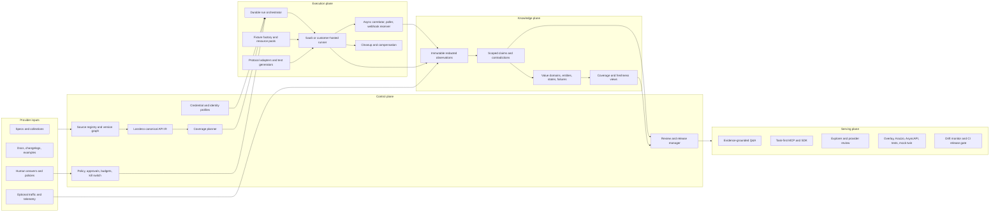

# DocentAPI architecture audit: from API documentation to a verified behavioral twin

Date: 2026-08-04  
Scope: repository implementation, product architecture, active verification, evidence, security, standards, competitive position, and build order.

## Executive verdict

The idea is larger and more valuable than “better API documentation.” The strongest version of DocentAPI is a **governed, continuously verified behavioral twin of an API**: a system that knows what an API declares, what it has actually observed, what depends on tenant/role/environment/state, what remains unknown, and which operations an agent may safely perform.

The repository already contains a credible first product:

- OpenAPI/Swagger/Postman/cURL ingestion with safe URL fetching;
- a compact endpoint IR, field maps, inferred value lineage, documentation crawling, and LLM enrichment;
- a human clarification loop with signed email completion links;
- public/private API pages, playground execution, code snippets, a grounded Q&A surface, and hosted MCP;
- versioned specs, evidence facts, scores, credentials, credential audit, analysis runs, and generated Arazzo/enriched-spec artifacts;
- SSRF protection, request validation, limits, Clerk tenancy, billing, QStash jobs, Redis rate limits, and encrypted credential storage.

That is substantially more than a mock-up. But the central promise is not implemented yet. Today the platform has:

1. a **static compiler** from a spec into an integration surface;
2. a **semantic enrichment pass** that infers field meaning and asks narrow questions;
3. a **small live-score sampler** that makes a few read-oriented requests.

It does not yet have the third engine the thesis requires: a durable, policy-controlled experimental runtime that creates fixtures, chains dependent calls, varies one condition at a time, observes state over time, correlates webhooks/events, cleans up, reproduces results, and promotes observations into scoped behavioral claims.

The most important near-term decision is therefore:

> Build the evidence-producing experiment engine before expanding the generated documentation or “MVP builder.”

The market already has strong spec-to-docs, spec-to-SDK, spec-to-MCP, testing, catalog, and agent products. DocentAPI’s defensible layer is **behavioral truth with provenance and an explicit unknown set**.

## 1. The promise to make—and the promise not to make

### Recommended product promise

For a specific API version, environment, tenant, credential role, and intended outcome, DocentAPI can:

- produce the safest known call plan;
- explain where every required value comes from;
- distinguish provider-declared behavior from observed behavior and human confirmation;
- show the evidence, scope, age, and reproducibility of each claim;
- identify exactly what it does not yet know;
- execute or rehearse an approved workflow within a declared safety and cost budget;
- detect drift and retract stale claims.

### Why “every value a parameter can take” is not literally discoverable

Many API value domains are open-ended or contextual: customer IDs come from a tenant’s data, a status can depend on a prior transition, an amount can be bounded by account configuration, and an OAuth scope can expose a different schema. Sampling can never establish that an unbounded set is complete.

Every field therefore needs a typed `ValueDomain`, not merely examples:

| Domain kind | Meaning | Example |
|---|---|---|
| `exact` | Complete, enumerable domain | enum, boolean, const |
| `constrained` | Infinite/large domain with known rules | integer 1–100, regex, date-time |
| `relational` | Must reference another resource or prior output | `customer_id` from `create_customer.id` |
| `derived` | Computed from other inputs or external state | signature, checksum, cursor |
| `provider_declared` | Human/provider says the rule, not yet observed | account-specific limit |
| `sampled` | Values observed in finite runs; never exhaustive by default | three error codes seen in 40 runs |
| `unknown` | Evidence is insufficient | undocumented opaque string |

Each domain also needs `completeness = exhaustive | partial | unknown`, its scope, evidence, and last verification time. A sampled set must never silently become an enum.

## 2. What is built today

### 2.1 Ingestion and normalization

The import path accepts OpenAPI 3, converts Swagger 2, converts Postman collections, and can form an operation from cURL. External `$ref` fetching is deliberately disabled, which is a good initial SSRF posture ([parser](./src/lib/importer/openapi.ts#L10)). The stored source is versioned by a content hash and can point to the raw snapshot ([schema](./src/lib/db/schema.ts#L96)).

The current IR is intentionally small: one dominant auth type, path/query/header/body parameters, one selected request media type, one selected 2xx JSON response schema, one selected 4xx JSON error schema, examples, and a `read | write | destructive` label ([IR](./src/lib/ir.ts#L7), [normalizer](./src/lib/normalize.ts#L285)). It caps an import at 300 operations ([IR](./src/lib/ir.ts#L62)).

That makes the UI and MCP compiler simple, but it is too lossy to be the source of truth for behavioral ownership.

### 2.2 Structural and semantic knowledge

The platform flattens request/response fields, infers resource relationships, and records lineage facts. It then crawls a bounded set of provider documentation pages—five seeds, twenty pages, 2 MB, depth two—and sends bounded field/resource chunks to an LLM ([crawler](./src/lib/docsCrawler.ts#L34), [enrichment](./src/lib/deepEnrich.ts#L87)). The enrichment code is unusually careful about prompt injection, hallucinated fields, disputed lineage, and preferring an open question over a guess.

The clarification system is also well conceived: questions are clustered across repeated fields, can be supported or reopened, and human answers become higher-trust evidence. This is an important foundation, not throwaway work.

### 2.3 Current live verification

The “live” score runs four probes concurrently ([score runner](./src/lib/probes/run.ts#L21)):

- auth clarity is mainly a static score plus one possible unauthenticated read request;
- error quality corrupts at most two read-operation examples and looks for a readable JSON message;
- doc drift checks at most three read operations and compares only top-level property names and JavaScript types;
- idempotency is entirely static and only looks for an idempotency-like parameter ([idempotency probe](./src/lib/probes/idempotency.ts#L7)).

Unavailable dimensions are removed from the denominator ([score runner](./src/lib/probes/run.ts#L34)). This means a high total can be computed from a small eligible subset. The UI nevertheless calls it a “verified” score “computed from live probes run against the real API” ([score panel](./src/components/product/VerifiedScorePanel.tsx#L20)). That wording overstates the demonstrated coverage.

### 2.4 Execution and MCP

The upstream executor validates arguments, chooses the first base URL, sends one request with a 30-second/1-MB bound, and returns the body ([MCP execution](./src/lib/mcpTools.ts#L106)). SSRF protection and URL pinning are strong defensive work.

The request builder is not protocol-complete: query values are stringified, OAuth is treated as a bearer token, and multipart, cookies, parameter `style`/`explode`, XML, streaming, and complex encodings are not faithfully represented ([upstream builder](./src/lib/upstream.ts#L23)). MCP exposes every non-destructive endpoint, including ordinary writes; only the `destructive` class is filtered ([IR exposure](./src/lib/ir.ts#L71)).

The MCP surface already has a better idea hiding inside it: advisor tools search and explain the API before execution. That should become the primary interface, while raw write tools become separately permissioned implementation details.

### 2.5 Credentials and jobs

Credential storage uses per-secret AES-GCM data keys and binds ciphertext to org/API/environment context. However, the wrapping key is derived from an application master secret using HKDF, not held by a cloud KMS/HSM ([vault](./src/lib/vault.ts#L7)). The database field named `kmsKeyId` records this local scheme. A real KMS should protect the root key; AWS’s KMS guidance describes envelope encryption specifically as encrypting the data key under a KMS-managed root key that does not leave its HSM unencrypted ([AWS KMS](https://docs.aws.amazon.com/kms/latest/developerguide/kms-cryptography.html)).

Credential audit writes are best-effort and never fail a credential use ([vault store](./src/lib/vaultStore.ts#L29)). That is reasonable for an early product, but it is not sufficient for a high-assurance “we operate your API” tier unless audit gaps trigger containment and alerting.

The analysis chain uses plain QStash messages and database stage checks. The queue module itself correctly notes that a workflow system is the fit for multi-step probe orchestration ([queue](./src/lib/queue.ts#L3)). The existing sliding-window rate limiter protects the application, but it does not implement per-provider weighted budgets, adaptive backoff, or distributed resource leases ([rate limiter](./src/lib/ratelimit.ts#L23)).

## 3. The missing system: a governed API behavioral twin



This separation matters:

- the **control plane** decides what may be tested and what coverage remains;
- the **execution plane** performs bounded experiments;
- the **knowledge plane** preserves evidence and turns it into retractable claims;
- the **serving plane** exposes only reviewed, scoped knowledge and permitted actions.

## 4. Canonical model: preserve first, simplify later

OpenAPI 3.2.0 is now the current published OpenAPI specification. It includes Links, callbacks, webhooks, richer media/streaming descriptions, parameter serialization rules, and security combinations including API keys in cookies and mutual TLS ([OpenAPI 3.2.0](https://spec.openapis.org/oas/v3.2.0.html)). The current normalizer drops or collapses much of this.

The target importer should retain the raw source and compile it into a protocol-neutral graph without discarding alternatives.

### Core objects

```text
ApiProduct
  ├─ ApiVersion
  ├─ Environment (sandbox, staging, production, region)
  ├─ ProtocolSurface (HTTP, GraphQL, gRPC, async/message)
  ├─ IdentityProfile (tenant, user, role, OAuth scopes, credential bundle)
  ├─ Operation / Channel / Message
  ├─ SchemaDialect + Schema
  ├─ Entity + EntityKey
  ├─ ValueDomain
  ├─ Workflow + StepDependency
  ├─ StateMachine + Transition + Invariant
  ├─ ErrorContract
  ├─ RetryAndIdempotencyContract
  ├─ EventAndWebhookContract
  ├─ ProbePolicy
  └─ VerificationRelease
```

For HTTP/OpenAPI, preserve:

- every response status/range/default, content type, header, link, callback, and example;
- all request content alternatives and encoding metadata;
- path/query/header/cookie parameters with `style`, `explode`, `allowReserved`, and examples;
- security requirement logic: schemes inside one requirement are AND; separate requirement objects are alternatives;
- OAuth flows/scopes, OIDC, API-key placement, mTLS, and anonymous alternatives;
- read/write-only, discriminator, XML, deprecated, external docs, server variables, tags, and source locations;
- the declared JSON Schema dialect. JSON Schema 2020-12 has vocabularies and semantics that should not be reduced to a small keyword allowlist ([JSON Schema 2020-12](https://json-schema.org/draft/2020-12)).

Use a **safe external-reference resolver**, not a permanent ban: allowlisted hosts, public DNS/IP validation at every redirect, content/byte/depth limits, cycle detection, cached content hashes, and an explicit fetched-source manifest.

### Multiple protocols

API ownership cannot stop at REST:

- AsyncAPI models message-driven APIs across protocols ([AsyncAPI 3.0](https://www.asyncapi.com/docs/reference/specification/v3.0.0));
- GraphQL exposes a typed schema through introspection and has query, mutation, and subscription behavior ([GraphQL introspection](https://spec.graphql.org/September2025/#sec-Introspection));
- gRPC reflection can expose protobuf services and types to clients ([gRPC reflection](https://grpc.io/docs/guides/reflection/)).

Build adapters behind the same canonical model. Start with faithful OpenAPI/HTTP, then add GraphQL, then webhooks/AsyncAPI, then gRPC. Do not force all protocols into HTTP endpoint-shaped rows.

## 5. The experiment engine

### 5.1 It is a planner, not a Cartesian fuzzer

Trying every combination is impossible and unsafe. The planner should generate test obligations and choose experiments by risk-adjusted information gain:

```text
priority(test) = expected_unknowns_resolved × claim_importance × drift_risk
                 -------------------------------------------------------
                 call_cost × side_effect_risk × flakiness × rate_pressure
```

Use pairwise/boundary/property-based generation for broad input coverage, then adapt based on observed constraints. Schemathesis already provides OpenAPI/GraphQL generation, stateful links between responses and later requests, shrinking, lifecycle checks, and adaptive learning from repeated errors ([stateful testing](https://schemathesis.readthedocs.io/en/stable/explanations/stateful/), [adaptive testing](https://schemathesis.readthedocs.io/en/stable/explanations/adaptive-testing/)). Integrate it as a runner engine instead of recreating its generator. DocentAPI’s proprietary layer should be policy, fixtures, business semantics, cross-protocol correlation, evidence, and provider review.

Microsoft’s RESTler research is also directly relevant: it derives producer-consumer dependencies and explores request sequences rather than isolated calls ([RESTler paper](https://www.microsoft.com/en-us/research/wp-content/uploads/2021/03/RESTler.pdf)).

### 5.2 Run lifecycle

1. **Compile passive evidence**  
   Parse specs, docs, examples, changelogs, SDKs, and optional telemetry. Record conflicts instead of overwriting one source with another.

2. **Readiness gate**  
   Require base URLs, environments, credential profiles, role/scopes, rate limits, allowed operations, forbidden data, financial/message limits, test-data rules, callback reachability, cleanup rules, and an emergency owner.

3. **Plan obligations**  
   Expand operations into positive, negative, boundary, auth, media, pagination, concurrency, retry, lifecycle, and asynchronous obligations. Mark each `planned`, `covered`, `blocked`, `unsafe`, `not_applicable`, or `stale`.

4. **Seed and discover**  
   Run known-good reads/examples, inventory accessible resources, and populate scoped resource pools. Never use arbitrary production objects as mutation fixtures.

5. **Create controlled fixtures**  
   Create namespaced test resources with a run marker, TTL, ownership tag, and cleanup/compensation plan. Track every object in a resource ledger.

6. **Exercise stateful workflows**  
   Chain producer output into consumer input, infer transitions, poll eventual results, and test legal/illegal transitions. Hold resource leases to prevent parallel runs from corrupting each other.

7. **Explore values and failures**  
   Vary one dimension where causal attribution matters; use boundary, omission, null, type, format, enum, relational, auth-role, concurrency, and conditional-field partitions. Shrink a failure into the smallest reproducible case.

8. **Verify asynchronous behavior**  
   Correlate request IDs, resource IDs, webhook IDs, attempt numbers, timestamps, and traces. Observe ordering, duplicates, retry backoff, replay windows, signatures, and terminal timeout.

9. **Test retries and unknown outcomes**  
   In an explicitly approved sandbox, simulate client timeouts/retries and determine whether idempotency keys, duplicate requests, and reconciliation are safe. HTTP’s safe/idempotent method semantics are useful defaults, but business side effects still require observation and provider policy ([RFC 9110](https://www.rfc-editor.org/rfc/rfc9110.html)). The emerging `Idempotency-Key` header specification is still an Internet-Draft and must be labeled as such ([draft](https://datatracker.ietf.org/doc/html/draft-ietf-httpapi-idempotency-key-header)).

10. **Cleanup, replay, and publish**  
    Run compensations, quarantine anything that fails cleanup, replay important results, synthesize claims, route contradictions/questions to a reviewer, and publish a signed verification release.

