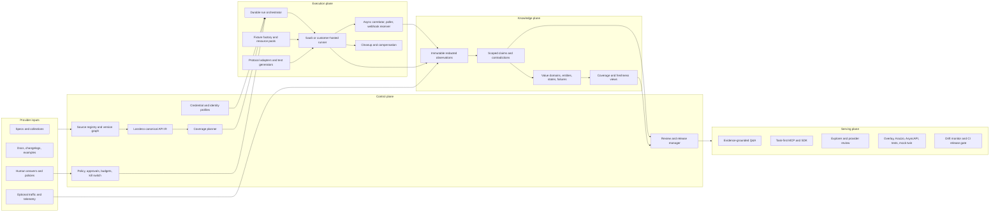

# DocentAPI architecture audit: from API documentation to a verified behavioral twin

Date: 2026-08-04  
Scope: repository implementation, product architecture, active verification, evidence, security, standards, competitive position, and build order.

## Executive verdict

The idea is larger and more valuable than “better API documentation.” The strongest version of DocentAPI is a **governed, continuously verified behavioral twin of an API**: a system that knows what an API declares, what it has actually observed, what depends on tenant/role/environment/state, what remains unknown, and which operations an agent may safely perform.

The repository already contains a credible first product:

- OpenAPI/Swagger/Postman/cURL ingestion with safe URL fetching;
- a compact endpoint IR, field maps, inferred value lineage, documentation crawling, and LLM enrichment;
- a human clarification loop with signed email completion links;
- public/private API pages, playground execution, code snippets, a grounded Q&A surface, and hosted MCP;
- versioned specs, evidence facts, scores, credentials, credential audit, analysis runs, and generated Arazzo/enriched-spec artifacts;
- SSRF protection, request validation, limits, Clerk tenancy, billing, QStash jobs, Redis rate limits, and encrypted credential storage.

That is substantially more than a mock-up. But the central promise is not implemented yet. Today the platform has:

1. a **static compiler** from a spec into an integration surface;
2. a **semantic enrichment pass** that infers field meaning and asks narrow questions;
3. a **small live-score sampler** that makes a few read-oriented requests.

It does not yet have the third engine the thesis requires: a durable, policy-controlled experimental runtime that creates fixtures, chains dependent calls, varies one condition at a time, observes state over time, correlates webhooks/events, cleans up, reproduces results, and promotes observations into scoped behavioral claims.

The most important near-term decision is therefore:

> Build the evidence-producing experiment engine before expanding the generated documentation or “MVP builder.”

The market already has strong spec-to-docs, spec-to-SDK, spec-to-MCP, testing, catalog, and agent products. DocentAPI’s defensible layer is **behavioral truth with provenance and an explicit unknown set**.

## 1. The promise to make—and the promise not to make

### Recommended product promise

For a specific API version, environment, tenant, credential role, and intended outcome, DocentAPI can:

- produce the safest known call plan;
- explain where every required value comes from;
- distinguish provider-declared behavior from observed behavior and human confirmation;
- show the evidence, scope, age, and reproducibility of each claim;
- identify exactly what it does not yet know;
- execute or rehearse an approved workflow within a declared safety and cost budget;
- detect drift and retract stale claims.

### Why “every value a parameter can take” is not literally discoverable

Many API value domains are open-ended or contextual: customer IDs come from a tenant’s data, a status can depend on a prior transition, an amount can be bounded by account configuration, and an OAuth scope can expose a different schema. Sampling can never establish that an unbounded set is complete.

Every field therefore needs a typed `ValueDomain`, not merely examples:

| Domain kind | Meaning | Example |
|---|---|---|
| `exact` | Complete, enumerable domain | enum, boolean, const |
| `constrained` | Infinite/large domain with known rules | integer 1–100, regex, date-time |
| `relational` | Must reference another resource or prior output | `customer_id` from `create_customer.id` |
| `derived` | Computed from other inputs or external state | signature, checksum, cursor |
| `provider_declared` | Human/provider says the rule, not yet observed | account-specific limit |
| `sampled` | Values observed in finite runs; never exhaustive by default | three error codes seen in 40 runs |
| `unknown` | Evidence is insufficient | undocumented opaque string |

Each domain also needs `completeness = exhaustive | partial | unknown`, its scope, evidence, and last verification time. A sampled set must never silently become an enum.

## 2. What is built today

### 2.1 Ingestion and normalization

The import path accepts OpenAPI 3, converts Swagger 2, converts Postman collections, and can form an operation from cURL. External `$ref` fetching is deliberately disabled, which is a good initial SSRF posture ([parser](./src/lib/importer/openapi.ts#L10)). The stored source is versioned by a content hash and can point to the raw snapshot ([schema](./src/lib/db/schema.ts#L96)).

The current IR is intentionally small: one dominant auth type, path/query/header/body parameters, one selected request media type, one selected 2xx JSON response schema, one selected 4xx JSON error schema, examples, and a `read | write | destructive` label ([IR](./src/lib/ir.ts#L7), [normalizer](./src/lib/normalize.ts#L285)). It caps an import at 300 operations ([IR](./src/lib/ir.ts#L62)).

That makes the UI and MCP compiler simple, but it is too lossy to be the source of truth for behavioral ownership.

### 2.2 Structural and semantic knowledge

The platform flattens request/response fields, infers resource relationships, and records lineage facts. It then crawls a bounded set of provider documentation pages—five seeds, twenty pages, 2 MB, depth two—and sends bounded field/resource chunks to an LLM ([crawler](./src/lib/docsCrawler.ts#L34), [enrichment](./src/lib/deepEnrich.ts#L87)). The enrichment code is unusually careful about prompt injection, hallucinated fields, disputed lineage, and preferring an open question over a guess.

The clarification system is also well conceived: questions are clustered across repeated fields, can be supported or reopened, and human answers become higher-trust evidence. This is an important foundation, not throwaway work.

### 2.3 Current live verification

The “live” score runs four probes concurrently ([score runner](./src/lib/probes/run.ts#L21)):

- auth clarity is mainly a static score plus one possible unauthenticated read request;
- error quality corrupts at most two read-operation examples and looks for a readable JSON message;
- doc drift checks at most three read operations and compares only top-level property names and JavaScript types;
- idempotency is entirely static and only looks for an idempotency-like parameter ([idempotency probe](./src/lib/probes/idempotency.ts#L7)).

Unavailable dimensions are removed from the denominator ([score runner](./src/lib/probes/run.ts#L34)). This means a high total can be computed from a small eligible subset. The UI nevertheless calls it a “verified” score “computed from live probes run against the real API” ([score panel](./src/components/product/VerifiedScorePanel.tsx#L20)). That wording overstates the demonstrated coverage.

### 2.4 Execution and MCP

The upstream executor validates arguments, chooses the first base URL, sends one request with a 30-second/1-MB bound, and returns the body ([MCP execution](./src/lib/mcpTools.ts#L106)). SSRF protection and URL pinning are strong defensive work.

The request builder is not protocol-complete: query values are stringified, OAuth is treated as a bearer token, and multipart, cookies, parameter `style`/`explode`, XML, streaming, and complex encodings are not faithfully represented ([upstream builder](./src/lib/upstream.ts#L23)). MCP exposes every non-destructive endpoint, including ordinary writes; only the `destructive` class is filtered ([IR exposure](./src/lib/ir.ts#L71)).

The MCP surface already has a better idea hiding inside it: advisor tools search and explain the API before execution. That should become the primary interface, while raw write tools become separately permissioned implementation details.

### 2.5 Credentials and jobs

Credential storage uses per-secret AES-GCM data keys and binds ciphertext to org/API/environment context. However, the wrapping key is derived from an application master secret using HKDF, not held by a cloud KMS/HSM ([vault](./src/lib/vault.ts#L7)). The database field named `kmsKeyId` records this local scheme. A real KMS should protect the root key; AWS’s KMS guidance describes envelope encryption specifically as encrypting the data key under a KMS-managed root key that does not leave its HSM unencrypted ([AWS KMS](https://docs.aws.amazon.com/kms/latest/developerguide/kms-cryptography.html)).

Credential audit writes are best-effort and never fail a credential use ([vault store](./src/lib/vaultStore.ts#L29)). That is reasonable for an early product, but it is not sufficient for a high-assurance “we operate your API” tier unless audit gaps trigger containment and alerting.

The analysis chain uses plain QStash messages and database stage checks. The queue module itself correctly notes that a workflow system is the fit for multi-step probe orchestration ([queue](./src/lib/queue.ts#L3)). The existing sliding-window rate limiter protects the application, but it does not implement per-provider weighted budgets, adaptive backoff, or distributed resource leases ([rate limiter](./src/lib/ratelimit.ts#L23)).

## 3. The missing system: a governed API behavioral twin



This separation matters:

- the **control plane** decides what may be tested and what coverage remains;
- the **execution plane** performs bounded experiments;
- the **knowledge plane** preserves evidence and turns it into retractable claims;
- the **serving plane** exposes only reviewed, scoped knowledge and permitted actions.

## 4. Canonical model: preserve first, simplify later

OpenAPI 3.2.0 is now the current published OpenAPI specification. It includes Links, callbacks, webhooks, richer media/streaming descriptions, parameter serialization rules, and security combinations including API keys in cookies and mutual TLS ([OpenAPI 3.2.0](https://spec.openapis.org/oas/v3.2.0.html)). The current normalizer drops or collapses much of this.

The target importer should retain the raw source and compile it into a protocol-neutral graph without discarding alternatives.

### Core objects

```text
ApiProduct
  ├─ ApiVersion
  ├─ Environment (sandbox, staging, production, region)
  ├─ ProtocolSurface (HTTP, GraphQL, gRPC, async/message)
  ├─ IdentityProfile (tenant, user, role, OAuth scopes, credential bundle)
  ├─ Operation / Channel / Message
  ├─ SchemaDialect + Schema
  ├─ Entity + EntityKey
  ├─ ValueDomain
  ├─ Workflow + StepDependency
  ├─ StateMachine + Transition + Invariant
  ├─ ErrorContract
  ├─ RetryAndIdempotencyContract
  ├─ EventAndWebhookContract
  ├─ ProbePolicy
  └─ VerificationRelease
```

For HTTP/OpenAPI, preserve:

- every response status/range/default, content type, header, link, callback, and example;
- all request content alternatives and encoding metadata;
- path/query/header/cookie parameters with `style`, `explode`, `allowReserved`, and examples;
- security requirement logic: schemes inside one requirement are AND; separate requirement objects are alternatives;
- OAuth flows/scopes, OIDC, API-key placement, mTLS, and anonymous alternatives;
- read/write-only, discriminator, XML, deprecated, external docs, server variables, tags, and source locations;
- the declared JSON Schema dialect. JSON Schema 2020-12 has vocabularies and semantics that should not be reduced to a small keyword allowlist ([JSON Schema 2020-12](https://json-schema.org/draft/2020-12)).

Use a **safe external-reference resolver**, not a permanent ban: allowlisted hosts, public DNS/IP validation at every redirect, content/byte/depth limits, cycle detection, cached content hashes, and an explicit fetched-source manifest.

### Multiple protocols

API ownership cannot stop at REST:

- AsyncAPI models message-driven APIs across protocols ([AsyncAPI 3.0](https://www.asyncapi.com/docs/reference/specification/v3.0.0));
- GraphQL exposes a typed schema through introspection and has query, mutation, and subscription behavior ([GraphQL introspection](https://spec.graphql.org/September2025/#sec-Introspection));
- gRPC reflection can expose protobuf services and types to clients ([gRPC reflection](https://grpc.io/docs/guides/reflection/)).

Build adapters behind the same canonical model. Start with faithful OpenAPI/HTTP, then add GraphQL, then webhooks/AsyncAPI, then gRPC. Do not force all protocols into HTTP endpoint-shaped rows.

## 5. The experiment engine

### 5.1 It is a planner, not a Cartesian fuzzer

Trying every combination is impossible and unsafe. The planner should generate test obligations and choose experiments by risk-adjusted information gain:

```text
priority(test) = expected_unknowns_resolved × claim_importance × drift_risk
                 -------------------------------------------------------
                 call_cost × side_effect_risk × flakiness × rate_pressure
```

Use pairwise/boundary/property-based generation for broad input coverage, then adapt based on observed constraints. Schemathesis already provides OpenAPI/GraphQL generation, stateful links between responses and later requests, shrinking, lifecycle checks, and adaptive learning from repeated errors ([stateful testing](https://schemathesis.readthedocs.io/en/stable/explanations/stateful/), [adaptive testing](https://schemathesis.readthedocs.io/en/stable/explanations/adaptive-testing/)). Integrate it as a runner engine instead of recreating its generator. DocentAPI’s proprietary layer should be policy, fixtures, business semantics, cross-protocol correlation, evidence, and provider review.

Microsoft’s RESTler research is also directly relevant: it derives producer-consumer dependencies and explores request sequences rather than isolated calls ([RESTler paper](https://www.microsoft.com/en-us/research/wp-content/uploads/2021/03/RESTler.pdf)).

### 5.2 Run lifecycle

1. **Compile passive evidence**  
   Parse specs, docs, examples, changelogs, SDKs, and optional telemetry. Record conflicts instead of overwriting one source with another.

2. **Readiness gate**  
   Require base URLs, environments, credential profiles, role/scopes, rate limits, allowed operations, forbidden data, financial/message limits, test-data rules, callback reachability, cleanup rules, and an emergency owner.

3. **Plan obligations**  
   Expand operations into positive, negative, boundary, auth, media, pagination, concurrency, retry, lifecycle, and asynchronous obligations. Mark each `planned`, `covered`, `blocked`, `unsafe`, `not_applicable`, or `stale`.

4. **Seed and discover**  
   Run known-good reads/examples, inventory accessible resources, and populate scoped resource pools. Never use arbitrary production objects as mutation fixtures.

5. **Create controlled fixtures**  
   Create namespaced test resources with a run marker, TTL, ownership tag, and cleanup/compensation plan. Track every object in a resource ledger.

6. **Exercise stateful workflows**  
   Chain producer output into consumer input, infer transitions, poll eventual results, and test legal/illegal transitions. Hold resource leases to prevent parallel runs from corrupting each other.

7. **Explore values and failures**  
   Vary one dimension where causal attribution matters; use boundary, omission, null, type, format, enum, relational, auth-role, concurrency, and conditional-field partitions. Shrink a failure into the smallest reproducible case.

8. **Verify asynchronous behavior**  
   Correlate request IDs, resource IDs, webhook IDs, attempt numbers, timestamps, and traces. Observe ordering, duplicates, retry backoff, replay windows, signatures, and terminal timeout.

9. **Test retries and unknown outcomes**  
   In an explicitly approved sandbox, simulate client timeouts/retries and determine whether idempotency keys, duplicate requests, and reconciliation are safe. HTTP’s safe/idempotent method semantics are useful defaults, but business side effects still require observation and provider policy ([RFC 9110](https://www.rfc-editor.org/rfc/rfc9110.html)). The emerging `Idempotency-Key` header specification is still an Internet-Draft and must be labeled as such ([draft](https://datatracker.ietf.org/doc/html/draft-ietf-httpapi-idempotency-key-header)).

10. **Cleanup, replay, and publish**  
    Run compensations, quarantine anything that fails cleanup, replay important results, synthesize claims, route contradictions/questions to a reviewer, and publish a signed verification release.

### 5.3 Durable execution requirements

Replace the three-message chain with a real workflow/run model:

- immutable run plan and versioned planner inputs;
- step leases, heartbeat, attempt count, retry class, deadline, and idempotency key;
- pause/resume/cancel and a global/provider/org kill switch;
- per-provider queues and concurrency limits;
- callbacks, dead-letter visibility, and operator replay;
- compensation steps that run even after cancellation;
- deterministic step inputs and content-addressed artifacts;
- separate `run status` from `claim publication status`.

QStash Workflow is a reasonable first orchestrator given the existing stack. The system still needs database-backed resource ownership and idempotency; a queue alone is not the source of truth.

### 5.4 SaaS and customer-hosted runners

Many valuable APIs are private, IP-allowlisted, or cannot send data to a multi-tenant SaaS. Support two execution modes sharing the same signed plan format:

- DocentAPI-managed isolated egress workers;
- a small customer-hosted Docker/Kubernetes/VPC runner that fetches a signed plan, obtains secrets locally, emits redacted observations, and can be revoked.

The hosted runner is a major enterprise capability, not an optional deployment detail.

## 6. Safety and authorization architecture

OWASP’s API Security Top 10 includes broken object authorization, broken authentication/property authorization, unrestricted resource consumption, sensitive business-flow abuse, SSRF, inventory failures, and unsafe consumption of third-party APIs ([OWASP API Security 2023](https://owasp.org/API-Security/editions/2023/en/0x10-api-security-risks/)). An autonomous probe system sits directly on these fault lines.

### Risk classes

| Class | Examples | Default policy |
|---|---|---|
| R0 passive | parse spec/docs, generate plan | automatic |
| R1 observation | approved GET/HEAD, introspection | automatic in sandbox after allowlist |
| R2 reversible mutation | create/update namespaced test object with proven cleanup | explicit environment policy |
| R3 consequential | delete, payment authorization, email/SMS, account changes, external publication | per-operation approval and tiny budgets |
| R4 irreversible/regulated | money movement, production deletion, identity/legal/health action | disabled for SaaS autonomous probing; customer-run controlled validation only |

Method names are only a hint. `GET` can trigger bad legacy behavior, `POST` can be safely idempotent, and “cancel” may have financial consequences. Store provider-approved risk and effect metadata at operation and workflow level.

### Policy object

Every run should bind an immutable `ProbePolicy` containing:

- allowed hosts, regions, protocols, environments, operations, and time window;
- identity profiles and least-privilege scopes;
- maximum calls, concurrency, duration, bytes, objects, and monetary/message effects;
- data classification and prohibited fields;
- read/write/destructive/consequential grants;
- fixture namespaces and cleanup SLA;
- webhook destinations and outbound allowlists;
- redaction/retention/export rules;
- approver identity and policy version.

Use a central policy decision point; Open Policy Agent is one option for separating declarative policy decisions from enforcement ([OPA](https://www.openpolicyagent.org/docs)). Enforce the decision again inside the runner immediately before the network call—never only in the UI/planner.

### Credentials and identities

Replace “one string per API/environment” with typed credential bundles:

- API key/header/query/cookie;
- bearer token with expiry;
- basic username/password;
- OAuth client credentials/device/authorization-code with scopes and refresh handling;
- mTLS certificate/private-key reference;
- multiple tenants and roles per environment;
- provider-managed secret reference for customer-hosted runners.

Use a real cloud KMS/HSM root, short-lived unwrap authority, rotation/revocation, and fail-closed authorization. Audit should be tamper-evident and alert on gaps. Never put credentials in query parameters: the current MCP fallback explicitly does this ([MCP block](./src/components/product/McpBlock.tsx#L57)) and should be removed.

### MCP authorization

The MCP authorization specification uses OAuth 2.1 patterns, resource/audience binding, and PKCE; access tokens must not be in the URI query string ([MCP authorization](https://modelcontextprotocol.io/specification/2025-11-25/basic/authorization)). MCP’s security guidance explicitly covers token passthrough, confused-deputy risks, SSRF, consent, and least-privilege scopes ([MCP security](https://modelcontextprotocol.io/docs/tutorials/security/security_best_practices)).

Implement:

- OAuth-based access for private MCP servers;
- resource-bound tokens and per-tool/per-effect scopes;
- separate inbound MCP authorization from the upstream provider credential;
- explicit human consent for consequential calls;
- no raw write tools by default;
- task/workflow tools that can present a plan before execution;
- a capability grant tied to operation, environment, identity profile, budget, and expiry.

The July 2026 MCP release candidate adds task handles for long-running tools, including status and cancellation. It is an RC, not yet a stable dependency, so support it behind capability negotiation while keeping a normal run API fallback ([MCP RC announcement](https://blog.modelcontextprotocol.io/posts/2026-07-28-release-candidate/)).

## 7. Evidence, claims, and the truth model

The current generic `evidence_facts` table is a useful seed ([schema](./src/lib/db/schema.ts#L146)), but observations and claims must be separate.

### Immutable observation

```text
Observation
  id, run_id, step_id, attempt
  api_version, environment, region
  identity_profile, tenant
  operation/channel, request_variant
  started_at, completed_at, latency
  request metadata + redacted/body artifact hash
  response status/headers + redacted/body artifact hash
  trace/correlation/resource/event IDs
  generator + runner + validator versions
  redaction policy + redaction result
  fixture IDs and cleanup state
```

Raw bodies should go to a quarantined, access-controlled artifact store only when policy permits. The normal evidence path should contain deterministic redacted structures, schema fingerprints, hashes, selected safe values, and pointers. Redaction happens before durable storage and again before model use.

OpenTelemetry’s HTTP semantic conventions give a common vocabulary for client/server spans, retries, status, and attributes, which makes optional provider-side correlation valuable ([OpenTelemetry HTTP conventions](https://opentelemetry.io/docs/specs/semconv/http/)). Traffic/telemetry ingestion is complementary evidence, not proof of completeness: production traces only show behavior that happened to be used.

### Scoped, retractable claim

```text
Claim
  subject, predicate, object
  scope = api_version + environment + tenant_class + identity_role + region
  epistemic_status = declared | inferred | observed | human_confirmed
  confidence and completeness
  supporting_observation_ids
  contradicting_observation_ids
  sample_size and reproduction_count
  valid_from, valid_until, last_observed_at
  synthesis_version
  state = candidate | reviewed | published | disputed | superseded | retracted
```

Examples:

- “`create_order.body.customer_id` is produced by `create_customer.response.id`”;
- “with role `viewer`, `GET /orders/{id}` returns 403 for another tenant’s object”;
- “duplicate POSTs with the same idempotency key return the same resource for 24 hours”;
- “state `processing → completed` was observed after 3–18 seconds in sandbox”;
- “webhook delivery is at-least-once; duplicate event IDs were observed.”

Contradiction is a first-class result. Never update a fact in place because a new run disagrees. Add evidence, mark the claim disputed, and require a synthesis/review decision. Claims must automatically become stale when their source spec, environment, policy, credential role, or important dependency changes.

### Error, webhook, and event contracts

Normalize errors using provider codes plus HTTP status and machine-readable structure. RFC 9457 defines a standard Problem Details shape, but its human-readable `detail` field should not be parsed as a stable programmatic code ([RFC 9457](https://www.rfc-editor.org/rfc/rfc9457.html)).

For webhooks, preserve the exact raw payload for signature verification within the approved ephemeral boundary, test duplicates/retries/replay windows, and model event IDs/attempts separately. The Standard Webhooks specification signs an ID, timestamp, and exact payload and describes retry identity/rotation behavior ([Standard Webhooks](https://github.com/standard-webhooks/standard-webhooks/blob/main/spec/standard-webhooks.md)). CloudEvents provides a protocol-neutral event envelope and bindings ([CloudEvents](https://github.com/cloudevents/spec/blob/main/cloudevents/spec.md)).

## 8. Coverage, score, and release semantics

### Stop using one global “verified” adjective

Verification is always scoped. Replace the current badge with a `VerificationManifest`:

```text
API version: sha256:…
Environment: sandbox
Identity profiles: anonymous, viewer, editor
Verified at: …
Freshness policy: 7 days
Eligible obligations: 1,284
Covered: 842
Blocked: 211
Unsafe/not authorized: 179
Failed: 52
Dimensions: operation, schema, failures, auth, workflows, async, retry
Evidence release: sha256:…
```

Display both **quality** and **coverage**. A 95% pass rate over 5% coverage is not “95% verified.” Do not renormalize away the unknown set without making the denominator visible.

### Coverage obligations

Track at least:

- operation × environment × identity profile × outcome class × media type;
- parameter/field × valid/boundary/invalid/omitted/null/relational partitions;
- every documented response/error class and important observed undocumented class;
- workflow edges and state transitions, including terminal states;
- pagination and resource lifecycle;
- retries, idempotency, concurrency, rate limits, and eventual consistency;
- callbacks/webhooks/events, duplicate/order/replay behavior;
- sandbox/production divergence where production observation is allowed;
- freshness and reproducibility.

Use weighted coverage for planning, but preserve raw counts so the weighting cannot hide gaps. Treat rate-limit header conventions as hints: the IETF `RateLimit` fields are still an Internet-Draft as of this audit, while HTTP 429 is standardized ([RateLimit draft](https://datatracker.ietf.org/doc/draft-ietf-httpapi-ratelimit-headers/), [RFC 6585](https://www.rfc-editor.org/rfc/rfc6585.html)).

### Signed releases

Publish an immutable verification release containing source hashes, plan/policy hashes, covered obligations, claims, evidence hashes, runner versions, reviewer decision, and expiry. A Sigstore bundle is one established packaging model for everything needed to verify a signature and can carry DSSE attestations ([Sigstore bundle](https://docs.sigstore.dev/about/bundle/)).

## 9. Provider workflow and question design

The questionnaire should not begin after random probes fail. It should have two stages.

### Stage A: readiness questionnaire

Ask only high-leverage operational questions:

- Which environment and tenant may be tested?
- Which roles/scopes must be covered?
- How are fixtures created and deleted?
- Which calls spend money, send messages, publish content, or touch real people?
- Which operations are forbidden?
- What limits, maintenance windows, IP allowlists, and cleanup SLAs apply?
- Where should webhooks arrive, and how are signatures/rotations handled?
- Who owns emergency stop and unresolved contradictions?

Without these answers, the planner can compile but must not mutate.

### Stage B: evidence-gap review

Generate questions from failed obligations and contradictory claims, not just unexplained writable fields. Each question should show:

- what DocentAPI believes;
- exact scope and confidence;
- evidence excerpts/observations;
- the contradiction or missing obligation;
- why the answer changes an integration;
- suggested structured answers plus “unknown/depends”;
- the release/coverage impact.

Answers become scoped claims, not timeless global truths. Require re-approval when the spec version or environment changes materially.

## 10. Serving layer: from endpoints to outcomes

### Task-first MCP and SDK

A 300-operation API becoming 300 tools is expensive for agents to understand and risky to authorize. Current products already illustrate alternatives: Speakeasy can generate operation tools from OpenAPI ([Speakeasy MCP](https://www.speakeasy.com/docs/standalone-mcp/overview)), while Stainless emphasizes a compact code-execution and documentation-search interface to reduce tool/context overhead ([Stainless MCP](https://www.stainless.com/docs/mcp/)). Postman Flows can package visual, conditional workflows and deploy them as MCP tools ([Postman Flows](https://www.postman.com/postman-best-practices/flows/)).

DocentAPI should expose three layers:

1. **knowledge tools**: search capabilities, explain fields, trace value provenance, inspect claims/evidence/unknowns;
2. **task tools**: `create_refunded_order`, `sync_customer`, `subscribe_to_events`, compiled from verified workflows;
3. **raw operation tools**: opt-in, scope-restricted, primarily for debugging and expert clients.

Every task tool returns a dry-run plan, required permissions, side effects, cost/budget impact, evidence age, and compensation behavior before consequential execution.

### Generated artifacts

Generate standards-based deltas rather than pretending inferred behavior was in the provider’s original spec:

- an OpenAPI Overlay for repeatable corrections/enrichment while preserving source provenance ([Overlay 1.1](https://spec.openapis.org/overlay/latest.html));
- Arazzo workflows for sequences and dependencies ([Arazzo 1.1](https://spec.openapis.org/arazzo/latest.html));
- AsyncAPI for event/webhook surfaces;
- provider conformance tests and consumer contract examples;
- a mock twin with explicit confidence/scope labels;
- integration recipes, SDK helpers, and task-first MCP;
- a signed verification manifest and drift diff.

Pact’s distinction is useful: schema/provider conformance and consumer-driven contracts answer different questions. Consumer contracts capture the interactions actual clients depend on and can be replayed against providers ([Pact](https://docs.pact.io/)). Exporting both provider-side conformance tests and consumer examples increases the platform’s operational value.

### What “build an MVP” should mean

Do not initially promise arbitrary product generation. Produce a **verified integration kit**:

- a reference workflow UI or sample app;
- authenticated client setup;
- verified happy path and recoveries;
- typed SDK/task tools;
- webhook receiver and signature verification;
- contract tests and fixtures;
- mock twin for local development;
- an evidence-linked runbook.

Once these outputs are reliable, a broader app builder can consume them. Generating an app before the behavior model is trustworthy merely automates integration bugs.

## 11. Concrete storage additions

Keep the existing tables, but add first-class structures rather than putting the whole system into open-ended JSON facts:

| Table/group | Purpose |
|---|---|
| `source_artifacts`, `source_edges` | raw specs/docs/collections/SDK/changelog/telemetry, hashes, fetch manifest, provenance |
| `api_versions`, `environments`, `protocol_surfaces` | explicit version/environment/protocol graph |
| `operations`, `parameters`, `representations`, `responses`, `security_requirements` | lossless compiled contract |
| `entities`, `entity_keys`, `value_domains`, `field_bindings` | semantic data and provenance model |
| `workflows`, `workflow_steps`, `step_bindings` | Arazzo-like task and dependency graph |
| `states`, `transitions`, `invariants` | lifecycle behavior |
| `error_contracts`, `event_contracts`, `retry_contracts` | failures and asynchronous/retry semantics |
| `identity_profiles`, `credential_refs` | multiple tenant/role/scope credential bundles |
| `probe_policies`, `policy_approvals` | immutable safety authorization |
| `run_plans`, `run_steps`, `step_attempts`, `leases` | durable orchestration |
| `fixtures`, `resource_instances`, `cleanup_attempts` | created object ownership and compensation |
| `observations`, `artifact_refs`, `redaction_results` | immutable experiment output |
| `claims`, `claim_support`, `claim_conflicts`, `claim_history` | current truth plus full derivation/retraction history |
| `coverage_obligations`, `coverage_results` | denominator-aware completeness |
| `review_items`, `questions`, `answers` | provider review and structured knowledge gaps |
| `verification_releases`, `release_artifacts`, `signatures` | publish gate and attestations |

Postgres remains appropriate for control/knowledge metadata. Keep large encrypted artifacts in blob/object storage. Use Redis for short-lived leases, queues, pools, and caches—not as the canonical evidence ledger.

## 12. Code-specific gap audit

| Priority | Current condition | Required change | Why it matters |
|---|---|---|---|
| P0 | UI calls a shallow sampled score “verified” | Rename to `Sampled live check`; add manifest/coverage/unknowns before restoring “verified” | Trust claim exceeds evidence |
| P0 | All non-destructive writes can be MCP tools | Disable raw writes by default; capability grants and approval for effects | Agents can cause unreviewed side effects |
| P0 | Upstream keys may be placed in `?key=` | Remove URL credentials; headers/OAuth only | URLs leak through history, logs, analytics, referrers |
| P0 | No experiment policy/kill switch/object ledger | Add risk policy, budgets, approvals, fixtures, cleanup, global/provider stop | Autonomous mutation is otherwise unsafe |
| P0 | Local app secret derives wrapping KEK | Move root wrapping to KMS/HSM; typed secret references | “KMS” semantics are not actually present |
| P1 | IR collapses auth, media, responses, serialization, callbacks, links | Build lossless versioned IR and keep raw source locations | Planner/executor cannot test behavior it discarded |
| P1 | Generic facts mix evidence and conclusions | Separate observations, claims, support/conflict, validity, retraction | Cannot reproduce or safely update knowledge |
| P1 | Plain QStash stage chain | Durable runs, steps, leases, cancellation, queues, DLQ/replay | Stateful probes span minutes/hours and fail partially |
| P1 | Request builder handles a narrow JSON-ish subset | Protocol-complete HTTP serialization and adapter boundary | Incorrect calls create false behavioral findings |
| P2 | Probes sample isolated reads | Stateful property/workflow testing with fixture pools and shrinking | Core behavioral promise |
| P2 | One credential per API/environment | Identity profiles by tenant/role/scope/auth flow | Authorization behavior is part of the contract |
| P2 | No async correlator | Webhook receiver, poller, trace/event correlation | Modern APIs finish out of band |
| P2 | Questions focus on field origins | Readiness plus contradiction/coverage review | Human attention should resolve highest-value unknowns |
| P3 | Endpoint-centric page and tool list | Entity/state/workflow/error/event/coverage explorer; task-first tools | Users integrate outcomes, not endpoint inventories |
| P3 | Enriched replacement OpenAPI | Overlay + Arazzo + AsyncAPI + verification release | Preserve provenance and use portable standards |
| P3 | No customer-hosted runner | Signed-plan VPC runner | Private/regulated enterprise APIs otherwise unreachable |
| P4 | No passive provider telemetry ingestion | Optional redacted OTel/API-gateway connector | Faster discovery and production drift evidence |
| P4 | “MVP” is undefined | Verified integration kit/reference app first | Keeps generation tied to proven workflows |

